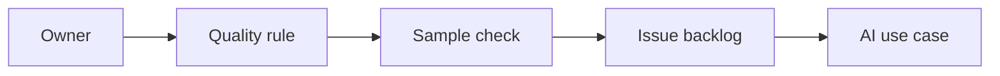

# AI Data Quality and Master Data Processes

> AI projects fail quietly when master data has no owner, no rule, and no sampled quality evidence.

**Type:** Build
**Languages:** Python
**Prerequisites:** Phase 11 Lesson 30 (Data Literacy for AI Projects), Phase 11 Lesson 36 (Internal Knowledge Assistants with RAG)
**Time:** ~45 minutes
**Capability:** Data Literacy - Quality Rules and Ownership

## Learning Objectives

- Identify master-data and data-quality gaps that weaken AI use cases
- Build a data-quality triage artifact in Python
- Map missing owner, duplicate records, stale field, and definition gap to controls
- Select quality controls before AI-assisted enrichment or reporting
- Explain why AI data work needs ownership, rules, samples, and an issue backlog

## The Problem

AI can summarize, enrich, classify, and explain data. If the source data is duplicated, stale, undefined, or ownerless, AI amplifies the confusion and makes the output look more reliable than it is.

## The Concept

Data quality for AI starts with ownership and checks. A lightweight triage model helps teams decide when to define a rule, sample records, assign an owner, or open a data-quality backlog item.

### Signals to Look For

- missing owner
- duplicate records
- stale field
- definition gap

### Controls to Teach

- data owner
- quality rule
- sample check
- issue backlog

### Target Roles

- Application Management
- Technology Consulting
- Corporate Functions
- Leadership

## Use It

Use the artifact for master-data cleanup, reporting feeds, AI enrichment preparation, migration checks, and internal knowledge assistants.

## Reusable Artifact

Data-quality AI readiness checklist.

The template in `outputs/checklist-data-quality-ai-readiness.md` can be used before feeding operational data into AI workflows.

## Key Takeaways

- AI quality depends on source-data quality.
- Master data needs named ownership.
- Sampling makes quality assumptions visible.
- Definition gaps should become backlog items before AI scaling.
