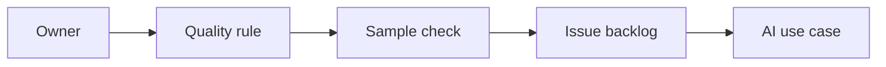

# AI Data Quality and Master Data Processes

> AI projects fail quietly when master data has no owner, no rule, and no sampled quality evidence.

**Type:** Build
**Languages:** Python
**Prerequisites:** Phase 11 Lesson 30 (Data Literacy for AI Projects), Phase 11 Lesson 36 (Internal Knowledge Assistants with RAG)
**Time:** ~45 minutes
**Capability:** Data Literacy - Quality Rules and Ownership

## Learning Objectives

- Identify master-data and data-quality gaps that weaken AI use cases
- Build a data-quality triage artifact in Python
- Map missing owner, duplicate records, stale field, and definition gap to controls
- Select quality controls before AI-assisted enrichment or reporting
- Explain why AI data work needs ownership, rules, samples, and an issue backlog

## The Problem

AI can summarize, enrich, classify, and explain data. If the source data is duplicated, stale, undefined, or ownerless, AI amplifies the confusion and makes the output look more reliable than it is.

## The Concept

Data quality for AI starts with ownership and checks. A lightweight triage model helps teams decide when to define a rule, sample records, assign an owner, or open a data-quality backlog item.

### Signals to Look For

- missing owner
- duplicate records
- stale field
- definition gap

### Controls to Teach

- data owner
- quality rule
- sample check
- issue backlog

### Target Roles

- Application Management
- Technology Consulting
- Corporate Functions
- Leadership

## Use It

Use the artifact for master-data cleanup, reporting feeds, AI enrichment preparation, migration checks, and internal knowledge assistants.

## Reusable Artifact

Data-quality AI readiness checklist.

The template in `outputs/checklist-data-quality-ai-readiness.md` can be used before feeding operational data into AI workflows.

## Worked scenario

The demo's first case is **customer master cleanup**: Duplicate records and missing owner before AI-assisted enrichment. Treat the labels missing owner, duplicate records, stale field, definition gap as evidence to inspect, not as an automatic approval. The implementation's signal matcher looks for those terms in the scenario name, description, and explicit signal list; then the scorer combines impact, uncertainty, and two points per matched signal (capped at 20). The priority function maps that score to a control level: launch gate at 16 or above, guided pilot at 11–15, team practice at 7–10, and awareness below 7.

Run the case and check which of the controls — data owner, quality rule, sample check, issue backlog — appear in the returned row. Ask three questions: Which signal is supported by an observable source? Which control has an owner who can act this week? What evidence would move the case to a different priority? Then change one signal or impact value and rerun it. If the priority changes, explain whether the change came from the score, the matching rule, or both. The score is a triage aid; it does not replace domain approval, privacy review, or a pilot metric. Keep that distinction in the artifact and in the handoff.
## Key Takeaways

- AI quality depends on source-data quality.
- Master data needs named ownership.
- Sampling makes quality assumptions visible.
- Definition gaps should become backlog items before AI scaling.

## Build It

Reconstruct **AI Data Quality and Master Data Processes** by following `Scenario` on the demo’s smallest built-in fixture. Run `python3 main.py` and verify that the result reports the empty case explicitly or raises the documented validation error.

## Ship It

Hand off `outputs/checklist-data-quality-ai-readiness.md` with the command `python3 main.py`, the accepted input shape (the demo’s smallest built-in fixture), the expected observable result, and a failure note for malformed inputs.

## Exercises

Use the demo as evidence, not as a ceremony: record what went in, what came out, and why that observation supports the objective.

1. **Start with a known input.** Run [main.py](../code/main.py) with `python3 main.py` from the lesson's `code/` directory. Record the smallest input that demonstrates “Identify master-data and data-quality gaps that weaken AI use cases”. Point to `normalize()`, `signal_matches()`, `score_scenario()` and name the returned field or printed value that serves as evidence.
2. **Run a controlled comparison.** Change exactly one input, threshold, or option that affects “Build a data-quality triage artifact in Python”. Predict the direction of the change before running it, then compare the two outputs and explain why the other fields should stay stable.
3. **Try the smallest valid counterexample.** Construct a case that stresses “Map missing owner, duplicate records, stale field, and definition gap to controls”: choose an empty collection, missing field, maximum-sized value, malformed record, or another boundary that fits this lesson. Write the expected behavior first and distinguish an intentional guard from an accidental crash.
4. **Transfer the result.** Open outputs/checklist-data-quality-ai-readiness.md and adapt one example to a real workflow. State the owner, evidence, and next decision required for “Select quality controls before AI-assisted enrichment or reporting”; mark any assumption that the demo does not establish.

## Reference Solution

The reference run should leave a small receipt: python3 main.py, its captured output, and your interpretation. Include:

- evidence for “Identify master-data and data-quality gaps that weaken AI use cases” with the relevant input and returned field;
- a one-variable comparison that makes “Build a data-quality triage artifact in Python” visible;
- a predicted and observed boundary result for “Map missing owner, duplicate records, stale field, and definition gap to controls”, including why the behavior is safe; and
- one concrete update to outputs/checklist-data-quality-ai-readiness.md that applies “Select quality controls before AI-assisted enrichment or reporting” without hiding uncertainty.

Use normalize(), signal_matches(), score_scenario() to explain the result, not only the prose output. If the experiment disagrees with the prediction, keep the failed prediction in the receipt and revise the explanation rather than changing the input until it passes.
