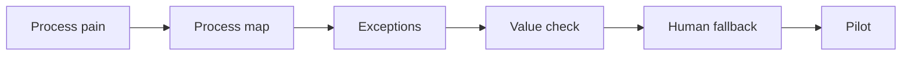

# AI Process Analysis and Automation Design

> AI automation starts with process understanding, not with a tool demo.

**Type:** Build
**Languages:** Python
**Prerequisites:** Phase 11 Lesson 24 (AI Use Case Spotting and Automation Discovery), Phase 11 Lesson 32 (AI Use Case Identification Workshop)
**Time:** ~45 minutes
**Capability:** Process Improvement - AI-Supported Automation Design

## Learning Objectives

- Identify process signals that make an AI automation idea worth analyzing
- Build a process-automation triage artifact in Python
- Map process pain, manual handoff, exception volume, and automation risk to controls
- Select pilot controls before automating a workflow
- Explain why exception handling and human fallback matter for AI automation

## The Problem

Many AI ideas start as "can we automate this?" before the process is understood. Without a process map, exception log, value check, and fallback plan, AI can make an inefficient process faster but less reliable.

## The Concept

Automation design begins with observable process signals. The team maps the flow, identifies handoffs and exceptions, checks value, and decides whether a pilot is safe.

### Signals to Look For

- process pain
- manual handoff
- exception volume
- automation risk

### Controls to Teach

- process map
- value check
- exception log
- human fallback

### Target Roles

- Business & Strategy Consulting
- Project Management & Agility
- Products & Value Streams
- Application Management

## Use It

Use the artifact for automation discovery, workflow redesign, AI pilot planning, and process-improvement workshops.

## Reusable Artifact

Process automation triage sheet.

The template in `outputs/sheet-process-automation-triage.md` can be used before choosing an AI automation pilot.

## Worked scenario

The demo's first case is **invoice handoff**: Manual handoff with exception volume and visible process pain. Treat the labels process pain, manual handoff, exception volume, automation risk as evidence to inspect, not as an automatic approval. The implementation's signal matcher looks for those terms in the scenario name, description, and explicit signal list; then the scorer combines impact, uncertainty, and two points per matched signal (capped at 20). The priority function maps that score to a control level: launch gate at 16 or above, guided pilot at 11–15, team practice at 7–10, and awareness below 7.

Run the case and check which of the controls — process map, value check, exception log, human fallback — appear in the returned row. Ask three questions: Which signal is supported by an observable source? Which control has an owner who can act this week? What evidence would move the case to a different priority? Then change one signal or impact value and rerun it. If the priority changes, explain whether the change came from the score, the matching rule, or both. The score is a triage aid; it does not replace domain approval, privacy review, or a pilot metric. Keep that distinction in the artifact and in the handoff.
## Key Takeaways

- AI automation should start with a mapped process.
- Exceptions determine how much human fallback is needed.
- Value checks prevent automating low-impact work.
- Pilots need clear boundaries before scaling.

## Build It

Reconstruct **AI Process Analysis and Automation Design** by following `Scenario` on the demo’s smallest built-in fixture. Run `python3 main.py` and verify that the result reports the empty case explicitly or raises the documented validation error.

## Ship It

Hand off `outputs/sheet-process-automation-triage.md` with the command `python3 main.py`, the accepted input shape (the demo’s smallest built-in fixture), the expected observable result, and a failure note for malformed inputs.

## Exercises

Make the experiment auditable. Save the input, output, and one sentence explaining how the result bears on the claim.

1. **Reproduce the control run.** Run [main.py](../code/main.py) with `python3 main.py` from the lesson's `code/` directory. Record the smallest input that demonstrates “Identify process signals that make an AI automation idea worth analyzing”. Point to `normalize()`, `signal_matches()`, `score_scenario()` and name the returned field or printed value that serves as evidence.
2. **Change one decision.** Change exactly one input, threshold, or option that affects “Build a process-automation triage artifact in Python”. Predict the direction of the change before running it, then compare the two outputs and explain why the other fields should stay stable.
3. **Probe a boundary.** Construct a case that stresses “Map process pain, manual handoff, exception volume, and automation risk to controls”: choose an empty collection, missing field, maximum-sized value, malformed record, or another boundary that fits this lesson. Write the expected behavior first and distinguish an intentional guard from an accidental crash.
4. **Transfer the result.** Open outputs/sheet-process-automation-triage.md and adapt one example to a real workflow. State the owner, evidence, and next decision required for “Select pilot controls before automating a workflow”; mark any assumption that the demo does not establish.

## Reference Solution

A useful submission records python3 main.py, the observed output, and the conclusion drawn from it. It should contain:

- evidence for “Identify process signals that make an AI automation idea worth analyzing” with the relevant input and returned field;
- a one-variable comparison that makes “Build a process-automation triage artifact in Python” visible;
- a predicted and observed boundary result for “Map process pain, manual handoff, exception volume, and automation risk to controls”, including why the behavior is safe; and
- one concrete update to outputs/sheet-process-automation-triage.md that applies “Select pilot controls before automating a workflow” without hiding uncertainty.

Use normalize(), signal_matches(), score_scenario() to explain the result, not only the prose output. If the experiment disagrees with the prediction, keep the failed prediction in the receipt and revise the explanation rather than changing the input until it passes.
