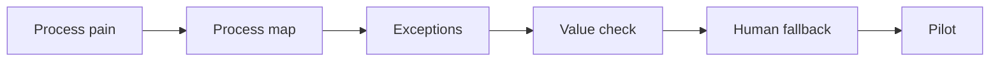

# AI Process Analysis and Automation Design

> AI automation starts with process understanding, not with a tool demo.

**Type:** Build
**Languages:** Python
**Prerequisites:** Phase 11 Lesson 24 (AI Use Case Spotting and Automation Discovery), Phase 11 Lesson 32 (AI Use Case Identification Workshop)
**Time:** ~45 minutes
**Capability:** Process Improvement - AI-Supported Automation Design

## Learning Objectives

- Identify process signals that make an AI automation idea worth analyzing
- Build a process-automation triage artifact in Python
- Map process pain, manual handoff, exception volume, and automation risk to controls
- Select pilot controls before automating a workflow
- Explain why exception handling and human fallback matter for AI automation

## The Problem

Many AI ideas start as "can we automate this?" before the process is understood. Without a process map, exception log, value check, and fallback plan, AI can make an inefficient process faster but less reliable.

## The Concept

Automation design begins with observable process signals. The team maps the flow, identifies handoffs and exceptions, checks value, and decides whether a pilot is safe.

### Signals to Look For

- process pain
- manual handoff
- exception volume
- automation risk

### Controls to Teach

- process map
- value check
- exception log
- human fallback

### Target Roles

- Business & Strategy Consulting
- Project Management & Agility
- Products & Value Streams
- Application Management

## Use It

Use the artifact for automation discovery, workflow redesign, AI pilot planning, and process-improvement workshops.

## Reusable Artifact

Process automation triage sheet.

The template in `outputs/sheet-process-automation-triage.md` can be used before choosing an AI automation pilot.

## Key Takeaways

- AI automation should start with a mapped process.
- Exceptions determine how much human fallback is needed.
- Value checks prevent automating low-impact work.
- Pilots need clear boundaries before scaling.

## Exercises

1. **Establish a baseline.** Run the lesson demo, then capture the inputs, outputs, and one invariant that demonstrates this objective: Identify process signals that make an AI automation idea worth analyzing.
2. **Change one variable.** Modify a single input or parameter and use the resulting evidence to investigate this objective: Build a process-automation triage artifact in Python.
3. **Probe an edge case.** Predict the result before running it, compare prediction with observation, and explain the discrepancy while applying this objective: Map process pain, manual handoff, exception volume, and automation risk to controls.

## Reference Solution

Use the canonical [main.py](../code/main.py) as the executable baseline. A complete solution records a successful run, identifies the invariant tied to “Identify process signals that make an AI automation idea worth analyzing,” and changes only one variable for the comparison. The edge-case result must distinguish the prediction from the observation, explain the cause using “Map process pain, manual handoff, exception volume, and automation risk to controls,” and cite a repeatable check rather than relying on visual inspection alone.
