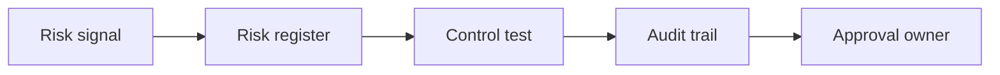

# AI Risk Management and Internal Controls

> AI risk work becomes actionable when every risk has an owner, a control, and evidence.

**Type:** Build
**Languages:** Python
**Prerequisites:** Phase 11 Lesson 18 (Responsible AI Compliance Workflow), Phase 11 Lesson 35 (AI Security and Prompt Injection Defense)
**Time:** ~45 minutes
**Capability:** Governance - AI Risk and Control Evidence

## Learning Objectives

- Identify AI risk scenarios that need internal control design
- Build a risk-and-control triage artifact in Python
- Map control owner, audit evidence, policy exception, and high impact to controls
- Choose when a risk belongs in a register, sprint, or committee review
- Explain why AI governance needs evidence, not only principles

## The Problem

Responsible AI policies are useful, but teams still need practical control evidence. If an AI use case has no owner, weak audit trail, or policy exception, the organization cannot prove that the risk is managed.

## The Concept

Risk management turns unclear concern into a control. A simple triage connects risk signals to a register, control test, audit trail, and approval owner.



### Signals to Look For

- control owner
- audit evidence
- policy exception
- high impact

### Controls to Teach

- risk register
- control test
- audit trail
- approval owner

### Target Roles

- Corporate Functions
- Leadership
- Business & Strategy Consulting
- Technology Consulting

## Build It

In the lab you build an AI risk and internal controls planner. It ranks risk scenarios and recommends the next governance step.

Run it locally:

```bash
cd phases/11-llm-engineering/51-ai-risk-management-internal-controls/code
python3 main.py
python3 -m unittest discover tests -v
```

## Use It

Use the artifact for AI risk intake, internal control design, audit preparation, and policy-exception review.

## Reusable Artifact

AI risk and control evidence register.

The template in `outputs/register-ai-risk-controls.md` can be used before an AI use case is approved for production or broader rollout.

## Key Takeaways

- AI governance needs named control ownership.
- Policy exceptions should be visible and reviewed.
- Audit evidence should be collected during delivery, not after.
- High-impact use cases need stronger review.
