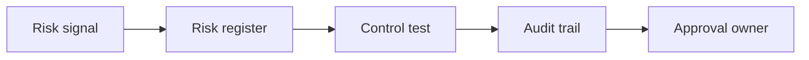

# AI Risk Management and Internal Controls

> AI risk work becomes actionable when every risk has an owner, a control, and evidence.

**Type:** Build
**Languages:** Python
**Prerequisites:** Phase 11 Lesson 18 (Responsible AI Compliance Workflow), Phase 11 Lesson 35 (AI Security and Prompt Injection Defense)
**Time:** ~45 minutes
**Capability:** Governance - AI Risk and Control Evidence

## Learning Objectives

- Identify AI risk scenarios that need internal control design
- Build a risk-and-control triage artifact in Python
- Map control owner, audit evidence, policy exception, and high impact to controls
- Choose when a risk belongs in a register, sprint, or committee review
- Explain why AI governance needs evidence, not only principles

## The Problem

Responsible AI policies are useful, but teams still need practical control evidence. If an AI use case has no owner, weak audit trail, or policy exception, the organization cannot prove that the risk is managed.

## The Concept

Risk management turns unclear concern into a control. A simple triage connects risk signals to a register, control test, audit trail, and approval owner.

### Signals to Look For

- control owner
- audit evidence
- policy exception
- high impact

### Controls to Teach

- risk register
- control test
- audit trail
- approval owner

### Target Roles

- Corporate Functions
- Leadership
- Business & Strategy Consulting
- Technology Consulting

## Use It

Use the artifact for AI risk intake, internal control design, audit preparation, and policy-exception review.

## Reusable Artifact

AI risk and control evidence register.

The template in `outputs/register-ai-risk-controls.md` can be used before an AI use case is approved for production or broader rollout.

## Worked scenario

The demo's first case is **customer-data assistant**: High impact AI use with policy exception and missing audit evidence. Treat the labels control owner, audit evidence, policy exception, high impact as evidence to inspect, not as an automatic approval. The implementation's signal matcher looks for those terms in the scenario name, description, and explicit signal list; then the scorer combines impact, uncertainty, and two points per matched signal (capped at 20). The priority function maps that score to a control level: launch gate at 16 or above, guided pilot at 11–15, team practice at 7–10, and awareness below 7.

Run the case and check which of the controls — risk register, control test, audit trail, approval owner — appear in the returned row. Ask three questions: Which signal is supported by an observable source? Which control has an owner who can act this week? What evidence would move the case to a different priority? Then change one signal or impact value and rerun it. If the priority changes, explain whether the change came from the score, the matching rule, or both. The score is a triage aid; it does not replace domain approval, privacy review, or a pilot metric. Keep that distinction in the artifact and in the handoff.
## Key Takeaways

- AI governance needs named control ownership.
- Policy exceptions should be visible and reviewed.
- Audit evidence should be collected during delivery, not after.
- High-impact use cases need stronger review.

## Build It

Reconstruct **AI Risk Management and Internal Controls** by following `Scenario` on the demo’s smallest built-in fixture. Run `python3 main.py` and verify that the result reports the empty case explicitly or raises the documented validation error.

## Ship It

Hand off `outputs/register-ai-risk-controls.md` with the command `python3 main.py`, the accepted input shape (the demo’s smallest built-in fixture), the expected observable result, and a failure note for malformed inputs.

## Exercises

Begin with a control run and leave a short receipt: input, output, and the reasoning that connects them to the objective.

1. **Trace the happy path.** Run [main.py](../code/main.py) with `python3 main.py` from the lesson's `code/` directory. Record the smallest input that demonstrates “Identify AI risk scenarios that need internal control design”. Point to `normalize()`, `signal_matches()`, `score_scenario()` and name the returned field or printed value that serves as evidence.
2. **Perturb the input.** Change exactly one input, threshold, or option that affects “Build a risk-and-control triage artifact in Python”. Predict the direction of the change before running it, then compare the two outputs and explain why the other fields should stay stable.
3. **Test a failure case.** Construct a case that stresses “Map control owner, audit evidence, policy exception, and high impact to controls”: choose an empty collection, missing field, maximum-sized value, malformed record, or another boundary that fits this lesson. Write the expected behavior first and distinguish an intentional guard from an accidental crash.
4. **Transfer the result.** Open outputs/register-ai-risk-controls.md and adapt one example to a real workflow. State the owner, evidence, and next decision required for “Choose when a risk belongs in a register, sprint, or committee review”; mark any assumption that the demo does not establish.

## Reference Solution

Keep the solution auditable: run python3 main.py, save the output, and explain what it demonstrates. Include:

- evidence for “Identify AI risk scenarios that need internal control design” with the relevant input and returned field;
- a one-variable comparison that makes “Build a risk-and-control triage artifact in Python” visible;
- a predicted and observed boundary result for “Map control owner, audit evidence, policy exception, and high impact to controls”, including why the behavior is safe; and
- one concrete update to outputs/register-ai-risk-controls.md that applies “Choose when a risk belongs in a register, sprint, or committee review” without hiding uncertainty.

Use normalize(), signal_matches(), score_scenario() to explain the result, not only the prose output. If the experiment disagrees with the prediction, keep the failed prediction in the receipt and revise the explanation rather than changing the input until it passes.
