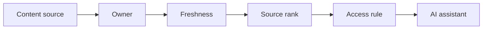

# AI Knowledge Management and Content Governance

> AI assistants are only as trustworthy as the knowledge sources they are allowed to use.

**Type:** Build
**Languages:** Python
**Prerequisites:** Phase 11 Lesson 36 (Internal Knowledge Assistants with RAG), Phase 11 Lesson 49 (AI Data Quality and Master Data Processes)
**Time:** ~45 minutes
**Capability:** Knowledge Management - Governed AI Content Sources

## Learning Objectives

- Identify content-governance gaps that weaken AI assistants
- Build a knowledge-source triage artifact in Python
- Map stale content, duplicate answer, unclear source, and access risk to controls
- Select source governance controls before knowledge is exposed to AI
- Explain why content owners, freshness checks, and access rules matter

## The Problem

Internal AI assistants often fail because the knowledge base is stale, duplicated, ownerless, or access-sensitive. Retrieval can make the wrong source look authoritative.

## The Concept

Knowledge governance prepares sources before they are used by AI. The team assigns owners, checks freshness, ranks sources, and verifies access rules.

### Signals to Look For

- stale content
- duplicate answer
- unclear source
- access risk

### Controls to Teach

- content owner
- freshness check
- source rank
- access rule

### Target Roles

- Corporate Functions
- Application Management
- Technology Consulting
- AI Champions

## Use It

Use the artifact for SharePoint cleanup, knowledge-base preparation, RAG source review, and content-owner assignment.

## Reusable Artifact

Knowledge source governance checklist.

The template in `outputs/checklist-knowledge-source-governance.md` can be used before internal content is connected to AI search or assistants.

## Key Takeaways

- Retrieval quality depends on source quality.
- Every important source needs an owner.
- Freshness and access checks are AI readiness controls.
- Duplicate answers should be resolved before launch.

## Exercises

1. **Establish a baseline.** Run the lesson demo, then capture the inputs, outputs, and one invariant that demonstrates this objective: Identify content-governance gaps that weaken AI assistants.
2. **Change one variable.** Modify a single input or parameter and use the resulting evidence to investigate this objective: Build a knowledge-source triage artifact in Python.
3. **Probe an edge case.** Predict the result before running it, compare prediction with observation, and explain the discrepancy while applying this objective: Map stale content, duplicate answer, unclear source, and access risk to controls.

## Reference Solution

Use the canonical [main.py](../code/main.py) as the executable baseline. A complete solution records a successful run, identifies the invariant tied to “Identify content-governance gaps that weaken AI assistants,” and changes only one variable for the comparison. The edge-case result must distinguish the prediction from the observation, explain the cause using “Map stale content, duplicate answer, unclear source, and access risk to controls,” and cite a repeatable check rather than relying on visual inspection alone.
