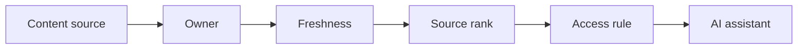

# AI Knowledge Management and Content Governance

> AI assistants are only as trustworthy as the knowledge sources they are allowed to use.

**Type:** Build
**Languages:** Python
**Prerequisites:** Phase 11 Lesson 36 (Internal Knowledge Assistants with RAG), Phase 11 Lesson 49 (AI Data Quality and Master Data Processes)
**Time:** ~45 minutes
**Capability:** Knowledge Management - Governed AI Content Sources

## Learning Objectives

- Identify content-governance gaps that weaken AI assistants
- Build a knowledge-source triage artifact in Python
- Map stale content, duplicate answer, unclear source, and access risk to controls
- Select source governance controls before knowledge is exposed to AI
- Explain why content owners, freshness checks, and access rules matter

## The Problem

Internal AI assistants often fail because the knowledge base is stale, duplicated, ownerless, or access-sensitive. Retrieval can make the wrong source look authoritative.

## The Concept

Knowledge governance prepares sources before they are used by AI. The team assigns owners, checks freshness, ranks sources, and verifies access rules.

### Signals to Look For

- stale content
- duplicate answer
- unclear source
- access risk

### Controls to Teach

- content owner
- freshness check
- source rank
- access rule

### Target Roles

- Corporate Functions
- Application Management
- Technology Consulting
- AI Champions

## Use It

Use the artifact for SharePoint cleanup, knowledge-base preparation, RAG source review, and content-owner assignment.

## Reusable Artifact

Knowledge source governance checklist.

The template in `outputs/checklist-knowledge-source-governance.md` can be used before internal content is connected to AI search or assistants.

## Worked scenario

The demo's first case is **policy assistant source**: Stale content and unclear source create duplicate answer risk. Treat the labels stale content, duplicate answer, unclear source, access risk as evidence to inspect, not as an automatic approval. The implementation's signal matcher looks for those terms in the scenario name, description, and explicit signal list; then the scorer combines impact, uncertainty, and two points per matched signal (capped at 20). The priority function maps that score to a control level: launch gate at 16 or above, guided pilot at 11–15, team practice at 7–10, and awareness below 7.

Run the case and check which of the controls — content owner, freshness check, source rank, access rule — appear in the returned row. Ask three questions: Which signal is supported by an observable source? Which control has an owner who can act this week? What evidence would move the case to a different priority? Then change one signal or impact value and rerun it. If the priority changes, explain whether the change came from the score, the matching rule, or both. The score is a triage aid; it does not replace domain approval, privacy review, or a pilot metric. Keep that distinction in the artifact and in the handoff.
## Key Takeaways

- Retrieval quality depends on source quality.
- Every important source needs an owner.
- Freshness and access checks are AI readiness controls.
- Duplicate answers should be resolved before launch.

## Build It

Reconstruct **AI Knowledge Management and Content Governance** by following `Scenario` on a graph with edges (0,1) and (1,2). Run `python3 main.py` and verify that degrees, adjacency, or connectivity expose the isolated/no-edge case explicitly.

## Ship It

Hand off `outputs/checklist-knowledge-source-governance.md` with the command `python3 main.py`, the accepted input shape (a graph with edges (0,1) and (1,2)), the expected observable result, and a failure note for malformed inputs.

## Exercises

Treat this as a lab exercise. Preserve the setup and result, then explain which observation is doing the evidentiary work.

1. **Start with a known input.** Run [main.py](../code/main.py) with `python3 main.py` from the lesson's `code/` directory. Record the smallest input that demonstrates “Identify content-governance gaps that weaken AI assistants”. Point to `normalize()`, `signal_matches()`, `score_scenario()` and name the returned field or printed value that serves as evidence.
2. **Run a controlled comparison.** Change exactly one input, threshold, or option that affects “Build a knowledge-source triage artifact in Python”. Predict the direction of the change before running it, then compare the two outputs and explain why the other fields should stay stable.
3. **Try the smallest valid counterexample.** Construct a case that stresses “Map stale content, duplicate answer, unclear source, and access risk to controls”: choose an empty collection, missing field, maximum-sized value, malformed record, or another boundary that fits this lesson. Write the expected behavior first and distinguish an intentional guard from an accidental crash.
4. **Transfer the result.** Open outputs/checklist-knowledge-source-governance.md and adapt one example to a real workflow. State the owner, evidence, and next decision required for “Select source governance controls before knowledge is exposed to AI”; mark any assumption that the demo does not establish.

## Reference Solution

A complete handoff records python3 main.py, the observed output, and the reasoning behind it. Check:

- evidence for “Identify content-governance gaps that weaken AI assistants” with the relevant input and returned field;
- a one-variable comparison that makes “Build a knowledge-source triage artifact in Python” visible;
- a predicted and observed boundary result for “Map stale content, duplicate answer, unclear source, and access risk to controls”, including why the behavior is safe; and
- one concrete update to outputs/checklist-knowledge-source-governance.md that applies “Select source governance controls before knowledge is exposed to AI” without hiding uncertainty.

Use normalize(), signal_matches(), score_scenario() to explain the result, not only the prose output. If the experiment disagrees with the prediction, keep the failed prediction in the receipt and revise the explanation rather than changing the input until it passes.
