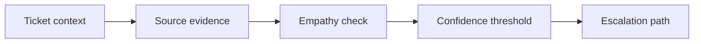

# AI Customer Communication and Service Quality

> AI service replies need evidence, empathy, confidence thresholds, and a clear escalation path.

**Type:** Build
**Languages:** Python
**Prerequisites:** Phase 11 Lesson 43 (AI for Service Management and Support), Phase 11 Lesson 45 (AI for Corporate Communications and Marketing)
**Time:** ~45 minutes
**Capability:** Customer Service - AI-Assisted Response Quality

## Learning Objectives

- Identify customer communication scenarios where AI requires stronger review
- Build a service-response triage artifact in Python
- Map customer frustration, response uncertainty, SLA risk, and escalation need to controls
- Select response controls before AI-assisted service messages are sent
- Explain why service communication needs both accuracy and empathy

## The Problem

AI can draft service replies and customer updates quickly. If the source is uncertain, tone is wrong, or escalation is missed, the reply can increase customer frustration even when it sounds professional.

## The Concept

Service quality needs four controls: source evidence, empathy check, confidence threshold, and escalation path. These make AI-assisted replies useful without hiding uncertainty.

### Signals to Look For

- customer frustration
- response uncertainty
- sla risk
- escalation need

### Controls to Teach

- response source
- empathy check
- confidence threshold
- escalation path

### Target Roles

- Application Management
- Products & Value Streams
- Business & Strategy Consulting
- Customer-facing Teams

## Use It

Use the artifact for support replies, customer updates, service recovery messages, and escalation preparation.

## Reusable Artifact

Customer response quality checklist.

The template in `outputs/checklist-customer-response-quality.md` can be used before sending AI-assisted customer communication.

## Worked scenario

The demo's first case is **delayed service reply**: Customer frustration, SLA risk and response uncertainty. Treat the labels customer frustration, response uncertainty, sla risk, escalation need as evidence to inspect, not as an automatic approval. The implementation's signal matcher looks for those terms in the scenario name, description, and explicit signal list; then the scorer combines impact, uncertainty, and two points per matched signal (capped at 20). The priority function maps that score to a control level: launch gate at 16 or above, guided pilot at 11–15, team practice at 7–10, and awareness below 7.

Run the case and check which of the controls — response source, empathy check, confidence threshold, escalation path — appear in the returned row. Ask three questions: Which signal is supported by an observable source? Which control has an owner who can act this week? What evidence would move the case to a different priority? Then change one signal or impact value and rerun it. If the priority changes, explain whether the change came from the score, the matching rule, or both. The score is a triage aid; it does not replace domain approval, privacy review, or a pilot metric. Keep that distinction in the artifact and in the handoff.
## Key Takeaways

- Customer-facing AI needs a source-backed answer.
- Empathy checks matter as much as factual checks.
- Low confidence should trigger escalation.
- SLA risk changes the review threshold.

## Build It

Reconstruct **AI Customer Communication and Service Quality** by following `Scenario` on the demo’s smallest built-in fixture. Run `python3 main.py` and verify that the result reports the empty case explicitly or raises the documented validation error.

## Ship It

Hand off `outputs/checklist-customer-response-quality.md` with the command `python3 main.py`, the accepted input shape (the demo’s smallest built-in fixture), the expected observable result, and a failure note for malformed inputs.

## Exercises

Start with the smallest reproducible run. Keep the input, output, and interpretation together so another reader can repeat the check.

1. **Reproduce the control run.** Run [main.py](../code/main.py) with `python3 main.py` from the lesson's `code/` directory. Record the smallest input that demonstrates “Identify customer communication scenarios where AI requires stronger review”. Point to `normalize()`, `signal_matches()`, `score_scenario()` and name the returned field or printed value that serves as evidence.
2. **Change one decision.** Change exactly one input, threshold, or option that affects “Build a service-response triage artifact in Python”. Predict the direction of the change before running it, then compare the two outputs and explain why the other fields should stay stable.
3. **Probe a boundary.** Construct a case that stresses “Map customer frustration, response uncertainty, SLA risk, and escalation need to controls”: choose an empty collection, missing field, maximum-sized value, malformed record, or another boundary that fits this lesson. Write the expected behavior first and distinguish an intentional guard from an accidental crash.
4. **Transfer the result.** Open outputs/checklist-customer-response-quality.md and adapt one example to a real workflow. State the owner, evidence, and next decision required for “Select response controls before AI-assisted service messages are sent”; mark any assumption that the demo does not establish.

## Reference Solution

Your solution is complete when it records python3 main.py, the captured output, and a short interpretation. Show:

- evidence for “Identify customer communication scenarios where AI requires stronger review” with the relevant input and returned field;
- a one-variable comparison that makes “Build a service-response triage artifact in Python” visible;
- a predicted and observed boundary result for “Map customer frustration, response uncertainty, SLA risk, and escalation need to controls”, including why the behavior is safe; and
- one concrete update to outputs/checklist-customer-response-quality.md that applies “Select response controls before AI-assisted service messages are sent” without hiding uncertainty.

Use normalize(), signal_matches(), score_scenario() to explain the result, not only the prose output. If the experiment disagrees with the prediction, keep the failed prediction in the receipt and revise the explanation rather than changing the input until it passes.
