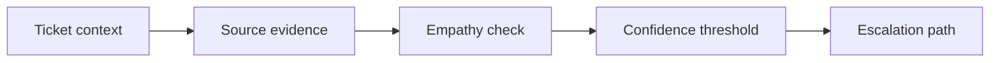

# AI Customer Communication and Service Quality

> AI service replies need evidence, empathy, confidence thresholds, and a clear escalation path.

**Type:** Build
**Languages:** Python
**Prerequisites:** Phase 11 Lesson 43 (AI for Service Management and Support), Phase 11 Lesson 45 (AI for Corporate Communications and Marketing)
**Time:** ~45 minutes
**Capability:** Customer Service - AI-Assisted Response Quality

## Learning Objectives

- Identify customer communication scenarios where AI requires stronger review
- Build a service-response triage artifact in Python
- Map customer frustration, response uncertainty, SLA risk, and escalation need to controls
- Select response controls before AI-assisted service messages are sent
- Explain why service communication needs both accuracy and empathy

## The Problem

AI can draft service replies and customer updates quickly. If the source is uncertain, tone is wrong, or escalation is missed, the reply can increase customer frustration even when it sounds professional.

## The Concept

Service quality needs four controls: source evidence, empathy check, confidence threshold, and escalation path. These make AI-assisted replies useful without hiding uncertainty.



### Signals to Look For

- customer frustration
- response uncertainty
- sla risk
- escalation need

### Controls to Teach

- response source
- empathy check
- confidence threshold
- escalation path

### Target Roles

- Application Management
- Products & Value Streams
- Business & Strategy Consulting
- Customer-facing Teams

## Build It

In the lab you build a customer service communication planner. It ranks response scenarios and recommends quality controls.

Run it locally:

```bash
cd phases/11-llm-engineering/53-ai-customer-communication-service-quality/code
python3 main.py
python3 -m unittest discover tests -v
```

## Use It

Use the artifact for support replies, customer updates, service recovery messages, and escalation preparation.

## Reusable Artifact

Customer response quality checklist.

The template in `outputs/checklist-customer-response-quality.md` can be used before sending AI-assisted customer communication.

## Key Takeaways

- Customer-facing AI needs a source-backed answer.
- Empathy checks matter as much as factual checks.
- Low confidence should trigger escalation.
- SLA risk changes the review threshold.
