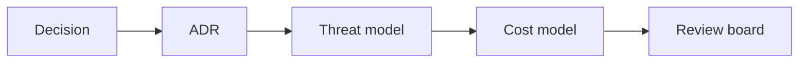

# AI Architecture Decision Governance

> AI architecture decisions need recorded tradeoffs before they become expensive defaults.

**Type:** Build
**Languages:** Python
**Prerequisites:** Phase 11 Lesson 03 (Structured Outputs), Phase 11 Lesson 37 (AI Vendor and Procurement Evaluation)
**Time:** ~45 minutes
**Capability:** Architecture - Governed AI Design Decisions

## Learning Objectives

- Identify AI architecture decisions that need formal governance
- Build an architecture-decision triage artifact in Python
- Map technical uncertainty, vendor lock-in, security boundary, and cost tradeoff to controls
- Choose when to create a design note, ADR, or architecture review
- Explain why reversibility matters in AI architecture decisions

## The Problem

AI architecture choices can become sticky: model providers, gateways, RAG designs, security boundaries, observability tools, and cost patterns. If tradeoffs are not recorded, teams inherit decisions without context.

## The Concept

Architecture governance records the decision, alternatives, risk, cost, security boundary, and review owner. The stronger the impact and the harder the reversal, the stronger the governance gate.

### Signals to Look For

- technical uncertainty
- vendor lock-in
- security boundary
- cost tradeoff

### Controls to Teach

- adr record
- threat model
- cost model
- review board

### Target Roles

- Technology Consulting
- Products & Value Streams
- Application Management
- Leadership

## Use It

Use the artifact for model gateway decisions, RAG architecture choices, vendor selection, AI security boundary design, and cost tradeoff reviews.

## Reusable Artifact

AI architecture decision record template.

The template in `outputs/template-ai-architecture-decision-record.md` can be used before approving a material AI architecture decision.

## Worked scenario

The demo's first case is **model gateway choice**: Vendor lock in, cost tradeoff and security boundary are open. Treat the labels technical uncertainty, vendor lock in, security boundary, cost tradeoff as evidence to inspect, not as an automatic approval. The implementation's signal matcher looks for those terms in the scenario name, description, and explicit signal list; then the scorer combines impact, uncertainty, and two points per matched signal (capped at 20). The priority function maps that score to a control level: launch gate at 16 or above, guided pilot at 11–15, team practice at 7–10, and awareness below 7.

Run the case and check which of the controls — adr record, threat model, cost model, review board — appear in the returned row. Ask three questions: Which signal is supported by an observable source? Which control has an owner who can act this week? What evidence would move the case to a different priority? Then change one signal or impact value and rerun it. If the priority changes, explain whether the change came from the score, the matching rule, or both. The score is a triage aid; it does not replace domain approval, privacy review, or a pilot metric. Keep that distinction in the artifact and in the handoff.
## Key Takeaways

- AI architecture decisions should be recorded before scaling.
- Vendor lock-in and security boundaries raise governance needs.
- Cost tradeoffs belong in the architecture discussion.
- Reversibility determines how formal the review should be.

## Build It

Reconstruct **AI Architecture Decision Governance** by following `Scenario` on the demo’s smallest built-in fixture. Run `python3 main.py` and verify that the result reports the empty case explicitly or raises the documented validation error.

## Ship It

Hand off `outputs/template-ai-architecture-decision-record.md` with the command `python3 main.py`, the accepted input shape (the demo’s smallest built-in fixture), the expected observable result, and a failure note for malformed inputs.

## Exercises

Use the demo as evidence, not as a ceremony: record what went in, what came out, and why that observation supports the objective.

1. **Trace the happy path.** Run [main.py](../code/main.py) with `python3 main.py` from the lesson's `code/` directory. Record the smallest input that demonstrates “Identify AI architecture decisions that need formal governance”. Point to `normalize()`, `signal_matches()`, `score_scenario()` and name the returned field or printed value that serves as evidence.
2. **Perturb the input.** Change exactly one input, threshold, or option that affects “Build an architecture-decision triage artifact in Python”. Predict the direction of the change before running it, then compare the two outputs and explain why the other fields should stay stable.
3. **Test a failure case.** Construct a case that stresses “Map technical uncertainty, vendor lock-in, security boundary, and cost tradeoff to controls”: choose an empty collection, missing field, maximum-sized value, malformed record, or another boundary that fits this lesson. Write the expected behavior first and distinguish an intentional guard from an accidental crash.
4. **Transfer the result.** Open outputs/template-ai-architecture-decision-record.md and adapt one example to a real workflow. State the owner, evidence, and next decision required for “Choose when to create a design note, ADR, or architecture review”; mark any assumption that the demo does not establish.

## Reference Solution

The reference run should leave a small receipt: python3 main.py, its captured output, and your interpretation. Include:

- evidence for “Identify AI architecture decisions that need formal governance” with the relevant input and returned field;
- a one-variable comparison that makes “Build an architecture-decision triage artifact in Python” visible;
- a predicted and observed boundary result for “Map technical uncertainty, vendor lock-in, security boundary, and cost tradeoff to controls”, including why the behavior is safe; and
- one concrete update to outputs/template-ai-architecture-decision-record.md that applies “Choose when to create a design note, ADR, or architecture review” without hiding uncertainty.

Use normalize(), signal_matches(), score_scenario() to explain the result, not only the prose output. If the experiment disagrees with the prediction, keep the failed prediction in the receipt and revise the explanation rather than changing the input until it passes.
