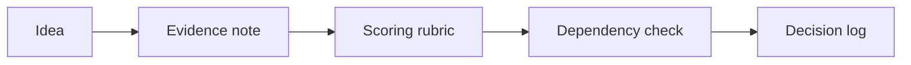

# AI Product Backlog and Prioritization

> AI helps backlog work when it improves evidence, scoring, dependencies, and decisions instead of just rewriting tickets.

**Type:** Build
**Languages:** Python
**Prerequisites:** Phase 11 Lesson 23 (AI-Enhanced User Research), Phase 11 Lesson 29 (Decision Making with AI)
**Time:** ~45 minutes
**Capability:** Product Management - AI-Supported Backlog Decisions

## Learning Objectives

- Identify backlog items where AI can support prioritization
- Build a product-backlog triage artifact in Python
- Map customer value, delivery effort, risk reduction, and dependency pressure to controls
- Select evidence and decision controls before prioritization
- Explain why AI-supported prioritization needs a transparent rubric

## The Problem

AI can help rewrite tickets, group feedback, and summarize roadmap options. That is useful, but product decisions still need evidence, effort, dependencies, and a clear decision log.

## The Concept

Backlog prioritization should turn fuzzy ideas into comparable options. AI can help structure the evidence, but the team must keep the scoring rubric and decision record visible.



### Signals to Look For

- customer value
- delivery effort
- risk reduction
- dependency pressure

### Controls to Teach

- evidence note
- scoring rubric
- dependency check
- decision log

### Target Roles

- Products & Value Streams
- Project Management & Agility
- Business & Strategy Consulting
- Leadership

## Build It

In the lab you build a backlog prioritization planner. It ranks product scenarios and recommends controls before planning review.

Run it locally:

```bash
cd phases/11-llm-engineering/55-ai-product-backlog-prioritization/code
python3 main.py
python3 -m unittest discover tests -v
```

## Use It

Use the artifact for backlog grooming, roadmap preparation, discovery refinement, and product steering discussions.

## Reusable Artifact

AI backlog prioritization sheet.

The template in `outputs/sheet-backlog-prioritization.md` can be used before AI-assisted backlog or roadmap prioritization.

## Key Takeaways

- AI can structure product evidence but should not hide the rubric.
- Backlog priority needs value and effort context.
- Dependency pressure should be visible before planning.
- Decisions should be logged for later learning.
