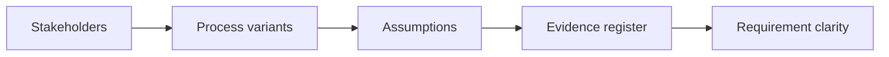

# AI Business Analysis and Process Discovery

> AI improves business analysis when it reveals assumptions, process variants, and evidence gaps.

**Type:** Build
**Languages:** Python
**Prerequisites:** Phase 11 Lesson 04 (AI: Requirement Engineering with AI), Phase 11 Lesson 50 (AI Process Analysis and Automation Design)
**Time:** ~45 minutes
**Capability:** Business Analysis - AI-Supported Discovery

## Learning Objectives

- Identify discovery situations where AI can support business analysis
- Build a discovery triage artifact in Python
- Map stakeholder gap, process variant, requirement ambiguity, and evidence missing to controls
- Select interview, mapping, assumption, and evidence controls
- Explain why AI-assisted analysis must separate facts from assumptions

## The Problem

AI can turn interview notes and process descriptions into clean summaries. If stakeholders, variants, requirements, or evidence are missing, a clean summary can create false confidence.

## The Concept

Business analysis uses AI best when discovery gaps are visible. The analyst asks better questions, maps variants, logs assumptions, and maintains an evidence register.

### Signals to Look For

- stakeholder gap
- process variant
- requirement ambiguity
- evidence missing

### Controls to Teach

- interview guide
- process variant map
- assumption log
- evidence register

### Target Roles

- Business & Strategy Consulting
- Project Management & Agility
- Products & Value Streams
- Leadership

## Use It

Use the artifact for stakeholder interviews, process discovery, requirement clarification, and AI-assisted business analysis.

## Reusable Artifact

Business analysis discovery canvas.

The template in `outputs/canvas-business-analysis-discovery.md` can be used before AI-assisted requirement or process analysis.

## Worked scenario

The demo's first case is **claim workflow**: Stakeholder gap and process variant create requirement ambiguity. Treat the labels stakeholder gap, process variant, requirement ambiguity, evidence missing as evidence to inspect, not as an automatic approval. The implementation's signal matcher looks for those terms in the scenario name, description, and explicit signal list; then the scorer combines impact, uncertainty, and two points per matched signal (capped at 20). The priority function maps that score to a control level: launch gate at 16 or above, guided pilot at 11–15, team practice at 7–10, and awareness below 7.

Run the case and check which of the controls — interview guide, process variant map, assumption log, evidence register — appear in the returned row. Ask three questions: Which signal is supported by an observable source? Which control has an owner who can act this week? What evidence would move the case to a different priority? Then change one signal or impact value and rerun it. If the priority changes, explain whether the change came from the score, the matching rule, or both. The score is a triage aid; it does not replace domain approval, privacy review, or a pilot metric. Keep that distinction in the artifact and in the handoff.
## Key Takeaways

- AI summaries need explicit evidence.
- Stakeholder gaps should trigger better interview design.
- Process variants belong in the analysis before solutioning.
- Assumption logs protect requirement quality.

## Build It

Reconstruct **AI Business Analysis and Process Discovery** by following `Scenario` on the demo’s smallest built-in fixture. Run `python3 main.py` and verify that the result reports the empty case explicitly or raises the documented validation error.

## Ship It

Hand off `outputs/canvas-business-analysis-discovery.md` with the command `python3 main.py`, the accepted input shape (the demo’s smallest built-in fixture), the expected observable result, and a failure note for malformed inputs.

## Exercises

Make the experiment auditable. Save the input, output, and one sentence explaining how the result bears on the claim.

1. **Start with a known input.** Run [main.py](../code/main.py) with `python3 main.py` from the lesson's `code/` directory. Record the smallest input that demonstrates “Identify discovery situations where AI can support business analysis”. Point to `normalize()`, `signal_matches()`, `score_scenario()` and name the returned field or printed value that serves as evidence.
2. **Run a controlled comparison.** Change exactly one input, threshold, or option that affects “Build a discovery triage artifact in Python”. Predict the direction of the change before running it, then compare the two outputs and explain why the other fields should stay stable.
3. **Try the smallest valid counterexample.** Construct a case that stresses “Map stakeholder gap, process variant, requirement ambiguity, and evidence missing to controls”: choose an empty collection, missing field, maximum-sized value, malformed record, or another boundary that fits this lesson. Write the expected behavior first and distinguish an intentional guard from an accidental crash.
4. **Transfer the result.** Open outputs/canvas-business-analysis-discovery.md and adapt one example to a real workflow. State the owner, evidence, and next decision required for “Select interview, mapping, assumption, and evidence controls”; mark any assumption that the demo does not establish.

## Reference Solution

A useful submission records python3 main.py, the observed output, and the conclusion drawn from it. It should contain:

- evidence for “Identify discovery situations where AI can support business analysis” with the relevant input and returned field;
- a one-variable comparison that makes “Build a discovery triage artifact in Python” visible;
- a predicted and observed boundary result for “Map stakeholder gap, process variant, requirement ambiguity, and evidence missing to controls”, including why the behavior is safe; and
- one concrete update to outputs/canvas-business-analysis-discovery.md that applies “Select interview, mapping, assumption, and evidence controls” without hiding uncertainty.

Use normalize(), signal_matches(), score_scenario() to explain the result, not only the prose output. If the experiment disagrees with the prediction, keep the failed prediction in the receipt and revise the explanation rather than changing the input until it passes.
