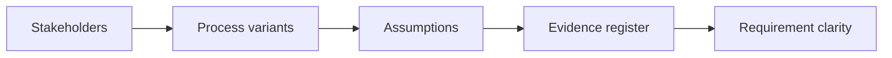

# AI Business Analysis and Process Discovery

> AI improves business analysis when it reveals assumptions, process variants, and evidence gaps.

**Type:** Build
**Languages:** Python
**Prerequisites:** Phase 11 Lesson 04 (AI: Requirement Engineering with AI), Phase 11 Lesson 50 (AI Process Analysis and Automation Design)
**Time:** ~45 minutes
**Capability:** Business Analysis - AI-Supported Discovery

## Learning Objectives

- Identify discovery situations where AI can support business analysis
- Build a discovery triage artifact in Python
- Map stakeholder gap, process variant, requirement ambiguity, and evidence missing to controls
- Select interview, mapping, assumption, and evidence controls
- Explain why AI-assisted analysis must separate facts from assumptions

## The Problem

AI can turn interview notes and process descriptions into clean summaries. If stakeholders, variants, requirements, or evidence are missing, a clean summary can create false confidence.

## The Concept

Business analysis uses AI best when discovery gaps are visible. The analyst asks better questions, maps variants, logs assumptions, and maintains an evidence register.



### Signals to Look For

- stakeholder gap
- process variant
- requirement ambiguity
- evidence missing

### Controls to Teach

- interview guide
- process variant map
- assumption log
- evidence register

### Target Roles

- Business & Strategy Consulting
- Project Management & Agility
- Products & Value Streams
- Leadership

## Build It

In the lab you build a business-analysis discovery planner. It ranks analysis scenarios and recommends discovery controls.

Run it locally:

```bash
cd phases/11-llm-engineering/56-ai-business-analysis-process-discovery/code
python3 main.py
python3 -m unittest discover tests -v
```

## Use It

Use the artifact for stakeholder interviews, process discovery, requirement clarification, and AI-assisted business analysis.

## Reusable Artifact

Business analysis discovery canvas.

The template in `outputs/canvas-business-analysis-discovery.md` can be used before AI-assisted requirement or process analysis.

## Key Takeaways

- AI summaries need explicit evidence.
- Stakeholder gaps should trigger better interview design.
- Process variants belong in the analysis before solutioning.
- Assumption logs protect requirement quality.
