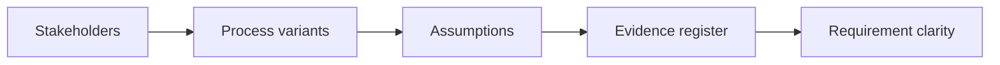

# AI Business Analysis and Process Discovery

> AI improves business analysis when it reveals assumptions, process variants, and evidence gaps.

**Type:** Build
**Languages:** Python
**Prerequisites:** Phase 11 Lesson 04 (AI: Requirement Engineering with AI), Phase 11 Lesson 50 (AI Process Analysis and Automation Design)
**Time:** ~45 minutes
**Capability:** Business Analysis - AI-Supported Discovery

## Learning Objectives

- Identify discovery situations where AI can support business analysis
- Build a discovery triage artifact in Python
- Map stakeholder gap, process variant, requirement ambiguity, and evidence missing to controls
- Select interview, mapping, assumption, and evidence controls
- Explain why AI-assisted analysis must separate facts from assumptions

## The Problem

AI can turn interview notes and process descriptions into clean summaries. If stakeholders, variants, requirements, or evidence are missing, a clean summary can create false confidence.

## The Concept

Business analysis uses AI best when discovery gaps are visible. The analyst asks better questions, maps variants, logs assumptions, and maintains an evidence register.

### Signals to Look For

- stakeholder gap
- process variant
- requirement ambiguity
- evidence missing

### Controls to Teach

- interview guide
- process variant map
- assumption log
- evidence register

### Target Roles

- Business & Strategy Consulting
- Project Management & Agility
- Products & Value Streams
- Leadership

## Use It

Use the artifact for stakeholder interviews, process discovery, requirement clarification, and AI-assisted business analysis.

## Reusable Artifact

Business analysis discovery canvas.

The template in `outputs/canvas-business-analysis-discovery.md` can be used before AI-assisted requirement or process analysis.

## Key Takeaways

- AI summaries need explicit evidence.
- Stakeholder gaps should trigger better interview design.
- Process variants belong in the analysis before solutioning.
- Assumption logs protect requirement quality.

## Exercises

1. **Establish a baseline.** Run the lesson demo, then capture the inputs, outputs, and one invariant that demonstrates this objective: Identify discovery situations where AI can support business analysis.
2. **Change one variable.** Modify a single input or parameter and use the resulting evidence to investigate this objective: Build a discovery triage artifact in Python.
3. **Probe an edge case.** Predict the result before running it, compare prediction with observation, and explain the discrepancy while applying this objective: Map stakeholder gap, process variant, requirement ambiguity, and evidence missing to controls.

## Reference Solution

Use the canonical [main.py](../code/main.py) as the executable baseline. A complete solution records a successful run, identifies the invariant tied to “Identify discovery situations where AI can support business analysis,” and changes only one variable for the comparison. The edge-case result must distinguish the prediction from the observation, explain the cause using “Map stakeholder gap, process variant, requirement ambiguity, and evidence missing to controls,” and cite a repeatable check rather than relying on visual inspection alone.
