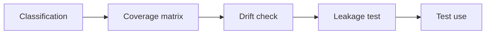

# AI Test Data and Synthetic Data Governance

> Synthetic test data is useful only when privacy, coverage, drift, and leakage are controlled.

**Type:** Build
**Languages:** Python
**Prerequisites:** Phase 11 Lesson 19 (AI-Driven Testing and QA), Phase 11 Lesson 49 (AI Data Quality and Master Data Processes)
**Time:** ~45 minutes
**Capability:** Quality Engineering - Governed Test Data

## Learning Objectives

- Identify test-data scenarios where synthetic data needs governance
- Build a test-data governance artifact in Python
- Map privacy risk, coverage gap, synthetic drift, and data leakage to controls
- Select classification, coverage, drift, and leakage controls
- Explain why synthetic data still requires governance

## The Problem

Synthetic data can help teams test without using sensitive production data. But it can still leak patterns, miss edge cases, drift away from reality, or create false coverage confidence.

## The Concept

Test data governance starts with classification and coverage. Synthetic data should be checked against target scenarios, privacy constraints, and leakage tests before use.



### Signals to Look For

- privacy risk
- coverage gap
- synthetic drift
- data leakage

### Controls to Teach

- data classification
- coverage matrix
- drift check
- leakage test

### Target Roles

- Technology Consulting
- Application Management
- Products & Value Streams
- Corporate Functions

## Build It

In the lab you build a synthetic test-data governance planner. It ranks test-data scenarios and recommends controls before use.

Run it locally:

```bash
cd phases/11-llm-engineering/57-ai-test-data-synthetic-data-governance/code
python3 main.py
python3 -m unittest discover tests -v
```

## Use It

Use the artifact for test-data requests, synthetic-data design, QA planning, and privacy-sensitive regression testing.

## Reusable Artifact

Synthetic test-data governance checklist.

The template in `outputs/checklist-synthetic-test-data-governance.md` can be used before synthetic or masked data is used in tests.

## Key Takeaways

- Synthetic data can still carry governance risk.
- Coverage needs explicit scenarios and edge cases.
- Drift checks protect test relevance.
- Leakage tests protect privacy and trust.
