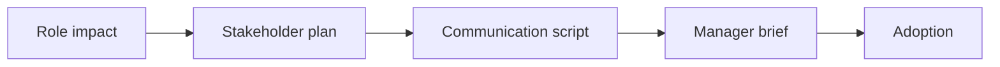

# AI Change Impact and Stakeholder Analysis

> AI adoption succeeds when role impact, stakeholder needs, communication, and manager enablement are explicit.

**Type:** Build
**Languages:** Python
**Prerequisites:** Phase 11 Lesson 33 (AI Change Management and Team Integration), Phase 11 Lesson 45 (AI for Corporate Communications and Marketing)
**Time:** ~45 minutes
**Capability:** Change Management - Stakeholder Impact Mapping

## Learning Objectives

- Identify AI rollouts that require change-impact analysis
- Build a stakeholder-impact artifact in Python
- Map role impact, adoption risk, communication gap, and manager dependency to controls
- Select impact, stakeholder, communication, and manager-enablement controls
- Explain why AI adoption needs role-specific change planning

## The Problem

AI rollouts often focus on tools and training. Teams still struggle when roles change, managers cannot explain expectations, or stakeholders do not see how the change affects their work.

## The Concept

Change analysis starts with impact. The team maps affected roles, stakeholder needs, communication gaps, and manager dependencies before scaling adoption.



### Signals to Look For

- role impact
- adoption risk
- communication gap
- manager dependency

### Controls to Teach

- impact map
- stakeholder plan
- communication script
- manager brief

### Target Roles

- Leadership
- Project Management & Agility
- Corporate Functions
- AI Champions

## Build It

In the lab you build a change-impact planner. It ranks adoption scenarios and recommends stakeholder controls.

Run it locally:

```bash
cd phases/11-llm-engineering/58-ai-change-impact-stakeholder-analysis/code
python3 main.py
python3 -m unittest discover tests -v
```

## Use It

Use the artifact for AI rollout planning, role-impact analysis, stakeholder communication, and manager enablement.

## Reusable Artifact

AI change impact map.

The template in `outputs/map-ai-change-impact.md` can be used before an AI tool, workflow, or assistant is rolled out.

## Key Takeaways

- AI change planning starts with role impact.
- Managers need clear briefing material.
- Communication gaps become adoption risk.
- Stakeholder plans should be specific to the affected work.
