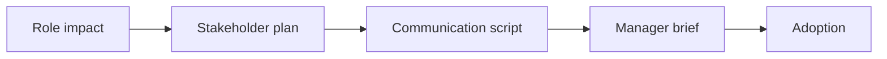

# AI Change Impact and Stakeholder Analysis

> AI adoption succeeds when role impact, stakeholder needs, communication, and manager enablement are explicit.

**Type:** Build
**Languages:** Python
**Prerequisites:** Phase 11 Lesson 33 (AI Change Management and Team Integration), Phase 11 Lesson 45 (AI for Corporate Communications and Marketing)
**Time:** ~45 minutes
**Capability:** Change Management - Stakeholder Impact Mapping

## Learning Objectives

- Identify AI rollouts that require change-impact analysis
- Build a stakeholder-impact artifact in Python
- Map role impact, adoption risk, communication gap, and manager dependency to controls
- Select impact, stakeholder, communication, and manager-enablement controls
- Explain why AI adoption needs role-specific change planning

## The Problem

AI rollouts often focus on tools and training. Teams still struggle when roles change, managers cannot explain expectations, or stakeholders do not see how the change affects their work.

## The Concept

Change analysis starts with impact. The team maps affected roles, stakeholder needs, communication gaps, and manager dependencies before scaling adoption.

### Signals to Look For

- role impact
- adoption risk
- communication gap
- manager dependency

### Controls to Teach

- impact map
- stakeholder plan
- communication script
- manager brief

### Target Roles

- Leadership
- Project Management & Agility
- Corporate Functions
- AI Champions

## Use It

Use the artifact for AI rollout planning, role-impact analysis, stakeholder communication, and manager enablement.

## Reusable Artifact

AI change impact map.

The template in `outputs/map-ai-change-impact.md` can be used before an AI tool, workflow, or assistant is rolled out.

## Worked scenario

The demo's first case is **assistant rollout**: Role impact and adoption risk are high with manager dependency. Treat the labels role impact, adoption risk, communication gap, manager dependency as evidence to inspect, not as an automatic approval. The implementation's signal matcher looks for those terms in the scenario name, description, and explicit signal list; then the scorer combines impact, uncertainty, and two points per matched signal (capped at 20). The priority function maps that score to a control level: launch gate at 16 or above, guided pilot at 11–15, team practice at 7–10, and awareness below 7.

Run the case and check which of the controls — impact map, stakeholder plan, communication script, manager brief — appear in the returned row. Ask three questions: Which signal is supported by an observable source? Which control has an owner who can act this week? What evidence would move the case to a different priority? Then change one signal or impact value and rerun it. If the priority changes, explain whether the change came from the score, the matching rule, or both. The score is a triage aid; it does not replace domain approval, privacy review, or a pilot metric. Keep that distinction in the artifact and in the handoff.
## Key Takeaways

- AI change planning starts with role impact.
- Managers need clear briefing material.
- Communication gaps become adoption risk.
- Stakeholder plans should be specific to the affected work.

## Build It

Reconstruct **AI Change Impact and Stakeholder Analysis** by following `Scenario` on the demo’s smallest built-in fixture. Run `python3 main.py` and verify that the result reports the empty case explicitly or raises the documented validation error.

## Ship It

Hand off `outputs/map-ai-change-impact.md` with the command `python3 main.py`, the accepted input shape (the demo’s smallest built-in fixture), the expected observable result, and a failure note for malformed inputs.

## Exercises

Begin with a control run and leave a short receipt: input, output, and the reasoning that connects them to the objective.

1. **Reproduce the control run.** Run [main.py](../code/main.py) with `python3 main.py` from the lesson's `code/` directory. Record the smallest input that demonstrates “Identify AI rollouts that require change-impact analysis”. Point to `normalize()`, `signal_matches()`, `score_scenario()` and name the returned field or printed value that serves as evidence.
2. **Change one decision.** Change exactly one input, threshold, or option that affects “Build a stakeholder-impact artifact in Python”. Predict the direction of the change before running it, then compare the two outputs and explain why the other fields should stay stable.
3. **Probe a boundary.** Construct a case that stresses “Map role impact, adoption risk, communication gap, and manager dependency to controls”: choose an empty collection, missing field, maximum-sized value, malformed record, or another boundary that fits this lesson. Write the expected behavior first and distinguish an intentional guard from an accidental crash.
4. **Transfer the result.** Open outputs/map-ai-change-impact.md and adapt one example to a real workflow. State the owner, evidence, and next decision required for “Select impact, stakeholder, communication, and manager-enablement controls”; mark any assumption that the demo does not establish.

## Reference Solution

Keep the solution auditable: run python3 main.py, save the output, and explain what it demonstrates. Include:

- evidence for “Identify AI rollouts that require change-impact analysis” with the relevant input and returned field;
- a one-variable comparison that makes “Build a stakeholder-impact artifact in Python” visible;
- a predicted and observed boundary result for “Map role impact, adoption risk, communication gap, and manager dependency to controls”, including why the behavior is safe; and
- one concrete update to outputs/map-ai-change-impact.md that applies “Select impact, stakeholder, communication, and manager-enablement controls” without hiding uncertainty.

Use normalize(), signal_matches(), score_scenario() to explain the result, not only the prose output. If the experiment disagrees with the prediction, keep the failed prediction in the receipt and revise the explanation rather than changing the input until it passes.
