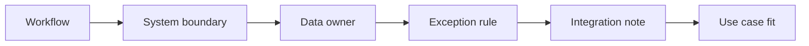

# AI Business Applications, ERP, and CRM Consulting

> AI in SAP, Salesforce, Microsoft business apps, and ERP workflows needs system boundaries before prompts.

**Type:** Build
**Languages:** Python
**Prerequisites:** Phase 11 Lesson 49 (AI Data Quality and Master Data Processes), Phase 11 Lesson 56 (AI Business Analysis and Process Discovery)
**Time:** ~45 minutes
**Capability:** Business Applications - AI Use Case Fit

## Learning Objectives

- Identify AI use cases inside ERP, CRM, and business application workflows
- Build a business-application use-case triage artifact in Python
- Map transaction context, master data dependency, workflow exception, and integration constraint to controls
- Select system-boundary and data-owner controls before solution design
- Explain why business application AI needs workflow and integration context

## The Problem

Business application teams often see AI opportunities in SAP, Salesforce, Microsoft business solutions, and other enterprise workflows. The risk is that an attractive prompt demo ignores transaction context, master data ownership, workflow exceptions, and integration boundaries.

## The Concept

AI use cases in business applications must be evaluated against the system boundary. Before designing an assistant or automation, define the data owner, exception rule, and integration note.



### Signals to Look For

- transaction context
- master data dependency
- workflow exception
- integration constraint

### Controls to Teach

- system boundary
- data owner
- exception rule
- integration note

### Target Roles

- Business & Strategy Consulting
- Products & Value Streams
- Corporate Functions
- Technology Consulting

## Build It

In the lab you build a business-application AI triage planner. It ranks ERP, CRM, and workflow scenarios and recommends controls before solution design.

Run it locally:

```bash
cd phases/11-llm-engineering/60-ai-business-applications-erp-crm-consulting/code
python3 main.py
python3 -m unittest discover tests -v
```

## Use It

Use the artifact for SAP, Salesforce, Microsoft business applications, workflow assistants, and business-process AI discovery.

## Reusable Artifact

Business application AI fit sheet.

The template in `outputs/sheet-business-application-ai-fit.md` can be used before an AI use case is proposed inside ERP, CRM, or business application workflows.

## Key Takeaways

- Business application AI depends on system boundaries.
- Master data ownership is a design input, not a cleanup detail.
- Workflow exceptions determine review and fallback needs.
- Integration constraints should be visible before solution design.
