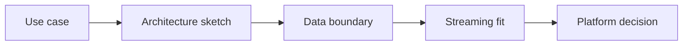

# AI Cloud, Data Platform, and IoT Use Case Design

> Platform-aware AI design connects value to latency, data boundaries, streaming needs, and cloud constraints.

**Type:** Build
**Languages:** Python
**Prerequisites:** Phase 11 Lesson 05 (Context Engineering), Phase 11 Lesson 54 (AI Architecture Decision Governance)
**Time:** ~45 minutes
**Capability:** Technology Consulting - Platform-Aware AI Design

## Learning Objectives

- Identify AI use cases shaped by cloud, data platform, or IoT constraints
- Build a platform-aware AI use-case triage artifact in Python
- Map latency need, data residency, sensor stream, and platform dependency to controls
- Select architecture, data-boundary, streaming, and platform-decision controls
- Explain why platform constraints must be known before choosing an AI architecture

## The Problem

AI use cases often look similar in business language but differ sharply in architecture. A document search, streaming anomaly detector, edge assistant, and cloud workflow have different latency, residency, and platform constraints.

## The Concept

Platform-aware design starts with boundaries. Teams sketch the architecture, identify data boundaries, test streaming fit, and record the platform decision.



### Signals to Look For

- latency need
- data residency
- sensor stream
- platform dependency

### Controls to Teach

- architecture sketch
- data boundary
- streaming fit
- platform decision

### Target Roles

- Technology Consulting
- Application Management
- Products & Value Streams
- Leadership

## Build It

In the lab you build a platform-aware AI planner. It ranks cloud, data platform, and IoT scenarios and recommends architecture controls.

Run it locally:

```bash
cd phases/11-llm-engineering/61-ai-cloud-data-platform-use-case-design/code
python3 main.py
python3 -m unittest discover tests -v
```

## Use It

Use the artifact for cloud AI concepts, data-platform AI use cases, IoT assistants, edge constraints, and architecture prechecks.

## Reusable Artifact

Platform-aware AI use-case canvas.

The template in `outputs/canvas-platform-ai-use-case.md` can be used before selecting cloud services, data platform patterns, or IoT architecture for an AI use case.

## Key Takeaways

- Platform constraints change the AI design.
- Data residency and latency are first-class requirements.
- Streaming use cases need a different fit check than document workflows.
- Platform decisions should be recorded before implementation.
