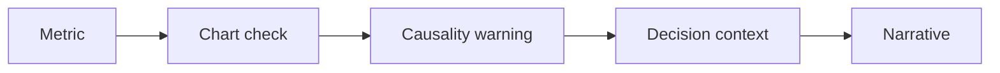

# AI BI Reporting and Data Storytelling

> AI can draft reporting narratives, but metrics, charts, causality, and decisions still need human review.

**Type:** Build
**Languages:** Python
**Prerequisites:** Phase 11 Lesson 30 (Data Literacy for AI Projects), Phase 11 Lesson 48 (AI Project Reporting and Steering)
**Time:** ~45 minutes
**Capability:** Data Literacy - AI-Assisted Reporting Narratives

## Learning Objectives

- Identify reporting scenarios where AI-generated narratives need evidence controls
- Build a BI storytelling triage artifact in Python
- Map metric ambiguity, visualization risk, causality claim, and audience decision to controls
- Select metric definition, chart check, causality warning, and decision-context controls
- Explain why AI data stories must not overstate what the data proves

## The Problem

AI can quickly write dashboard summaries and management report narratives. The risk is that it turns ambiguous metrics, misleading charts, or weak correlations into confident business explanations.

## The Concept

Data storytelling needs a review gate. Before a narrative is shared, define the metric, inspect the chart, flag causality limits, and state the decision context.

### Signals to Look For

- metric ambiguity
- visualization risk
- causality claim
- audience decision

### Controls to Teach

- metric definition
- chart check
- causality warning
- decision context

### Target Roles

- Leadership
- Corporate Functions
- Business & Strategy Consulting
- Project Management & Agility

## Use It

Use the artifact for Power BI narratives, management reports, KPI summaries, dashboard notes, and decision briefings.

## Reusable Artifact

AI reporting narrative review sheet.

The template in `outputs/sheet-bi-reporting-narrative-review.md` can be used before AI-generated reporting text is shared.

## Worked scenario

The demo's first case is **executive kpi story**: Audience decision depends on ambiguous metric and causality claim. Treat the labels metric ambiguity, visualization risk, causality claim, audience decision as evidence to inspect, not as an automatic approval. The implementation's signal matcher looks for those terms in the scenario name, description, and explicit signal list; then the scorer combines impact, uncertainty, and two points per matched signal (capped at 20). The priority function maps that score to a control level: launch gate at 16 or above, guided pilot at 11–15, team practice at 7–10, and awareness below 7.

Run the case and check which of the controls — metric definition, chart check, causality warning, decision context — appear in the returned row. Ask three questions: Which signal is supported by an observable source? Which control has an owner who can act this week? What evidence would move the case to a different priority? Then change one signal or impact value and rerun it. If the priority changes, explain whether the change came from the score, the matching rule, or both. The score is a triage aid; it does not replace domain approval, privacy review, or a pilot metric. Keep that distinction in the artifact and in the handoff.
## Key Takeaways

- AI reporting text needs metric definitions.
- Chart risks can change the story.
- Correlation should not be written as causality.
- Decision context determines how much review is needed.

## Build It

Reconstruct **AI BI Reporting and Data Storytelling** by following `Scenario` on the text "red fox". Run `python3 main.py` and verify that the tokenizer/retriever reports zero or a clear empty-input result, rather than borrowing a result from the previous text.

## Ship It

Hand off `outputs/sheet-bi-reporting-narrative-review.md` with the command `python3 main.py`, the accepted input shape (the text "red fox"), the expected observable result, and a failure note for malformed inputs.

## Exercises

Start with the smallest reproducible run. Keep the input, output, and interpretation together so another reader can repeat the check.

1. **Start with a known input.** Run [main.py](../code/main.py) with `python3 main.py` from the lesson's `code/` directory. Record the smallest input that demonstrates “Identify reporting scenarios where AI-generated narratives need evidence controls”. Point to `normalize()`, `signal_matches()`, `score_scenario()` and name the returned field or printed value that serves as evidence.
2. **Run a controlled comparison.** Change exactly one input, threshold, or option that affects “Build a BI storytelling triage artifact in Python”. Predict the direction of the change before running it, then compare the two outputs and explain why the other fields should stay stable.
3. **Try the smallest valid counterexample.** Construct a case that stresses “Map metric ambiguity, visualization risk, causality claim, and audience decision to controls”: choose an empty collection, missing field, maximum-sized value, malformed record, or another boundary that fits this lesson. Write the expected behavior first and distinguish an intentional guard from an accidental crash.
4. **Transfer the result.** Open outputs/sheet-bi-reporting-narrative-review.md and adapt one example to a real workflow. State the owner, evidence, and next decision required for “Select metric definition, chart check, causality warning, and decision-context controls”; mark any assumption that the demo does not establish.

## Reference Solution

Your solution is complete when it records python3 main.py, the captured output, and a short interpretation. Show:

- evidence for “Identify reporting scenarios where AI-generated narratives need evidence controls” with the relevant input and returned field;
- a one-variable comparison that makes “Build a BI storytelling triage artifact in Python” visible;
- a predicted and observed boundary result for “Map metric ambiguity, visualization risk, causality claim, and audience decision to controls”, including why the behavior is safe; and
- one concrete update to outputs/sheet-bi-reporting-narrative-review.md that applies “Select metric definition, chart check, causality warning, and decision-context controls” without hiding uncertainty.

Use normalize(), signal_matches(), score_scenario() to explain the result, not only the prose output. If the experiment disagrees with the prediction, keep the failed prediction in the receipt and revise the explanation rather than changing the input until it passes.
