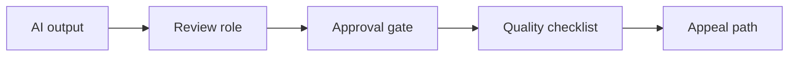

# AI Human Review and Approval Workflow Design

> Human-in-the-loop only works when review roles, approval gates, quality checks, and appeal paths are explicit.

**Type:** Build
**Languages:** Python
**Prerequisites:** Phase 11 Lesson 18 (Responsible AI Compliance Workflow), Phase 11 Lesson 51 (AI Risk Management and Internal Controls)
**Time:** ~45 minutes
**Capability:** Responsible AI - Human-in-the-Loop Control

## Learning Objectives

- Identify AI workflows that need human review or approval gates
- Build a review-and-approval triage artifact in Python
- Map decision authority, approval gap, quality uncertainty, and user impact to controls
- Select review role, approval gate, quality checklist, and appeal-path controls
- Explain why "human in the loop" must be designed as a workflow

## The Problem

Teams often say a human will review AI output, but the review role, authority, checklist, and escalation path are unclear. That turns human-in-the-loop into a vague reassurance instead of a control.

## The Concept

Human review is a workflow. It needs a named role, a decision point, quality criteria, and a way to appeal or escalate uncertain outcomes.

### Signals to Look For

- decision authority
- approval gap
- quality uncertainty
- user impact

### Controls to Teach

- review role
- approval gate
- quality checklist
- appeal path

### Target Roles

- Corporate Functions
- Leadership
- Application Management
- Business & Strategy Consulting

## Use It

Use the artifact for HR, finance, legal, customer communication, service management, and any workflow where AI output may affect people or decisions.

## Reusable Artifact

Human review and approval workflow sheet.

The template in `outputs/sheet-human-review-approval-workflow.md` can be used before launching an AI workflow with accountable human review.

## Key Takeaways

- Human review must name a role and authority.
- Approval gates should be tied to impact and uncertainty.
- Quality checklists turn review into an inspectable control.
- Appeal paths protect users and customers.

## Exercises

1. **Establish a baseline.** Run the lesson demo, then capture the inputs, outputs, and one invariant that demonstrates this objective: Identify AI workflows that need human review or approval gates.
2. **Change one variable.** Modify a single input or parameter and use the resulting evidence to investigate this objective: Build a review-and-approval triage artifact in Python.
3. **Probe an edge case.** Predict the result before running it, compare prediction with observation, and explain the discrepancy while applying this objective: Map decision authority, approval gap, quality uncertainty, and user impact to controls.

## Reference Solution

Use the canonical [main.py](../code/main.py) as the executable baseline. A complete solution records a successful run, identifies the invariant tied to “Identify AI workflows that need human review or approval gates,” and changes only one variable for the comparison. The edge-case result must distinguish the prediction from the observation, explain the cause using “Map decision authority, approval gap, quality uncertainty, and user impact to controls,” and cite a repeatable check rather than relying on visual inspection alone.
