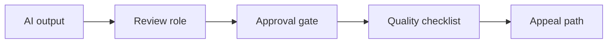

# AI Human Review and Approval Workflow Design

> Human-in-the-loop only works when review roles, approval gates, quality checks, and appeal paths are explicit.

**Type:** Build
**Languages:** Python
**Prerequisites:** Phase 11 Lesson 18 (Responsible AI Compliance Workflow), Phase 11 Lesson 51 (AI Risk Management and Internal Controls)
**Time:** ~45 minutes
**Capability:** Responsible AI - Human-in-the-Loop Control

## Learning Objectives

- Identify AI workflows that need human review or approval gates
- Build a review-and-approval triage artifact in Python
- Map decision authority, approval gap, quality uncertainty, and user impact to controls
- Select review role, approval gate, quality checklist, and appeal-path controls
- Explain why "human in the loop" must be designed as a workflow

## The Problem

Teams often say a human will review AI output, but the review role, authority, checklist, and escalation path are unclear. That turns human-in-the-loop into a vague reassurance instead of a control.

## The Concept

Human review is a workflow. It needs a named role, a decision point, quality criteria, and a way to appeal or escalate uncertain outcomes.

### Signals to Look For

- decision authority
- approval gap
- quality uncertainty
- user impact

### Controls to Teach

- review role
- approval gate
- quality checklist
- appeal path

### Target Roles

- Corporate Functions
- Leadership
- Application Management
- Business & Strategy Consulting

## Use It

Use the artifact for HR, finance, legal, customer communication, service management, and any workflow where AI output may affect people or decisions.

## Reusable Artifact

Human review and approval workflow sheet.

The template in `outputs/sheet-human-review-approval-workflow.md` can be used before launching an AI workflow with accountable human review.

## Worked scenario

The demo's first case is **candidate shortlist**: Decision authority and user impact require a human approval gate. Treat the labels decision authority, approval gap, quality uncertainty, user impact as evidence to inspect, not as an automatic approval. The implementation's signal matcher looks for those terms in the scenario name, description, and explicit signal list; then the scorer combines impact, uncertainty, and two points per matched signal (capped at 20). The priority function maps that score to a control level: launch gate at 16 or above, guided pilot at 11–15, team practice at 7–10, and awareness below 7.

Run the case and check which of the controls — review role, approval gate, quality checklist, appeal path — appear in the returned row. Ask three questions: Which signal is supported by an observable source? Which control has an owner who can act this week? What evidence would move the case to a different priority? Then change one signal or impact value and rerun it. If the priority changes, explain whether the change came from the score, the matching rule, or both. The score is a triage aid; it does not replace domain approval, privacy review, or a pilot metric. Keep that distinction in the artifact and in the handoff.
## Key Takeaways

- Human review must name a role and authority.
- Approval gates should be tied to impact and uncertainty.
- Quality checklists turn review into an inspectable control.
- Appeal paths protect users and customers.

## Build It

Reconstruct **AI Human Review and Approval Workflow Design** by following `Scenario` on the smallest valid record {"id": 1}. Run `python3 main.py` and verify that validation names the missing field or rejects the request; it must not silently accept an incomplete record.

## Ship It

Hand off `outputs/sheet-human-review-approval-workflow.md` with the command `python3 main.py`, the accepted input shape (the smallest valid record {"id": 1}), the expected observable result, and a failure note for malformed inputs.

## Exercises

Use the demo as evidence, not as a ceremony: record what went in, what came out, and why that observation supports the objective.

1. **Reproduce the control run.** Run [main.py](../code/main.py) with `python3 main.py` from the lesson's `code/` directory. Record the smallest input that demonstrates “Identify AI workflows that need human review or approval gates”. Point to `normalize()`, `signal_matches()`, `score_scenario()` and name the returned field or printed value that serves as evidence.
2. **Change one decision.** Change exactly one input, threshold, or option that affects “Build a review-and-approval triage artifact in Python”. Predict the direction of the change before running it, then compare the two outputs and explain why the other fields should stay stable.
3. **Probe a boundary.** Construct a case that stresses “Map decision authority, approval gap, quality uncertainty, and user impact to controls”: choose an empty collection, missing field, maximum-sized value, malformed record, or another boundary that fits this lesson. Write the expected behavior first and distinguish an intentional guard from an accidental crash.
4. **Transfer the result.** Open outputs/sheet-human-review-approval-workflow.md and adapt one example to a real workflow. State the owner, evidence, and next decision required for “Select review role, approval gate, quality checklist, and appeal-path controls”; mark any assumption that the demo does not establish.

## Reference Solution

The reference run should leave a small receipt: python3 main.py, its captured output, and your interpretation. Include:

- evidence for “Identify AI workflows that need human review or approval gates” with the relevant input and returned field;
- a one-variable comparison that makes “Build a review-and-approval triage artifact in Python” visible;
- a predicted and observed boundary result for “Map decision authority, approval gap, quality uncertainty, and user impact to controls”, including why the behavior is safe; and
- one concrete update to outputs/sheet-human-review-approval-workflow.md that applies “Select review role, approval gate, quality checklist, and appeal-path controls” without hiding uncertainty.

Use normalize(), signal_matches(), score_scenario() to explain the result, not only the prose output. If the experiment disagrees with the prediction, keep the failed prediction in the receipt and revise the explanation rather than changing the input until it passes.
