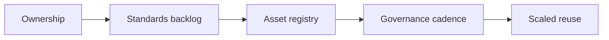

# AI Operating Model and Center of Excellence

> AI scales when ownership, standards, reusable assets, and governance cadence are designed deliberately.

**Type:** Build
**Languages:** Python
**Prerequisites:** Phase 11 Lesson 34 (AI Champion Enablement), Phase 11 Lesson 39 (AI Portfolio and Roadmap Management)
**Time:** ~45 minutes
**Capability:** Leadership - AI Operating Model

## Learning Objectives

- Identify when AI work needs an operating model or Center of Excellence pattern
- Build an operating-model triage artifact in Python
- Map ownership unclear, standards gap, reuse opportunity, and scaling risk to controls
- Select role-charter, standards-backlog, asset-registry, and governance-cadence controls
- Explain how reusable AI assets and standards support scale

## The Problem

AI pilots often grow faster than ownership. Teams create prompt libraries, assistants, templates, and pilots, but standards, reuse, support, and governance cadence remain unclear.

## The Concept

An AI operating model decides who owns what, which standards matter, which assets are reusable, and how governance decisions are made. A Center of Excellence is useful only when it provides concrete services and reusable assets.



### Signals to Look For

- ownership unclear
- standards gap
- reuse opportunity
- scaling risk

### Controls to Teach

- role charter
- standards backlog
- asset registry
- governance cadence

### Target Roles

- Leadership
- AI Champions
- Project Management & Agility
- Corporate Functions

## Build It

In the lab you build an AI operating-model planner. It ranks scaling scenarios and recommends governance and reuse controls.

Run it locally:

```bash
cd phases/11-llm-engineering/64-ai-operating-model-center-of-excellence/code
python3 main.py
python3 -m unittest discover tests -v
```

## Use It

Use the artifact for AI Center of Excellence design, champion network setup, prompt-library governance, reusable asset planning, and AI standards work.

## Reusable Artifact

AI operating model canvas.

The template in `outputs/canvas-ai-operating-model.md` can be used when scaling AI support beyond a single team.

## Key Takeaways

- Scaling AI requires clear ownership.
- Standards should be managed as a backlog, not a static PDF.
- Reusable assets need a registry and review owner.
- Governance cadence keeps the operating model alive.
