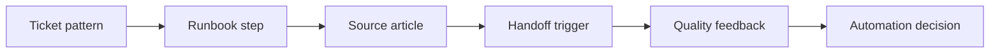

# AI Service Desk Runbook and Knowledge Automation

> AI support only scales when every answer is tied to a runbook, a source, and a handoff rule.

**Type:** Build
**Languages:** Python
**Prerequisites:** Phase 11 Lesson 43 (AI for Service Management and Support), Phase 11 Lesson 52 (AI Knowledge Management and Content Governance)
**Time:** ~45 minutes
**Capability:** Application Management - Service Desk Automation

## Learning Objectives

- Identify service desk scenarios that are suitable for AI-assisted answers or runbook automation
- Build a service automation triage artifact in Python
- Map repeat tickets, known fixes, escalation rules, and knowledge gaps to controls
- Select runbook, source, handoff, and feedback controls before automation
- Explain why service automation must preserve support accountability

## The Problem

Service teams receive repeated questions, recurring incidents, and known-fix requests. AI can reduce ticket load, but only if the answer is grounded in the current knowledge base and the handoff boundary is explicit. Without that boundary, AI can hide stale articles, skip escalation, or give confident answers for unsupported cases.

## The Concept

A service desk AI use case starts with the ticket pattern. If the issue repeats and the fix is known, AI can draft or route an answer. If the issue has risk, missing knowledge, or unclear escalation, the automation should strengthen the runbook before it answers.



### Signals to Look For

- repeat ticket
- known fix
- escalation rule
- knowledge gap

### Controls to Teach

- runbook step
- source article
- handoff trigger
- quality feedback

### Target Roles

- Application Management
- Service Management
- Service Technology
- Corporate Functions

## Build It

In the lab you build a service desk runbook triage planner. It ranks support scenarios and recommends whether to improve the knowledge article, design agent assist, or pilot a controlled automation.

Run it locally:

```bash
cd phases/11-llm-engineering/65-ai-service-desk-runbook-automation/code
python3 main.py
python3 -m unittest discover tests -v
```

## Use It

Use the artifact for support bots, service desk copilots, runbook automation, deflection design, and knowledge-base cleanup.

## Reusable Artifact

Service desk runbook automation sheet.

The template in `outputs/sheet-service-desk-runbook-automation.md` can be used before a repeated ticket pattern is moved into AI-assisted support.

## Key Takeaways

- Repeated tickets are good candidates only when the fix and source are known.
- Handoff triggers protect users from unsupported automation.
- Knowledge gaps should be fixed before AI scales the answer.
- Feedback loops keep support automation current.
