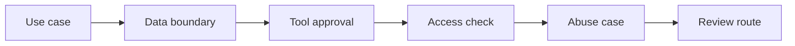

# AI Security Review and Threat Triage for Business Teams

> Business teams do not need to become security engineers, but they do need to spot the AI risks that require review.

**Type:** Build
**Languages:** Python
**Prerequisites:** Phase 11 Lesson 35 (AI Security and Prompt Injection Defense), Phase 11 Lesson 51 (AI Risk Management and Internal Controls)
**Time:** ~45 minutes
**Capability:** IT Security Management - Business Threat Triage

## Learning Objectives

- Identify AI use cases that need a security review before rollout
- Build a business threat triage artifact in Python
- Map sensitive data, external tools, identity risk, and untrusted input to controls
- Select data-boundary, tool-approval, access-check, and abuse-case controls
- Explain when business teams should escalate to security specialists

## The Problem

Many AI ideas start in business teams: a proposal assistant, a document summarizer, a customer reply helper, or a workflow bot. These teams often know the process risk, but they may miss security triggers such as sensitive data, external tools, identity boundaries, or prompt injection exposure.

## The Concept

Security triage should be lightweight enough for business teams and strict enough to catch review triggers. The goal is not to approve everything locally. The goal is to make the risk visible and route the use case to the right review path.



### Signals to Look For

- sensitive data
- external tool
- identity risk
- untrusted input

### Controls to Teach

- data boundary
- tool approval
- access check
- abuse case

### Target Roles

- IT Security Management
- Corporate Functions
- Business Consulting
- Products & Value Streams

## Build It

In the lab you build a security triage planner. It ranks business AI scenarios and recommends whether to document assumptions, apply controls, or require a formal security review.

Run it locally:

```bash
cd phases/11-llm-engineering/66-ai-security-threat-triage-business-teams/code
python3 main.py
python3 -m unittest discover tests -v
```

## Use It

Use the artifact when a team wants to use external AI tools, connect AI to business systems, process sensitive content, or expose AI to untrusted user input.

## Reusable Artifact

Business AI threat triage sheet.

The template in `outputs/sheet-security-threat-triage.md` can be used before a business AI idea is submitted for approval.

## Key Takeaways

- Business teams can identify security review triggers early.
- Sensitive data and external tools require explicit boundaries.
- Identity and access are AI design inputs.
- Abuse cases make risks concrete enough to review.
