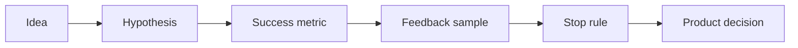

# AI Product Experiment Design and Feedback Analytics

> Product AI work needs hypotheses and feedback loops, not just feature ideas.

**Type:** Build
**Languages:** Python
**Prerequisites:** Phase 11 Lesson 23 (AI-Enhanced User Research), Phase 11 Lesson 55 (AI Product Backlog and Prioritization)
**Time:** ~45 minutes
**Capability:** Products and Value Streams - Experiment Feedback Fit

## Learning Objectives

- Identify product AI ideas that should be tested as experiments
- Build a product experiment triage artifact in Python
- Map user feedback, unclear hypotheses, missing metrics, and rollout risk to controls
- Select hypothesis, metric, feedback-sample, and stop-rule controls
- Explain why AI product decisions need explicit learning goals

## The Problem

AI features often reach the backlog as broad ideas: add a copilot, summarize customer input, classify requests, or automate a workflow. Without a hypothesis and feedback design, the team may ship an impressive demo that does not improve the product outcome.

## The Concept

A product experiment connects an AI capability to a user behavior, a measurable outcome, and a decision. AI can help synthesize feedback, but the team still needs a clear hypothesis, success metric, sample plan, and stop rule.



### Signals to Look For

- user feedback
- hypothesis unclear
- metric missing
- experiment risk

### Controls to Teach

- hypothesis statement
- success metric
- feedback sample
- stop rule

### Target Roles

- Products & Value Streams
- Product Owners
- Project Management & Agility
- Business Consulting

## Build It

In the lab you build a product experiment planner. It ranks AI product ideas and recommends whether to define a hypothesis, prepare a feedback study, or run a controlled experiment.

Run it locally:

```bash
cd phases/11-llm-engineering/67-ai-product-experiment-feedback-analytics/code
python3 main.py
python3 -m unittest discover tests -v
```

## Use It

Use the artifact for AI backlog items, product discovery, feedback synthesis, pilot planning, and controlled rollout decisions.

## Reusable Artifact

Product experiment feedback canvas.

The template in `outputs/canvas-product-experiment-feedback.md` can be used before an AI product idea moves from discovery into delivery.

## Key Takeaways

- AI product work should start with a hypothesis.
- Feedback synthesis needs a visible sample and bias check.
- Metrics should decide what happens after the pilot.
- Stop rules protect teams from scaling weak evidence.
