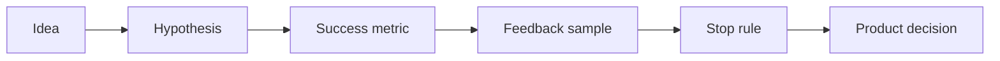

# AI Product Experiment Design and Feedback Analytics

> Product AI work needs hypotheses and feedback loops, not just feature ideas.

**Type:** Build
**Languages:** Python
**Prerequisites:** Phase 11 Lesson 23 (AI-Enhanced User Research), Phase 11 Lesson 105 (AI-Assisted Backlog Scoring)
**Time:** ~45 minutes
**Capability:** Products and Value Streams - Experiment Feedback Fit

## Learning Objectives

- Identify product AI ideas that should be tested as experiments
- Build a product experiment triage artifact in Python
- Map user feedback, unclear hypotheses, missing metrics, and rollout risk to controls
- Select hypothesis, metric, feedback-sample, and stop-rule controls
- Explain why AI product decisions need explicit learning goals

## The Problem

AI features often reach the backlog as broad ideas: add a copilot, summarize customer input, classify requests, or automate a workflow. Without a hypothesis and feedback design, the team may ship an impressive demo that does not improve the product outcome.

## The Concept

A product experiment connects an AI capability to a user behavior, a measurable outcome, and a decision. AI can help synthesize feedback, but the team still needs a clear hypothesis, success metric, sample plan, and stop rule.

### Signals to Look For

- user feedback
- hypothesis unclear
- metric missing
- experiment risk

### Controls to Teach

- hypothesis statement
- success metric
- feedback sample
- stop rule

### Target Roles

- Products & Value Streams
- Product Owners
- Project Management & Agility
- Business Consulting

## Use It

Use the artifact for AI backlog items, product discovery, feedback synthesis, pilot planning, and controlled rollout decisions.

## Reusable Artifact

Product experiment feedback canvas.

The template in `outputs/canvas-product-experiment-feedback.md` can be used before an AI product idea moves from discovery into delivery.

## Worked scenario

The demo's first case is **copilot onboarding test**: User feedback is strong but hypothesis unclear and metric missing. Treat the labels user feedback, hypothesis unclear, metric missing, experiment risk as evidence to inspect, not as an automatic approval. The implementation's signal matcher looks for those terms in the scenario name, description, and explicit signal list; then the scorer combines impact, uncertainty, and two points per matched signal (capped at 20). The priority function maps that score to a control level: launch gate at 16 or above, guided pilot at 11–15, team practice at 7–10, and awareness below 7.

Run the case and check which of the controls — hypothesis statement, success metric, feedback sample, stop rule — appear in the returned row. Ask three questions: Which signal is supported by an observable source? Which control has an owner who can act this week? What evidence would move the case to a different priority? Then change one signal or impact value and rerun it. If the priority changes, explain whether the change came from the score, the matching rule, or both. The score is a triage aid; it does not replace domain approval, privacy review, or a pilot metric. Keep that distinction in the artifact and in the handoff.
## Key Takeaways

- AI product work should start with a hypothesis.
- Feedback synthesis needs a visible sample and bias check.
- Metrics should decide what happens after the pilot.
- Stop rules protect teams from scaling weak evidence.

## Build It

Reconstruct **AI Product Experiment Design and Feedback Analytics** by following `Scenario` on the demo’s smallest built-in fixture. Run `python3 main.py` and verify that the result reports the empty case explicitly or raises the documented validation error.

## Ship It

Hand off `outputs/canvas-product-experiment-feedback.md` with the command `python3 main.py`, the accepted input shape (the demo’s smallest built-in fixture), the expected observable result, and a failure note for malformed inputs.

## Exercises

Make the experiment auditable. Save the input, output, and one sentence explaining how the result bears on the claim.

1. **Trace the happy path.** Run [main.py](../code/main.py) with `python3 main.py` from the lesson's `code/` directory. Record the smallest input that demonstrates “Identify product AI ideas that should be tested as experiments”. Point to `normalize()`, `signal_matches()`, `score_scenario()` and name the returned field or printed value that serves as evidence.
2. **Perturb the input.** Change exactly one input, threshold, or option that affects “Build a product experiment triage artifact in Python”. Predict the direction of the change before running it, then compare the two outputs and explain why the other fields should stay stable.
3. **Test a failure case.** Construct a case that stresses “Map user feedback, unclear hypotheses, missing metrics, and rollout risk to controls”: choose an empty collection, missing field, maximum-sized value, malformed record, or another boundary that fits this lesson. Write the expected behavior first and distinguish an intentional guard from an accidental crash.
4. **Transfer the result.** Open outputs/canvas-product-experiment-feedback.md and adapt one example to a real workflow. State the owner, evidence, and next decision required for “Select hypothesis, metric, feedback-sample, and stop-rule controls”; mark any assumption that the demo does not establish.

## Reference Solution

A useful submission records python3 main.py, the observed output, and the conclusion drawn from it. It should contain:

- evidence for “Identify product AI ideas that should be tested as experiments” with the relevant input and returned field;
- a one-variable comparison that makes “Build a product experiment triage artifact in Python” visible;
- a predicted and observed boundary result for “Map user feedback, unclear hypotheses, missing metrics, and rollout risk to controls”, including why the behavior is safe; and
- one concrete update to outputs/canvas-product-experiment-feedback.md that applies “Select hypothesis, metric, feedback-sample, and stop-rule controls” without hiding uncertainty.

Use normalize(), signal_matches(), score_scenario() to explain the result, not only the prose output. If the experiment disagrees with the prediction, keep the failed prediction in the receipt and revise the explanation rather than changing the input until it passes.
