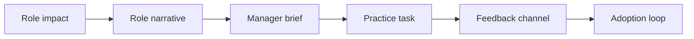

# AI Adoption Communications and Role-Based Enablement

> AI adoption improves when each role understands what changes, what stays human, and how to practice safely.

**Type:** Build
**Languages:** Python
**Prerequisites:** Phase 11 Lesson 58 (AI Change Impact and Stakeholder Analysis), Phase 11 Lesson 46 (AI Learning Design and Knowledge Transfer)
**Time:** ~45 minutes
**Capability:** Change Management - Role-Based Adoption Communication

## Learning Objectives

- Identify adoption risks created by unclear AI communication
- Build a role-based enablement triage artifact in Python
- Map role impact, resistance signals, manager dependency, and message gaps to controls
- Select role-narrative, manager-brief, practice-task, and feedback-channel controls
- Explain why AI rollouts need role-specific communication rather than generic awareness

## The Problem

AI rollout messages often say what the tool can do, but not how a specific role should work differently. Teams need to know which tasks change, which decisions remain human, what good practice looks like, and where to raise concerns.

## The Concept

Role-based enablement translates a tool launch into concrete changes for the target audience. The communication should include a role narrative, manager brief, practice task, and feedback channel.

### Signals to Look For

- role impact
- resistance signal
- manager dependency
- message gap

### Controls to Teach

- role narrative
- manager brief
- practice task
- feedback channel

### Target Roles

- Leadership
- Project Management & Agility
- Corporate Functions
- Business Consulting

## Use It

Use the artifact for AI launch campaigns, role-based training, manager communications, champion enablement, and adoption feedback loops.

## Reusable Artifact

AI adoption communications plan.

The template in `outputs/plan-adoption-communications.md` can be used before launching an AI tool or workflow change to a role group.

## Worked scenario

The demo's first case is **claims team rollout**: Role impact is high with resistance signal and manager dependency. Treat the labels role impact, resistance signal, manager dependency, message gap as evidence to inspect, not as an automatic approval. The implementation's signal matcher looks for those terms in the scenario name, description, and explicit signal list; then the scorer combines impact, uncertainty, and two points per matched signal (capped at 20). The priority function maps that score to a control level: launch gate at 16 or above, guided pilot at 11–15, team practice at 7–10, and awareness below 7.

Run the case and check which of the controls — role narrative, manager brief, practice task, feedback channel — appear in the returned row. Ask three questions: Which signal is supported by an observable source? Which control has an owner who can act this week? What evidence would move the case to a different priority? Then change one signal or impact value and rerun it. If the priority changes, explain whether the change came from the score, the matching rule, or both. The score is a triage aid; it does not replace domain approval, privacy review, or a pilot metric. Keep that distinction in the artifact and in the handoff.
## Key Takeaways

- Generic AI announcements rarely change behavior.
- Managers need a separate brief because they carry local adoption risk.
- Practice tasks turn communication into behavior.
- Feedback channels keep adoption concerns visible.

## Build It

Reconstruct **AI Adoption Communications and Role-Based Enablement** by following `Scenario` on the demo’s smallest built-in fixture. Run `python3 main.py` and verify that the result reports the empty case explicitly or raises the documented validation error.

## Ship It

Hand off `outputs/plan-adoption-communications.md` with the command `python3 main.py`, the accepted input shape (the demo’s smallest built-in fixture), the expected observable result, and a failure note for malformed inputs.

## Exercises

Begin with a control run and leave a short receipt: input, output, and the reasoning that connects them to the objective.

1. **Start with a known input.** Run [main.py](../code/main.py) with `python3 main.py` from the lesson's `code/` directory. Record the smallest input that demonstrates “Identify adoption risks created by unclear AI communication”. Point to `normalize()`, `signal_matches()`, `score_scenario()` and name the returned field or printed value that serves as evidence.
2. **Run a controlled comparison.** Change exactly one input, threshold, or option that affects “Build a role-based enablement triage artifact in Python”. Predict the direction of the change before running it, then compare the two outputs and explain why the other fields should stay stable.
3. **Try the smallest valid counterexample.** Construct a case that stresses “Map role impact, resistance signals, manager dependency, and message gaps to controls”: choose an empty collection, missing field, maximum-sized value, malformed record, or another boundary that fits this lesson. Write the expected behavior first and distinguish an intentional guard from an accidental crash.
4. **Transfer the result.** Open outputs/plan-adoption-communications.md and adapt one example to a real workflow. State the owner, evidence, and next decision required for “Select role-narrative, manager-brief, practice-task, and feedback-channel controls”; mark any assumption that the demo does not establish.

## Reference Solution

Keep the solution auditable: run python3 main.py, save the output, and explain what it demonstrates. Include:

- evidence for “Identify adoption risks created by unclear AI communication” with the relevant input and returned field;
- a one-variable comparison that makes “Build a role-based enablement triage artifact in Python” visible;
- a predicted and observed boundary result for “Map role impact, resistance signals, manager dependency, and message gaps to controls”, including why the behavior is safe; and
- one concrete update to outputs/plan-adoption-communications.md that applies “Select role-narrative, manager-brief, practice-task, and feedback-channel controls” without hiding uncertainty.

Use normalize(), signal_matches(), score_scenario() to explain the result, not only the prose output. If the experiment disagrees with the prediction, keep the failed prediction in the receipt and revise the explanation rather than changing the input until it passes.
