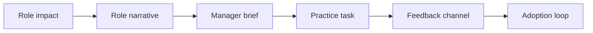

# AI Adoption Communications and Role-Based Enablement

> AI adoption improves when each role understands what changes, what stays human, and how to practice safely.

**Type:** Build
**Languages:** Python
**Prerequisites:** Phase 11 Lesson 58 (AI Change Impact and Stakeholder Analysis), Phase 11 Lesson 46 (AI Learning Design and Knowledge Transfer)
**Time:** ~45 minutes
**Capability:** Change Management - Role-Based Adoption Communication

## Learning Objectives

- Identify adoption risks created by unclear AI communication
- Build a role-based enablement triage artifact in Python
- Map role impact, resistance signals, manager dependency, and message gaps to controls
- Select role-narrative, manager-brief, practice-task, and feedback-channel controls
- Explain why AI rollouts need role-specific communication rather than generic awareness

## The Problem

AI rollout messages often say what the tool can do, but not how a specific role should work differently. Teams need to know which tasks change, which decisions remain human, what good practice looks like, and where to raise concerns.

## The Concept

Role-based enablement translates a tool launch into concrete changes for the target audience. The communication should include a role narrative, manager brief, practice task, and feedback channel.

### Signals to Look For

- role impact
- resistance signal
- manager dependency
- message gap

### Controls to Teach

- role narrative
- manager brief
- practice task
- feedback channel

### Target Roles

- Leadership
- Project Management & Agility
- Corporate Functions
- Business Consulting

## Use It

Use the artifact for AI launch campaigns, role-based training, manager communications, champion enablement, and adoption feedback loops.

## Reusable Artifact

AI adoption communications plan.

The template in `outputs/plan-adoption-communications.md` can be used before launching an AI tool or workflow change to a role group.

## Key Takeaways

- Generic AI announcements rarely change behavior.
- Managers need a separate brief because they carry local adoption risk.
- Practice tasks turn communication into behavior.
- Feedback channels keep adoption concerns visible.

## Exercises

1. **Establish a baseline.** Run the lesson demo, then capture the inputs, outputs, and one invariant that demonstrates this objective: Identify adoption risks created by unclear AI communication.
2. **Change one variable.** Modify a single input or parameter and use the resulting evidence to investigate this objective: Build a role-based enablement triage artifact in Python.
3. **Probe an edge case.** Predict the result before running it, compare prediction with observation, and explain the discrepancy while applying this objective: Map role impact, resistance signals, manager dependency, and message gaps to controls.

## Reference Solution

Use the canonical [main.py](../code/main.py) as the executable baseline. A complete solution records a successful run, identifies the invariant tied to “Identify adoption risks created by unclear AI communication,” and changes only one variable for the comparison. The edge-case result must distinguish the prediction from the observation, explain the cause using “Map role impact, resistance signals, manager dependency, and message gaps to controls,” and cite a repeatable check rather than relying on visual inspection alone.
