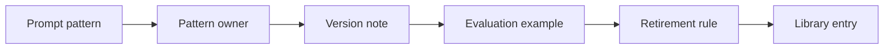

# AI Prompt Library Governance and Reuse

> A prompt library becomes useful only when patterns have owners, examples, versions, and retirement rules.

**Type:** Build
**Languages:** Python
**Prerequisites:** Phase 11 Lesson 31 (Hands-on Prompt Clinic), Phase 11 Lesson 52 (AI Knowledge Management and Content Governance)
**Time:** ~45 minutes
**Capability:** Knowledge Management - Reusable Prompt Pattern Governance

## Learning Objectives

- Identify prompt patterns that are worth sharing beyond one team
- Build a prompt-library governance artifact in Python
- Map reused prompts, missing owners, quality drift, and context dependency to controls
- Select owner, version, evaluation-example, and retirement-rule controls
- Explain why reusable prompts need governance rather than copy-paste sharing

## The Problem

Teams often collect useful prompts in chats, documents, wikis, and slide decks. The library grows quickly, but ownership, context, evaluation examples, and retirement rules remain unclear. A copied prompt can then be used outside its intended context and produce weaker or riskier outputs.

## The Concept

A governed prompt library treats prompts as reusable patterns. Each pattern needs an owner, version note, evaluation example, and retirement rule. This keeps useful prompts available without turning the library into stale advice.



### Signals to Look For

- reused prompt
- owner missing
- quality drift
- context dependency

### Controls to Teach

- pattern owner
- version note
- evaluation example
- retirement rule

### Target Roles

- AI Champions
- Corporate Functions
- Business Consulting
- Technology Consulting

## Build It

In the lab you build a prompt library governance planner. It ranks prompt patterns and recommends whether to keep a prompt local, assign an owner, review it before reuse, or publish it as a governed pattern.

Run it locally:

```bash
cd phases/11-llm-engineering/69-ai-prompt-library-governance-reuse/code
python3 main.py
python3 -m unittest discover tests -v
```

## Use It

Use the artifact for prompt libraries, reusable pattern catalogs, community assets, team templates, and AI champion enablement.

## Reusable Artifact

Prompt library governance register.

The template in `outputs/register-prompt-library-governance.md` can be used before a prompt is published as a shared asset.

## Key Takeaways

- Shared prompts need owners and context notes.
- Evaluation examples make quality expectations concrete.
- Version notes help users know what changed.
- Retirement rules prevent stale patterns from spreading.
