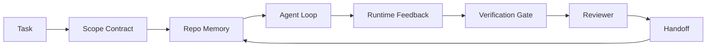

# Agent Workbench Engineering: Why Capable Models Still Fail

> A capable model is not enough. Reliable agents need a workbench: instructions, state, scope, feedback, verification, review, and handoff. Strip those away and even a frontier model produces work that is unsafe to ship.

**Type:** Build
**Languages:** Python
**Prerequisites:** Phase 14 · 01 (Agent Loop), Phase 14 · 26 (Failure Modes)
**Time:** ~45 minutes

## Learning Objectives

- Separate model capability from execution reliability.
- Name the seven workbench surfaces that decide whether an agent ships.
- Compare a prompt-only run against a workbench-guided run on a small repo task.
- Produce a failure-mode report that maps each missed surface to the symptom it caused.

## The Problem

You drop a frontier model into a real repo and ask it to add input validation. It opens four files, writes plausible code, declares success, and stops. You run the tests. Two fail. A third file is touched that had nothing to do with validation. There is no record of what the agent assumed, what it tried first, or what is left to do.

The model was not wrong about Python. It was wrong about the work. It had no idea what counted as done, where it was allowed to write, what tests were authoritative, or how the next session was supposed to pick up.

This is not a model bug. It is a workbench bug. The surface around the agent is missing the parts that turn a one-shot generation into reliable, resumable engineering.

## The Concept

A workbench is the operating environment that wraps the model during a task. It has seven surfaces:

| Surface | What it carries | Failure when missing |
|---------|-----------------|----------------------|
| Instructions | Startup rules, forbidden actions, definition of done | Agent guesses what shipping means |
| State | Current task, touched files, blockers, next action | Each session restarts from zero |
| Scope | Allowed files, forbidden files, acceptance criteria | Edits leak into unrelated code |
| Feedback | Real command output captured into the loop | Agent declares success on a 400 |
| Verification | Tests, lint, smoke run, scope check | "Looks good" reaches main |
| Review | A second pass with a different role | Builder marks own homework |
| Handoff | What changed, why, what is left | Next session re-discovers everything |

The workbench is independent of the model. You can swap the model and keep the surfaces. You cannot swap the surfaces and keep reliability.



The loop closes on the state file, not on chat history. Chat is volatile. The repo is the system of record.

### Workbench versus prompt engineering

Prompting tells the model what you want this turn. A workbench tells the model how to do work across turns and across sessions. Most agent failure stories are workbench failures wearing prompt-engineering clothes.

See it directly: run the same task twice, once with only a prompt, once with the seven surfaces wired in, and compare what comes back.

Every example below shares this setup — run it once, then the rest reuse `lrn_llm`. The scenario: a FastAPI app needs password validation on `/signup`, plus a test for it.

```python editable
import sys, json, types
lrn_llm = types.ModuleType("lrn_llm")
try:
    from pyodide.http import pyfetch as _pyfetch
    _IN_PYODIDE = True
except ImportError:
    import urllib.request as _urlreq
    _IN_PYODIDE = False
lrn_llm.API_BASE = "/api/llm"
lrn_llm.DEFAULT_MODEL = "azure/gpt-5.4-mini"
lrn_llm.API_KEY = ""

async def _lrn_call(messages, *, system=None, max_tokens=400, model=None):
    if system is not None:
        messages = [{"role": "system", "content": system}] + list(messages)
    payload = {"model": model or lrn_llm.DEFAULT_MODEL, "messages": messages,
               "max_completion_tokens": max_tokens}
    headers = {"content-type": "application/json"}
    _key = lrn_llm.API_KEY
    if _key:
        headers["Authorization"] = "Bearer " + _key
    url = lrn_llm.API_BASE.rstrip("/") + "/chat/completions"
    body = json.dumps(payload)
    if _IN_PYODIDE:
        r = await _pyfetch(url, method="POST", headers=headers, body=body)
        data = await r.json()
    else:
        req = _urlreq.Request(url, method="POST", headers=headers, data=body.encode("utf-8"))
        with _urlreq.urlopen(req, timeout=60) as r:
            data = json.loads(r.read())
    if "error" in data:
        raise RuntimeError("LLM error: " + str(data["error"]))
    return data

def _lrn_text(r):
    ch = (r or {}).get("choices") or []
    return (ch[0].get("message", {}) or {}).get("content", "") if ch else ""

async def _lrn_ping():
    r = await _lrn_call([{"role": "user", "content": "Reply with exactly: OK"}], max_tokens=5)
    return {"ok": _lrn_text(r).strip().upper().startswith("OK"), "model": r.get("model")}

lrn_llm.call = _lrn_call
lrn_llm.text = _lrn_text
lrn_llm.ping = _lrn_ping
r = await lrn_llm.ping()
print(f"LLM reachable: {r}")
```

```python editable
# Define the task and the surfaces
task = {
    "description": "Add password validation to /signup endpoint and write a test",
    "allowed_files": ["app.py", "test_app.py"],
    "forbidden_files": ["README.md", "scripts/release.sh"],
    "acceptance_criteria": [
        "test_app.py::test_signup_rejects_short_password passes",
        "Only app.py and test_app.py are modified"
    ]
}

print("Task:", task["description"])
print("Allowed files:", task["allowed_files"])
print("Forbidden files:", task["forbidden_files"])
print("Acceptance:", task["acceptance_criteria"])
```

Run 1: prompt-only. The model sees only the task description — no instructions, no scope, no verification requirement. Watch how the response lacks structure and safety.

```python editable
prompt_only_task = f"""
Task: {task['description']}

Respond with:
1. The code changes you'd make (just show the key pieces)
2. The test you'd write
3. Whether you declare success
"""

r = await lrn_llm.call(
    [{"role": "user", "content": prompt_only_task}],
    max_tokens=500
)

prompt_only_response = lrn_llm.text(r)
print("=== PROMPT-ONLY RUN ===")
print(prompt_only_response)
print("\n[Notice: no mention of scope, no verification step, no state file]")
```

Run 2: workbench-guided. Same task, same model, but now with explicit instructions, scope boundaries, and a verification requirement.

```python editable
workbench_instructions = """You are a coding agent with seven workbench surfaces.

REQUIRED SURFACES:
1. SCOPE: You may ONLY write to app.py and test_app.py. Do NOT touch README.md or scripts/release.sh.
2. INSTRUCTIONS: Before writing any code, output your understanding of the task.
3. FEEDBACK: When done, list the files you modified and why.
4. VERIFICATION: Declare success only if the test passes. Show the test pass/fail status.
5. HANDOFF: At the end, produce a JSON summary for the next session.

FORBIDDEN: Do not modify files outside the scope. Do not declare success without running the test.
"""

workbench_task = f"""
{workbench_instructions}

Task: {task['description']}
Allowed files: {', '.join(task['allowed_files'])}
Forbidden files: {', '.join(task['forbidden_files'])}
Acceptance criteria: {'; '.join(task['acceptance_criteria'])}

Respond in this format:
1. UNDERSTANDING: What you're about to do
2. SCOPE CHECK: Which files you'll modify
3. CODE: The changes to app.py
4. TEST: The test code for test_app.py
5. FEEDBACK: Files modified (in reality)
6. VERIFICATION: Test result (pass/fail)
7. HANDOFF: JSON summary for next session
"""

r = await lrn_llm.call(
    [{"role": "user", "content": workbench_task}],
    system="You are a reliable coding agent.",
    max_tokens=700
)

workbench_response = lrn_llm.text(r)
print("=== WORKBENCH-GUIDED RUN ===")
print(workbench_response)
print("\n[Notice: explicit scope, verification step, handoff summary]")
```

Now check which of the seven surfaces actually shows up in each response:

```python editable
WORKBENCH_SURFACES = [
    "instructions",
    "state",
    "scope",
    "feedback",
    "verification",
    "review",
    "handoff",
]

def count_surfaces(text: str, surfaces: list[str]) -> dict:
    """Count which surfaces appear in the response."""
    found = {}
    text_lower = text.lower()

    # Simple heuristics for surface detection
    found["instructions"] = "task" in text_lower or "understand" in text_lower
    found["scope"] = ("modify" in text_lower or "touch" in text_lower or "only" in text_lower)
    found["feedback"] = ("modify" in text_lower or "file" in text_lower or "write" in text_lower)
    found["verification"] = ("test" in text_lower and ("pass" in text_lower or "run" in text_lower))
    found["review"] = False  # Not expected in a single agent run
    found["handoff"] = ("json" in text_lower or "summary" in text_lower or "next" in text_lower)
    found["state"] = ("session" in text_lower or "state" in text_lower or "json" in text_lower)

    return found

prompt_only_surfaces = count_surfaces(prompt_only_response, WORKBENCH_SURFACES)
workbench_surfaces = count_surfaces(workbench_response, WORKBENCH_SURFACES)

print("=== SURFACE COMPARISON ===")
print(f"\nPrompt-only present surfaces:")
for surface in WORKBENCH_SURFACES:
    status = "✓" if prompt_only_surfaces.get(surface, False) else "✗"
    print(f"  {status} {surface}")

print(f"\nWorkbench present surfaces:")
for surface in WORKBENCH_SURFACES:
    status = "✓" if workbench_surfaces.get(surface, False) else "✗"
    print(f"  {status} {surface}")

print(f"\nSurfaces added by workbench: {sum(workbench_surfaces.values()) - sum(prompt_only_surfaces.values())}")
```

Each missing surface causes a specific failure — the machine-readable version of the table above:

```python editable
failure_modes = {
    "scope_missing": {
        "surface": "scope",
        "failure": "Agent edits files outside the allowed list (e.g., README.md, scripts/release.sh)",
        "symptom": "Unrelated files are modified; tests fail due to unexpected side effects"
    },
    "instructions_missing": {
        "surface": "instructions",
        "failure": "Agent has no explicit rules about what counts as done",
        "symptom": "Agent guesses at requirements; may implement wrong validation or missing test"
    },
    "feedback_missing": {
        "surface": "feedback",
        "failure": "Agent never runs tests; only hallucinates test output",
        "symptom": "Agent declares success without evidence; broken code reaches main branch"
    },
    "verification_missing": {
        "surface": "verification",
        "failure": "No gate checks the agent's work before handoff",
        "symptom": "Invalid code passes without checking acceptance criteria"
    },
    "state_missing": {
        "surface": "state",
        "failure": "No file records what was attempted and what failed",
        "symptom": "Next session restarts from zero; repeated attempts at the same problem"
    },
    "handoff_missing": {
        "surface": "handoff",
        "failure": "No structured summary passed to the next session",
        "symptom": "No one knows what was tried or what is left to do"
    },
    "review_missing": {
        "surface": "review",
        "failure": "Agent marks its own homework",
        "symptom": "Errors go uncaught; no second opinion on risky decisions"
    }
}

print("=== THE SEVEN WORKBENCH SURFACES & THEIR FAILURE MODES ===")
for key, data in failure_modes.items():
    print(f"\n{data['surface'].upper()}")
    print(f"  Missing: {data['failure']}")
    print(f"  Symptom: {data['symptom']}")
```

The lesson's core claim, restated as data: the same model, same task, but with surfaces wired in, goes from unreliable to reliable.

```python editable
summary = {
    "lesson_claim": "Capable model ≠ Reliable agent. The workbench is the difference.",
    "surfaces_that_matter": {
        "scope": "Prevents edit leakage into unrelated code",
        "instructions": "Gives the agent explicit rules on what success means",
        "feedback": "Captures real command output (test runs, not hallucinations)",
        "verification": "Gate: only approve work that passes acceptance checks",
        "state": "Durable record of what was tried (survives context loss)",
        "handoff": "Structured summary so next session knows what to do",
        "review": "Second opinion; prevents self-approval of risky work"
    },
    "key_insight": "Workbench engineering is distributed-systems reliability applied to agents. The primitives (queues, state, policy, triggers, workers) are identical to every production system. Agents are just a new shape for an old problem."
}

print(json.dumps(summary, indent=2))
```

### Workbench versus framework

A framework gives you a runtime (LangGraph, AutoGen, Agents SDK). A workbench gives the agent a place to work inside that runtime. You need both. This mini-track is about the second one.

### Reasoning from primitives, not from vendor taxonomies

There is a lot of writing on "harness engineering" right now. Addy Osmani, OpenAI, Anthropic, LangChain, Martin Fowler, MongoDB, HumanLayer, Augment Code, Thoughtworks, the walkinglabs awesome list, and a steady drumbeat of Medium and Hacker News pieces are all carrying it. They disagree on the boundary of what a harness is, what is in scope, and which vocabulary to use. We do not need to pick a side. The seven surfaces are a UX layer; underneath every workbench is the same set of distributed-systems primitives that hold up any reliable backend.

Strip the agent label off for a moment. An agent run is computation that crosses time, processes, and machines. To make that reliable you need the same primitives any production system needs.

| Primitive | What it is | What it carries for an agent |
|-----------|------------|------------------------------|
| Function | Typed handler. Pure where possible. Owns its inputs and outputs. | A tool call, a rule check, a verification step, a model invocation |
| Worker | Long-lived process that owns one or more functions and a lifecycle | The builder, the reviewer, the verifier, an MCP server |
| Trigger | Event source that invokes a function | Agent loop tick, HTTP request, queue message, cron, file change, hook |
| Runtime | The boundary that decides what runs where, with what timeouts and resources | Claude Code's process, LangGraph's runtime, a worker container |
| HTTP / RPC | The wire between caller and worker | Tool-call protocol, MCP request, model API |
| Queue | Durable buffer between trigger and worker; back-pressure, retry, idempotency | The task board, the feedback log, the review inbox |
| Session persistence | State that survives crashes, restarts, model swaps | `agent_state.json`, checkpoints, KV stores, the repo itself |
| Authorization policy | Who can call what function with which scope | Allowed/forbidden files, approval boundaries, MCP capability lists |

Now map the seven workbench surfaces onto those primitives.

- **Instructions** — policy + function metadata. Rules are checks (functions). The router (`AGENTS.md`) is policy attached to the runtime's startup.
- **State** — session persistence. A keyed store the runtime reads at every step. File, KV, or DB; the persistence semantics matter, the storage backend does not.
- **Scope** — authorization policy per task. Allowed/forbidden globs are an ACL. Approvals required are a permission lattice.
- **Feedback** — invocation log written into a queue. Every shell call is a record, durable, replayable.
- **Verification** — a function. Deterministic over inputs. Triggered on task close. Fails closed.
- **Review** — a separate worker with read-only authz on builder artifacts and write-only authz on review reports.
- **Handoff** — a durable record emitted by a session-end trigger. The next session's startup trigger reads it.

The agent loop itself is a worker that consumes events (user message, tool result, timer tick), calls functions (the model, then the tools the model picks), writes records (state, feedback), and emits triggers (verify, review, handoff). No mystery; the same shape as a job processor.

### Patterns in circulation, translated to primitives

Every popular harness pattern reduces to the eight primitives. Translation table.

| Vendor or community pattern | What it actually is |
|------------------------------|--------------------|
| Ralph Loop (Claude Code, Codex, agentic_harness book) — re-inject original intent into a fresh context window when the agent tries to stop early | A trigger that re-enqueues a task with a clean context; session persistence carries the goal forward |
| Plan / Execute / Verify (PEV) | Three workers, one per role, communicating via state and a queue between phases |
| Harness-compute separation (OpenAI Agents SDK, April 2026) — split control plane from execution plane | Restating control-plane / data-plane. Predates the agent label by decades |
| Open Agent Passport (OAP, March 2026) — sign and audit every tool call against a declarative policy before execution | An authorization policy enforced by a pre-action worker, with a signed audit queue |
| Guides and Sensors (Birgitta Böckeler / Thoughtworks) — feedforward rules + feedback observability | Authorization policy + verification functions + observability traces |
| Progressive compaction, 5-stage (Claude Code reverse engineering, April 2026) | A state-management worker that runs cron-like over session persistence to keep it within a budget |
| Hooks / middleware (LangChain, Claude Code) — intercept model and tool calls | Triggers + functions wrapped around the runtime's invocation path |
| Skills as Markdown with progressive disclosure (Anthropic, Flue) | A function registry where the function metadata is loaded into context just-in-time |
| Sandbox agents (Codex, Sandcastle, Vercel Sandbox) | The compute plane: a runtime with isolated filesystem, network, and lifecycle |
| MCP servers | Workers exposing functions over a stable RPC, with capability lists as authorization |

Every entry in that table is the agent community arriving at a primitive that already had a name in distributed systems and giving it a new one. Useful labels for marketing; not useful as engineering vocabulary.

### What the receipts actually say

The harness-over-model claim has numbers behind it now. Worth knowing, because they are also the only honest argument against "just wait for a smarter model."

- Terminal Bench 2.0 — a harness change moved the same model from outside the top 30 to rank five ([LangChain, *Anatomy of an Agent Harness*](https://blog.langchain.com/the-anatomy-of-an-agent-harness/)).
- Vercel and Harvey are summarized as examples of tool reduction and harness optimization in [MongoDB's harness-engineering overview](https://www.mongodb.com/company/blog/technical/agent-harness-why-llm-is-smallest-part-of-your-agent-system); validate the original case material before reusing its exact percentages.
- Postmortems on enterprise agent projects that stalled between demo and production consistently point at the runtime around the model — state handling, tool wiring, authorization — rather than at the model's reasoning itself.
- A 2026 framework comparison preprint reports substantial task-completion degradation in long-context conditions; treat the result as preliminary until peer review and reproduce it on your own tasks ([preprint](https://www.preprints.org/manuscript/202603.1756)).

The takeaway is not "harness wins forever." Models do absorb harness tricks over time. The takeaway is that today, the load-bearing engineering is around the model, not inside it, and the primitives that carry that load are the ones every production system has always needed.

### Where vendor writeups stop short

This is the part you do not need to be polite about.

- LangChain's *Anatomy of an Agent Harness* lists the harness as system prompts, tools/skills/MCPs, bundled infrastructure (filesystem, sandbox, browser), orchestration logic (subagent spawning, handoffs, model routing), and hooks/middleware for deterministic execution. It does not name queues, workers as a deployment unit, trigger semantics, session persistence as a separate concern, or authorization policy. It treats the harness as an object you configure, not as a system you deploy.
- Addy Osmani's *Agent Harness Engineering* lands the framing `Agent = Model + Harness` and the ratchet pattern, but stops short of saying what a harness is built out of. It reads as a stance, not a spec.
- Anthropic and OpenAI go deepest on the surfaces but stay inside their own runtimes. The "harness-compute separation" announcement in the April 2026 Agents SDK is the first vendor piece that explicitly endorses the control-plane / data-plane split. That is a primitive idea, not a new one.
- The agentic_harness book treats harness as a config object (Jaymin West's *Agentic Engineering*, chapter 6) and the strongest line in it is "the harness is the primary security boundary in an agentic system." That is just authorization policy, restated.
- Hacker News threads keep arriving at the same place. The April 2026 thread *The agent harness belongs outside the sandbox* argues the harness should sit "more like a hypervisor that sits outside everything and authorises access based on context and user." That is, again, authorization policy as a separate plane.

You do not need to disagree with any of these pieces to notice the gap. They are writing UX descriptions of a system that already exists. We are writing the system. When the system is built right, the seven surfaces fall out of the primitives. When it is built wrong, no amount of `AGENTS.md` polish fixes the missing queue.

So when you hear "harness engineering" elsewhere, translate to primitives. Prompts and rules are policy and functions. Scaffolding is the runtime. Guardrails are authorization + verification. Hooks are triggers. Memory is session persistence. The Ralph Loop is requeue. Subagents are workers. Sandboxes are compute planes. The vocabulary changes; the engineering does not. The workbench is the agent-facing UX; the harness, in the sense that survives the next vendor reframe, is functions, workers, triggers, runtimes, queues, persistence, and policy wired together correctly.

## Try It Yourself

Edit the task description or add new workbench surfaces above, then re-run the workbench-guided call. Try adding a new instruction like `"FORBIDDEN: Do not use any external packages. Only stdlib."`, or change the task to `"Add rate limiting to the /signup endpoint"`. Watch how the model adapts to the new constraint.

```python editable
# TODO: Modify the task or surfaces and re-run the workbench-guided call above.
# Try adding a new instruction like:
#   "FORBIDDEN: Do not use any external packages. Only stdlib."
# Or change the task to:
#   "Add rate limiting to the /signup endpoint"
# Watch how the model adapts to the new constraint.

custom_task = "Add email validation (must contain @) to the /signup endpoint and write a test"

print("Custom task:")
print(custom_task)
print("\nTo run this, edit the cell above and call lrn_llm.call() with your modified task.")
print("The workbench surfaces will guide the model to safer, more reliable work.")
```

## Further Reading

Read these as data points, not as authorities. Each one is a partial taxonomy. Translate every concept back to a primitive (function, worker, trigger, runtime, HTTP/RPC, queue, persistence, policy) before deciding whether to adopt it.

Vendor framings:

- [Addy Osmani, Agent Harness Engineering](https://addyosmani.com/blog/agent-harness-engineering/) — `Agent = Model + Harness` and the ratchet pattern; thin on infrastructure
- [LangChain, The Anatomy of an Agent Harness](https://blog.langchain.com/the-anatomy-of-an-agent-harness/) — prompts, tools/skills/MCPs, bundled infrastructure, orchestration logic, hooks/middleware; omits queues, deployment, authz
- [OpenAI, Harness engineering: leveraging Codex in an agent-first world](https://openai.com/index/harness-engineering/) — Codex team's view of the surfaces around their runtime
- [OpenAI, Unrolling the Codex agent loop](https://openai.com/index/unrolling-the-codex-agent-loop/) — the agent loop reduced to a `while` over function calls
- [Anthropic, Effective harnesses for long-running agents](https://www.anthropic.com/engineering/effective-harnesses-for-long-running-agents) — long-horizon surfaces inside a specific runtime
- [Anthropic, Harness design for long-running application development](https://www.anthropic.com/engineering/harness-design-long-running-apps) — applied design notes
- [LangChain Deep Agents harness capabilities](https://docs.langchain.com/oss/python/deepagents/harness) — runtime config surface

Practitioner pieces with usable detail:

- [Martin Fowler / Birgitta Böckeler, Harness engineering for coding agent users](https://martinfowler.com/articles/harness-engineering.html) — guides (feedforward) + sensors (feedback); the cleanest control-theory framing
- [HumanLayer, Skill Issue: Harness Engineering for Coding Agents](https://www.humanlayer.dev/blog/skill-issue-harness-engineering-for-coding-agents) — "it's not a model problem, it's a configuration problem"
- [MongoDB, The Agent Harness: Why the LLM Is the Smallest Part of Your Agent System](https://www.mongodb.com/company/blog/technical/agent-harness-why-llm-is-smallest-part-of-your-agent-system) — receipts: Vercel 80% to 100%, Harvey 2x accuracy, Terminal Bench Top 30 to Top 5
- [Augment Code, Harness Engineering for AI Coding Agents](https://www.augmentcode.com/guides/harness-engineering-ai-coding-agents) — constraint-first walkthrough
- [Sequoia podcast, Harrison Chase on Context Engineering Long-Horizon Agents](https://sequoiacap.com/podcast/context-engineering-our-way-to-long-horizon-agents-langchains-harrison-chase/) — runtime concerns over model concerns

Books, papers, and reference implementations:

- [Jaymin West, Agentic Engineering — Chapter 6: Harnesses](https://www.jayminwest.com/agentic-engineering-book/6-harnesses) — book-length treatment, treats harness as the primary security boundary
- [preprints.org, Harness Engineering for Language Agents (March 2026)](https://www.preprints.org/manuscript/202603.1756) — academic framing as control / agency / runtime
- [walkinglabs/awesome-harness-engineering](https://github.com/walkinglabs/awesome-harness-engineering) — curated reading list across context, evaluation, observability, orchestration
- [ai-boost/awesome-harness-engineering](https://github.com/ai-boost/awesome-harness-engineering) — alternate curated list (tools, evals, memory, MCP, permissions)
- [andrewgarst/agentic_harness](https://github.com/andrewgarst/agentic_harness) — production-ready reference implementation with Redis-backed memory and eval suite
- [HKUDS/OpenHarness](https://github.com/HKUDS/OpenHarness) — open agent harness with built-in personal agent

Hacker News threads worth reading for the disagreements, not the consensus:

- [HN: Effective harnesses for long-running agents](https://news.ycombinator.com/item?id=46081704)
- [HN: Improving 15 LLMs at Coding in One Afternoon. Only the Harness Changed](https://news.ycombinator.com/item?id=46988596)
- [HN: The agent harness belongs outside the sandbox](https://news.ycombinator.com/item?id=47990675) — argues for authorization as a separate plane

Cross-references inside this curriculum:

- Phase 14 · 23 — OpenTelemetry GenAI conventions: the observability layer the sensors literature points at
- Phase 14 · 26 — Failure modes catalog the seven surfaces are designed to absorb
- Phase 14 · 27 — Prompt injection defenses that sit at the authorization-policy primitive
- Phase 14 · 29 — Production runtimes (queue, event, cron): where the primitives in this lesson live in deployment
