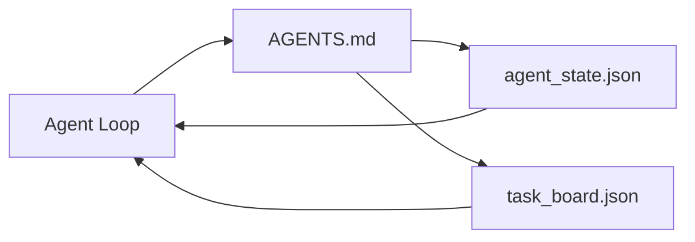

# The Minimal Agent Workbench

> The smallest useful workbench is three files: a root instructions router, a state file, and a task board. Everything else is layered on top. If a repo cannot carry these three, no model will save it.

**Type:** Build
**Languages:** Python
**Prerequisites:** Phase 14 · 31 (Why Capable Models Still Fail)
**Time:** ~45 minutes

## Learning Objectives

- Define the three files that form the minimum viable workbench.
- Explain why a short root router beats a long monolithic `AGENTS.md`.
- Build a state file the agent can read at every turn and write at the end.
- Build a task board that survives multi-session work without chat history.

## The Problem

Most teams reach for a workbench by writing a 3000-line `AGENTS.md` and calling it done. The model loads it, ignores the parts it cannot summarize, and still fails on the same surfaces it always failed on.

You need the opposite. A tiny root file that routes the agent into deeper files only when relevant. Durable state the agent reads before acting and writes after. A task board that says what is in flight, what is blocked, and what is up next.

Three files. Each one with a job. Each one machine-readable enough to evolve into a real system later.

## The Concept

### AGENTS.md is a router, not a manual

A good `AGENTS.md` is short. It points the agent at:

- The state file (where you are).
- The task board (what is left).
- The deeper rules (under `docs/agent-rules.md`).
- The verification command (how to know it works).

Anything longer goes in deeper docs, loaded only when needed. Long manuals get ignored. Short routers get followed.

### agent_state.json is the system of record

State carries: the active task id, the touched files, the assumptions made, the blockers, and the next action. The agent reads it at every turn. The next session reads it instead of replaying chat.

State lives in a file because chat history is unreliable. Sessions die. Conversations get trimmed. The file does not.

### task_board.json is the queue

The task board carries every task with status `todo | in_progress | done | blocked`. It is the queue the agent pulls from when state is empty, and the queue you read when you want to know whether the agent is on track.

A task on the board has an id, a goal, an owner (`builder`, `reviewer`, or `human`), and acceptance criteria. The board is small on purpose: when it grows past a screen, you have a planning problem, not a board problem.

### Three files is the floor, not the ceiling

Later lessons add scope contracts, feedback runners, verification gates, reviewer checklists, and handoff packets. The three files here are what they all assume.

## Build It

Reconstruct **The Minimal Agent Workbench** by following `AgentState` on the smallest valid record {"id": 1}. Run `python3 main.py` and verify that validation names the missing field or rejects the request; it must not silently accept an incomplete record.

## Use It

Call `AgentState` from a small caller with the smallest valid record {"id": 1}. Compare its result with the demo output, and record the input contract and the one field a downstream user should rely on.

## Ship It

Hand off `outputs/skill-minimal-workbench.md` with the command `python3 main.py`, the accepted input shape (the smallest valid record {"id": 1}), the expected observable result, and a failure note for malformed inputs.

## Further Reading

- [agents.md — the open spec](https://agents.md/) — adopted by Cursor, Codex, Claude Code, Copilot, Gemini, OpenCode
- [Augment Code, A good AGENTS.md is a model upgrade. A bad one is worse than no docs at all](https://www.augmentcode.com/blog/how-to-write-good-agents-dot-md-files) — measured quality jumps
- [Blake Crosley, AGENTS.md Patterns: What Actually Changes Agent Behavior](https://blakecrosley.com/blog/agents-md-patterns) — what works empirically, what does not
- [Datadog Frontend, Steering AI Agents in Monorepos with AGENTS.md](https://dev.to/datadog-frontend-dev/steering-ai-agents-in-monorepos-with-agentsmd-13g0) — nested precedence in practice
- [Nx Blog, Teach Your AI Agent How to Work in a Monorepo](https://nx.dev/blog/nx-ai-agent-skills) — single-source generation across six tools
- [The Prompt Shelf, AGENTS.md Best Practices: Structure, Scope, and Real Examples](https://thepromptshelf.dev/blog/agents-md-best-practices/) — section ordering that survives review
- [Anthropic, Claude Code subagents and session store](https://docs.anthropic.com/en/docs/agents-and-tools/claude-code/sub-agents)
- Phase 14 · 31 — the failure modes this minimum absorbs
- Phase 14 · 34 — the durable state schema this lesson previews

## Exercises

Keep two runs side by side for **The Minimal Agent Workbench**. The important evidence is the named field, shape, or status—not a polished paragraph about the run.

1. **Read the first result.** From `code/`, run `python3 main.py` using the smallest valid record {"id": 1}. Follow `AgentState`, `Task`, `write_initial`. Expect validation names the missing field or rejects the request; it must not silently accept an incomplete record; capture the first printed shape, metric, status, or summary field and state which part supports **Define the three files that form the minimum viable workbench.**.
2. **Run a two-value comparison.** Repeat the command after changing only the optional field: use the same record with one optional field changed. Predict the direction of the change, then compare the two output values. Explain why **Explain why a short root router beats a long monolithic `AGENTS.md`.** says the other inputs should stay fixed.
3. **Try an adversarial fixture.** Feed the implementation a record missing the required "id" field. Before running it, write down whether the relevant function should return an empty value, a zero-sized result, or a validation error. Check the observed status against **Build a state file the agent can read at every turn and write at the end.** and record the exception text if the code rejects the case.
4. **Write the operator note.** Open `outputs/skill-minimal-workbench.md` and add a worked example using the smallest valid record {"id": 1}. Include the input contract, one expected output field, and a named acceptance check for **Build a task board that survives multi-session work without chat history.**; note what the demo cannot establish.

## Reference Solution

A checkable result for **The Minimal Agent Workbench** should contain:

- the `python3 main.py` output for the smallest valid record {"id": 1}, with `AgentState`, `Task`, `write_initial` traced to the value or shape that supports **Define the three files that form the minimum viable workbench.**;
- a before/after comparison for the optional field, where the same record with one optional field changed changes the observation in the direction predicted by **Explain why a short root router beats a long monolithic `AGENTS.md`.**;
- a recorded result for a record missing the required "id" field that matches the implementation’s validation or empty-result contract and explains the evidence for **Build a state file the agent can read at every turn and write at the end.**; and
- an updated `outputs/skill-minimal-workbench.md` example with a concrete input, expected output field, and acceptance check tied to **Build a task board that survives multi-session work without chat history.**.

Run the lesson tests after the demo. If the boundary behaves differently from the prediction, keep the actual exception or output and explain the implementation path that produced it.
