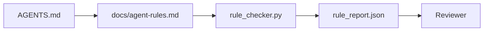

# Agent Instructions as Executable Constraints

> Instructions written as prose are wishes. Instructions written as constraints are tests. The workbench turns each rule into something an agent can check at runtime and a reviewer can verify after the fact.

**Type:** Build
**Languages:** Python
**Prerequisites:** Phase 14 · 32 (Minimal Workbench)
**Time:** ~50 minutes

## Learning Objectives

- Separate routing prose from operational rules.
- Express startup rules, forbidden actions, definition of done, uncertainty handling, and approval boundaries as machine-checkable constraints.
- Implement a rule checker that scores a run against the rule set.
- Make the rule set diff-friendly so review can see what changed.

## The Problem

A typical `AGENTS.md` reads like onboarding documentation. It tells the agent to "be careful" and "test thoroughly" and "ask if unsure." Three days later, the agent ships a change with no tests, writes to a forbidden directory, and never asks because it never knew where the line was.

Instructions are powerful when they are operational and weak when they are aspirational. The fix is to write rules the workbench can interpret and the reviewer can score.

## The Concept

Rules belong in `docs/agent-rules.md`, away from the short root router. Each rule has a name, a category, and a check.



### Five categories that cover most rules

| Category | Question the rule answers | Example |
|----------|---------------------------|---------|
| Startup | What must be true before work begins? | "state file exists and is fresh" |
| Forbidden | What must never happen? | "do not edit `scripts/release.sh`" |
| Definition of done | What proves the task is complete? | "pytest exits 0 and acceptance line passes" |
| Uncertainty | What does the agent do when unsure? | "open a question note instead of guessing" |
| Approval | What requires human approval? | "any new dependency, any prod write" |

A rule that does not fit one of these five usually wants to be two rules. Force the split.

### Rules are machine-readable

Each rule has a slug, a category, a one-line description, and a `check` field that names a function in `rule_checker.py`. Adding a rule means adding a check; the checker grows with the workbench.

### Rules are diff-friendly

Rules live one per heading in a single markdown file. Renames are visible in diffs. New rules sit at the top of their category. Stale rules get deleted, not commented out, because the workbench is the source of truth, not the chat log of how the team felt last quarter.

### Rules versus framework guardrails

Framework guardrails (OpenAI Agents SDK guardrails, LangGraph interrupts) enforce rules at the runtime level. The rule set in this lesson is the human-readable, reviewable contract that those guardrails implement. You need both: the runtime catches violations during a turn, the rule set proves the runtime is doing the right thing.

### Progressive disclosure: a map, not an encyclopedia

The reason `AGENTS.md` keeps growing is that every incident adds a rule and no incident removes one. A year in, the file is two thousand lines, and the agent reads the first screen, runs out of attention budget, and acts on a fraction of what it was told. A giant instruction file fails for the same reason a forty-page onboarding doc fails: the reader skims it once and never returns to the part that mattered.

The fix is not a shorter file. It is a layered one. The root router stays small enough to read every session and holds nothing but pointers. The depth lives in topic files the agent loads only when the task touches them. Give the agent a map, not the whole encyclopedia, and let it walk to the page it needs.

```
AGENTS.md                  # router, < 50 lines: what this repo is, where to look, the 5 hard rules
docs/
  agent-rules.md           # the full rule set (this lesson)
  architecture.md          # loaded when the task touches module boundaries
  testing.md               # loaded when the task writes or runs tests
  deploy.md                # loaded only for release work, gated behind an approval rule
feature_list.json          # the backlog (Phase 14 · 36)
```

| Tier | Lives in | Read when | Size budget |
|------|----------|-----------|-------------|
| Router | `AGENTS.md` | Every session, always | Under ~50 lines |
| Rules | `docs/agent-rules.md` | Every session, on startup | One screen per category |
| Topic docs | `docs/<topic>.md` | Only when the task touches that topic | As deep as needed |

Two tests keep the layering honest. The reachability test: an agent should reach any rule in at most two hops from the router, so the router must link every topic doc by path, not describe it in prose. The freshness test: the router is short enough that a reviewer rereads it on every PR, which is the only thing that stops it from silently growing back into the encyclopedia it replaced. A pointer that no longer resolves is a worse failure than a missing rule, so a broken link in the router is itself a startup-check violation.


## Build It

Reconstruct **Agent Instructions as Executable Constraints** by following `on` on x=0.5 with the demo defaults. Run `python3 main.py` and verify that the update or loss change agrees with the gradient sign; a zero gradient produces no accidental jump.

## Use It

Call `on` from a small caller with x=0.5 with the demo defaults. Compare its result with the demo output, and record the input contract and the one field a downstream user should rely on.

## Ship It

Hand off `outputs/skill-rule-set-builder.md` with the command `python3 main.py`, the accepted input shape (x=0.5 with the demo defaults), the expected observable result, and a failure note for malformed inputs.

## Further Reading

- [OpenAI Agents SDK, Guardrails and approvals](https://developers.openai.com/api/docs/guides/agents/guardrails-approvals)
- [LangGraph interrupts](https://langchain-ai.github.io/langgraph/how-tos/human_in_the_loop/breakpoints/)
- [Anthropic, Building Effective Agents](https://www.anthropic.com/research/building-effective-agents)
- [Rick Hightower, Agent RuleZ: A Deterministic Policy Engine](https://medium.com/@richardhightower/agent-rulez-a-deterministic-policy-engine-for-ai-coding-agents-9489e0561edf) — block/warn/info severity in production
- [Cloudflare, Orchestrating AI Code Review at Scale](https://blog.cloudflare.com/ai-code-review/) — 131k review runs, rule composition lessons
- [microservices.io, GenAI development platform — part 1: guardrails](https://microservices.io/post/architecture/2026/03/09/genai-development-platform-part-1-development-guardrails.html) — defense in depth between rules and CI
- [Type-Checked Compliance: Deterministic Guardrails (arXiv 2604.01483)](https://arxiv.org/pdf/2604.01483) — Lean 4 as the upper bound on rule-as-check
- [logi-cmd/agent-guardrails](https://github.com/logi-cmd/agent-guardrails) — merge-gate implementation: scope, mutation testing, violation budgets
- Phase 14 · 32 — the minimal workbench this rule set drops into
- Phase 14 · 38 — the verification gate that consumes the rule report
- Phase 14 · 39 — the reviewer agent that scores rule compliance

## Exercises

Work from the smallest fixture that the Agent Instructions as Executable Constraints demo already understands, then make one deliberate change and record what moved.

1. **Run the smallest fixture.** From `code/`, run `python3 main.py` using x=0.5 with the demo defaults. Follow `on`, `Rule`, `TurnTrace`. Expect the update or loss change agrees with the gradient sign; a zero gradient produces no accidental jump; capture the first printed shape, metric, status, or summary field and state which part supports **Separate routing prose from operational rules.**.
2. **Perturb one field.** Repeat the command after changing only the learning rate: use the same run with learning rate 0.1 instead of 0.01. Predict the direction of the change, then compare the two output values. Explain why **Express startup rules, forbidden actions, definition of done, uncertainty handling, and approval boundaries as machine-checkable constraints.** says the other inputs should stay fixed.
3. **Check the failure boundary.** Feed the implementation a zero gradient or an already-minimized point. Before running it, write down whether the relevant function should return an empty value, a zero-sized result, or a validation error. Check the observed status against **Implement a rule checker that scores a run against the rule set.** and record the exception text if the code rejects the case.
4. **Make the result repeatable.** Open `outputs/skill-rule-set-builder.md` and add a worked example using x=0.5 with the demo defaults. Include the input contract, one expected output field, and a named acceptance check for **Make the rule set diff-friendly so review can see what changed.**; note what the demo cannot establish.

## Reference Solution

A checkable result for **Agent Instructions as Executable Constraints** should contain:

- the `python3 main.py` output for x=0.5 with the demo defaults, with `on`, `Rule`, `TurnTrace` traced to the value or shape that supports **Separate routing prose from operational rules.**;
- a before/after comparison for the learning rate, where the same run with learning rate 0.1 instead of 0.01 changes the observation in the direction predicted by **Express startup rules, forbidden actions, definition of done, uncertainty handling, and approval boundaries as machine-checkable constraints.**;
- a recorded result for a zero gradient or an already-minimized point that matches the implementation’s validation or empty-result contract and explains the evidence for **Implement a rule checker that scores a run against the rule set.**; and
- an updated `outputs/skill-rule-set-builder.md` example with a concrete input, expected output field, and acceptance check tied to **Make the rule set diff-friendly so review can see what changed.**.

Run the lesson tests after the demo. If the boundary behaves differently from the prediction, keep the actual exception or output and explain the implementation path that produced it.
