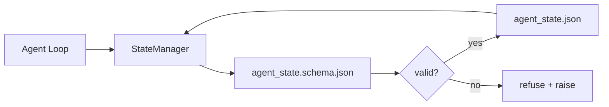

# Repo Memory and Durable State

> Chat history is volatile. The repo is durable. The workbench stores agent state in versioned files so the next session, the next agent, and the next reviewer all read from the same source of truth.

**Type:** Build
**Languages:** Python
**Prerequisites:** Phase 14 · 32 (Minimal Workbench)
**Time:** ~60 minutes

## Learning Objectives

- Define what belongs in repo memory and what belongs in chat history.
- Author JSON Schemas for `agent_state.json` and `task_board.json`.
- Build a state manager that loads, validates, mutates, and persists state atomically.
- Use the schema to refuse bad writes before they corrupt the workbench.

## The Problem

The agent finishes a session. The chat closes. The next session opens and asks where to start. The model says "let me check the files," reads stale notes, and re-does work that was already complete. Or worse, it rewrites a finished file because no one told it the file was finished.

The workbench fix is repo memory: state lives in JSON files in the repo, written under a schema, persisted atomically, diff-friendly in code review. Chat is a transient feed; the repo is the system of record.

## The Concept

### What belongs in repo memory

| Belongs | Does not belong |
|---------|-----------------|
| Active task id | Raw chat transcripts |
| Touched files this session | Token-level reasoning traces |
| Assumptions the agent made | "The user seemed frustrated" |
| Open blockers | Sampled completions |
| Next action | Vendor-specific model ids |

The test is durability: would this be useful three months from now in a CI rerun? If yes, repo. If no, telemetry.

### Schema-first state

JSON Schema is the contract. Without it, every agent invents new fields, every reviewer learns a new shape, and every CI script has to special-case past versions. With it, a bad write is a refused write.

The schema covers:

- Required keys.
- Allowed `status` values.
- Forbidden values (e.g. `null` for arrays).
- Pattern constraints (task ids match `T-\d{3,}`).
- Version field for migrations.

### Atomic writes

State writes need to survive partial failures: write to a tempfile, fsync, rename over the target. The state file is the source of truth; a half-written one is worse than no file at all.

### Migrations

When the schema changes, ship a migration script next to the schema bump. The state file carries a `schema_version` field; the manager refuses to load a file from a version it cannot migrate.

## Build It

Reconstruct **Repo Memory and Durable State** by following `SchemaError` on the smallest valid record {"id": 1}. Run `python3 main.py` and verify that validation names the missing field or rejects the request; it must not silently accept an incomplete record.

## Use It

Call `SchemaError` from a small caller with the smallest valid record {"id": 1}. Compare its result with the demo output, and record the input contract and the one field a downstream user should rely on.

## Ship It

Hand off `outputs/skill-state-schema.md` with the command `python3 main.py`, the accepted input shape (the smallest valid record {"id": 1}), the expected observable result, and a failure note for malformed inputs.

## Further Reading

- [JSON Schema specification](https://json-schema.org/specification.html)
- [LangGraph checkpointers](https://langchain-ai.github.io/langgraph/concepts/persistence/)
- [Letta memory blocks](https://docs.letta.com/concepts/memory)
- [Fast.io, AI Agent State Checkpointing: A Practical Guide](https://fast.io/resources/ai-agent-state-checkpointing/) — schema-first checkpointing with idempotency
- [Fast.io, AI Agent Workflow State Persistence: Best Practices 2026](https://fast.io/resources/ai-agent-workflow-state-persistence/) — concurrency control, TTL, event sourcing
- [Hive Issue #6263 — non-atomic state.json writes silently ignored](https://github.com/aden-hive/hive/issues/6263) — the failure mode in a real project
- [eunomia, Checkpoint/Restore Systems: Evolution, Techniques, Applications](https://eunomia.dev/blog/2025/05/11/checkpointrestore-systems-evolution-techniques-and-applications-in-ai-agents/) — CR primitives from OS history applied to agents
- [Indium, 7 State Persistence Strategies for Long-Running AI Agents in 2026](https://www.indium.tech/blog/7-state-persistence-strategies-ai-agents-2026/)
- [Microsoft Agent Framework, Compaction](https://learn.microsoft.com/en-us/agent-framework/agents/conversations/compaction) — vendor checkpoint manager
- Phase 14 · 08 — memory blocks and sleep-time compute
- Phase 14 · 32 — the three-file minimum this lesson schematizes
- Phase 14 · 40 — handoff packets read from the same schema

## Exercises

Use `SchemaError` as the trace: start from the smallest valid record {"id": 1}, keep the raw output, and tie each observation to a named objective.

1. **Reproduce the reference path.** From `code/`, run `python3 main.py` using the smallest valid record {"id": 1}. Follow `SchemaError`, `validate`, `atomic_write`. Expect validation names the missing field or rejects the request; it must not silently accept an incomplete record; capture the first printed shape, metric, status, or summary field and state which part supports **Define what belongs in repo memory and what belongs in chat history.**.
2. **Vary one named input.** Repeat the command after changing only the optional field: use the same record with one optional field changed. Predict the direction of the change, then compare the two output values. Explain why **Author JSON Schemas for `agent_state.json` and `task_board.json`.** says the other inputs should stay fixed.
3. **Probe the empty case.** Feed the implementation a record missing the required "id" field. Before running it, write down whether the relevant function should return an empty value, a zero-sized result, or a validation error. Check the observed status against **Build a state manager that loads, validates, mutates, and persists state atomically.** and record the exception text if the code rejects the case.
4. **Package a usable handoff.** Open `outputs/skill-state-schema.md` and add a worked example using the smallest valid record {"id": 1}. Include the input contract, one expected output field, and a named acceptance check for **Use the schema to refuse bad writes before they corrupt the workbench.**; note what the demo cannot establish.

## Reference Solution

A checkable result for **Repo Memory and Durable State** should contain:

- the `python3 main.py` output for the smallest valid record {"id": 1}, with `SchemaError`, `validate`, `atomic_write` traced to the value or shape that supports **Define what belongs in repo memory and what belongs in chat history.**;
- a before/after comparison for the optional field, where the same record with one optional field changed changes the observation in the direction predicted by **Author JSON Schemas for `agent_state.json` and `task_board.json`.**;
- a recorded result for a record missing the required "id" field that matches the implementation’s validation or empty-result contract and explains the evidence for **Build a state manager that loads, validates, mutates, and persists state atomically.**; and
- an updated `outputs/skill-state-schema.md` example with a concrete input, expected output field, and acceptance check tied to **Use the schema to refuse bad writes before they corrupt the workbench.**.

Run the lesson tests after the demo. If the boundary behaves differently from the prediction, keep the actual exception or output and explain the implementation path that produced it.
