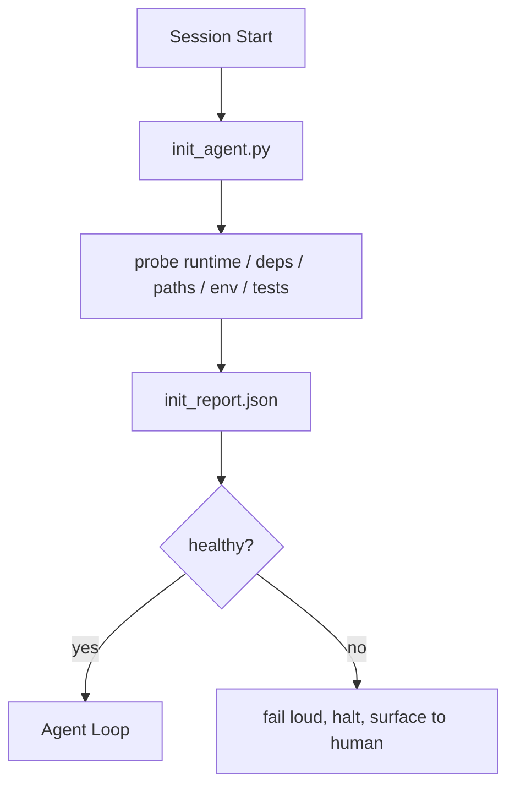

# Initialization Scripts for Agents

> Every session that starts cold pays a tax. The agent reads the same files, retries the same probes, and rediscovers the same paths. An init script pays the tax once and writes the answers into state.

**Type:** Build
**Languages:** Python
**Prerequisites:** Phase 14 · 32 (Minimal Workbench), Phase 14 · 34 (Repo Memory)
**Time:** ~45 minutes

## Learning Objectives

- Identify the work an agent should never have to redo per session.
- Build a deterministic init script that probes runtime, dependencies, and repo health.
- Persist the probe result so the agent reads it instead of re-running checks.
- Fail loud, fast, and with one place to look when initialization fails.

## The Problem

Open a session. The agent guesses the Python version. Guesses the test command. Lists the repo root five times to find the entry point. Tries to import a package that is not installed. Asks the user where the config file lives. By the time it makes a real edit, ten thousand tokens have gone to setup work that should have been a single script.

The fix is one initialization script that runs before the agent does anything else and writes a `init_report.json` the agent reads at startup.

## The Concept

### What the init script probes

| Probe | Why it matters |
|-------|----------------|
| Runtime versions | Wrong Python or Node version means silent wrong-version bugs |
| Dependency availability | A missing package later costs ten times the cost of catching it now |
| Test command | The agent must know how to verify; if the command is missing the workbench is broken |
| Repo paths | Hard-coded paths drift; resolve them once and pin |
| Environment variables | Missing `OPENAI_API_KEY` is a failure surface, not a runtime mystery |
| State + board freshness | Stale state from a crashed session is a footgun |
| Last-known-good commit | Anchor for the handoff diff at the end of the session |

### Fail loud, fail fast, fail in one place

A probe failure means halt and surface to the human. No "the agent will figure it out." The whole point of init is to refuse to start when the workbench is broken.

### Idempotent

Run it twice in a row. The second run should be a no-op except for a fresh timestamp. Idempotency is what lets you wire the script into CI, hooks, or a pre-task slash command.

### Init versus startup rules

Rules (Phase 14 · 33) describe what must be true to act. Init is the script that establishes that those rules can be checked. Rules without init become "be careful." Init without rules becomes a polished failure.

## Build It

Reconstruct **Initialization Scripts for Agents** by following `Probe` on the smallest valid record {"id": 1}. Run `python3 main.py` and verify that validation names the missing field or rejects the request; it must not silently accept an incomplete record.

## Use It

Call `Probe` from a small caller with the smallest valid record {"id": 1}. Compare its result with the demo output, and record the input contract and the one field a downstream user should rely on.

## Ship It

Hand off `outputs/skill-init-script.md` with the command `python3 main.py`, the accepted input shape (the smallest valid record {"id": 1}), the expected observable result, and a failure note for malformed inputs.

## Further Reading

- [Anthropic, Effective harnesses for long-running agents](https://www.anthropic.com/engineering/effective-harnesses-for-long-running-agents)
- [GitHub Actions, composite actions for setup](https://docs.github.com/en/actions/sharing-automations/creating-actions/creating-a-composite-action)
- [microservices.io, GenAI dev platform: guardrails](https://microservices.io/post/architecture/2026/03/09/genai-development-platform-part-1-development-guardrails.html) — pre-commit + CI checks as init
- [Augment Code, How to Build Your AGENTS.md (2026)](https://www.augmentcode.com/guides/how-to-build-agents-md) — init expectations
- [Codex Blog, Codex CLI Context Compaction](https://codex.danielvaughan.com/2026/03/31/codex-cli-context-compaction-architecture/) — session start as compaction-aware init
- Phase 14 · 33 — the rule set this script enables
- Phase 14 · 34 — the state file this script seeds
- Phase 14 · 38 — the verification gate the init script feeds
- Phase 14 · 40 — the handoff that consumes the init report's last-known-good

## Exercises

This lab follows `Probe` and `probe_runtime` on a controlled fixture; write down the value before changing the input.

1. **Trace the canonical fixture.** From `code/`, run `python3 main.py` using the smallest valid record {"id": 1}. Follow `Probe`, `probe_runtime`, `probe_dependencies`. Expect validation names the missing field or rejects the request; it must not silently accept an incomplete record; capture the first printed shape, metric, status, or summary field and state which part supports **Identify the work an agent should never have to redo per session.**.
2. **Change the controlled parameter.** Repeat the command after changing only the optional field: use the same record with one optional field changed. Predict the direction of the change, then compare the two output values. Explain why **Build a deterministic init script that probes runtime, dependencies, and repo health.** says the other inputs should stay fixed.
3. **Exercise the guard.** Feed the implementation a record missing the required "id" field. Before running it, write down whether the relevant function should return an empty value, a zero-sized result, or a validation error. Check the observed status against **Persist the probe result so the agent reads it instead of re-running checks.** and record the exception text if the code rejects the case.
4. **Prepare the artifact for reuse.** Open `outputs/skill-init-script.md` and add a worked example using the smallest valid record {"id": 1}. Include the input contract, one expected output field, and a named acceptance check for **Fail loud, fast, and with one place to look when initialization fails.**; note what the demo cannot establish.

## Reference Solution

A checkable result for **Initialization Scripts for Agents** should contain:

- the `python3 main.py` output for the smallest valid record {"id": 1}, with `Probe`, `probe_runtime`, `probe_dependencies` traced to the value or shape that supports **Identify the work an agent should never have to redo per session.**;
- a before/after comparison for the optional field, where the same record with one optional field changed changes the observation in the direction predicted by **Build a deterministic init script that probes runtime, dependencies, and repo health.**;
- a recorded result for a record missing the required "id" field that matches the implementation’s validation or empty-result contract and explains the evidence for **Persist the probe result so the agent reads it instead of re-running checks.**; and
- an updated `outputs/skill-init-script.md` example with a concrete input, expected output field, and acceptance check tied to **Fail loud, fast, and with one place to look when initialization fails.**.

Run the lesson tests after the demo. If the boundary behaves differently from the prediction, keep the actual exception or output and explain the implementation path that produced it.
