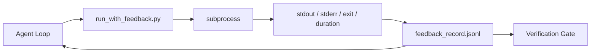

# Runtime Feedback Loops

> Agents that do not see real command output guess. A feedback runner captures stdout, stderr, exit code, and timing into a structured record the next turn can read. Then the agent reacts to facts instead of to its own prediction of facts.

**Type:** Build
**Languages:** Python
**Prerequisites:** Phase 14 · 32 (Minimal Workbench), Phase 14 · 35 (Init Script)
**Time:** ~50 minutes

## Learning Objectives

- Distinguish runtime feedback from observability telemetry.
- Build a feedback runner that wraps shell commands and persists structured records.
- Truncate large outputs deterministically so the loop stays within token budget.
- Refuse to advance the loop when feedback is missing.

## The Problem

The agent says "running tests now." The next message says "all tests pass." The reality is that no test ran. The agent imagined the output, or it ran the command and never read the result, or it read the result and silently truncated the failure line.

A feedback runner removes that gap. Every command goes through the runner. Every record carries the command, the captured stdout and stderr, the exit code, the wall-clock duration, and a one-line agent note. The agent reads the record at the next turn. The verification gate reads the records at the end of the task.

## The Concept

### What goes in a feedback record

| Field | Why it matters |
|-------|----------------|
| `command` | Exact argv, no shell expansion surprises |
| `stdout_tail` | Last N lines, deterministic truncation |
| `stderr_tail` | Last N lines, separate from stdout |
| `exit_code` | The unambiguous success signal |
| `duration_ms` | Surfaces slow probes and runaway processes |
| `started_at` | Timestamp for replay |
| `agent_note` | One line the agent writes about what it expected |

### Truncation is deterministic

A 50 MB log destroys the loop. The runner truncates head and tail with a `...truncated N lines...` marker, deterministic so the same output always produces the same record. No sampling; the parts the agent needs to see (final error, final summary) live at the tail.

### Feedback versus telemetry

Telemetry (Phase 14 · 23, OTel GenAI conventions) is for human operators reviewing runs across time. Feedback is for the next turn of this run. They share fields but they live in different files with different retention.

### Refuse to advance without feedback

If the runner errors before capturing exit, the record carries `exit_code: null` and `error: <reason>`. The agent loop must refuse to claim success on a `null` exit. No exit, no progress.

## Build It

Reconstruct **Runtime Feedback Loops** by following `FeedbackRecord` on tokens=["red","fox"]. Run `python3 main.py` and verify that the attention/embedding shape follows the token count and each valid attention row remains normalized.

## Use It

Call `FeedbackRecord` from a small caller with tokens=["red","fox"]. Compare its result with the demo output, and record the input contract and the one field a downstream user should rely on.

## Ship It

Hand off `outputs/skill-feedback-runner.md` with the command `python3 main.py`, the accepted input shape (tokens=["red","fox"]), the expected observable result, and a failure note for malformed inputs.

## Further Reading

- [OpenTelemetry GenAI semantic conventions](https://opentelemetry.io/docs/specs/semconv/gen-ai/)
- [Anthropic, Effective harnesses for long-running agents](https://www.anthropic.com/engineering/effective-harnesses-for-long-running-agents)
- [Guardrails AI x MLflow — deterministic safety, PII, quality validators](https://guardrailsai.com/blog/guardrails-mlflow) — redaction patterns as regression tests
- [Aport.io, Best AI Agent Guardrails 2026: Pre-Action Authorization Compared](https://aport.io/blog/best-ai-agent-guardrails-2026-pre-action-authorization-compared/) — pre/post-tool capture
- [Andrii Furmanets, AI Agents in 2026: Practical Architecture for Tools, Memory, Evals, Guardrails](https://andriifurmanets.com/blogs/ai-agents-2026-practical-architecture-tools-memory-evals-guardrails) — observability surfaces
- Phase 14 · 23 — OTel GenAI conventions for the telemetry side
- Phase 14 · 24 — agent observability platforms (Langfuse, Phoenix, Opik)
- Phase 14 · 33 — the rule that demands feedback before declaring done
- Phase 14 · 38 — the verification gate that reads the JSONL

## Exercises

Work from the smallest fixture that the Runtime Feedback Loops demo already understands, then make one deliberate change and record what moved.

1. **Run the smallest fixture.** From `code/`, run `python3 main.py` using tokens=["red","fox"]. Follow `FeedbackRecord`, `redact`, `deterministic_tail`. Expect the attention/embedding shape follows the token count and each valid attention row remains normalized; capture the first printed shape, metric, status, or summary field and state which part supports **Distinguish runtime feedback from observability telemetry.**.
2. **Perturb one field.** Repeat the command after changing only the token sequence: use tokens=["red","fox","runs"]. Predict the direction of the change, then compare the two output values. Explain why **Build a feedback runner that wraps shell commands and persists structured records.** says the other inputs should stay fixed.
3. **Check the failure boundary.** Feed the implementation tokens=[]. Before running it, write down whether the relevant function should return an empty value, a zero-sized result, or a validation error. Check the observed status against **Truncate large outputs deterministically so the loop stays within token budget.** and record the exception text if the code rejects the case.
4. **Make the result repeatable.** Open `outputs/skill-feedback-runner.md` and add a worked example using tokens=["red","fox"]. Include the input contract, one expected output field, and a named acceptance check for **Refuse to advance the loop when feedback is missing.**; note what the demo cannot establish.

## Reference Solution

A checkable result for **Runtime Feedback Loops** should contain:

- the `python3 main.py` output for tokens=["red","fox"], with `FeedbackRecord`, `redact`, `deterministic_tail` traced to the value or shape that supports **Distinguish runtime feedback from observability telemetry.**;
- a before/after comparison for the token sequence, where tokens=["red","fox","runs"] changes the observation in the direction predicted by **Build a feedback runner that wraps shell commands and persists structured records.**;
- a recorded result for tokens=[] that matches the implementation’s validation or empty-result contract and explains the evidence for **Truncate large outputs deterministically so the loop stays within token budget.**; and
- an updated `outputs/skill-feedback-runner.md` example with a concrete input, expected output field, and acceptance check tied to **Refuse to advance the loop when feedback is missing.**.

Run the lesson tests after the demo. If the boundary behaves differently from the prediction, keep the actual exception or output and explain the implementation path that produced it.
