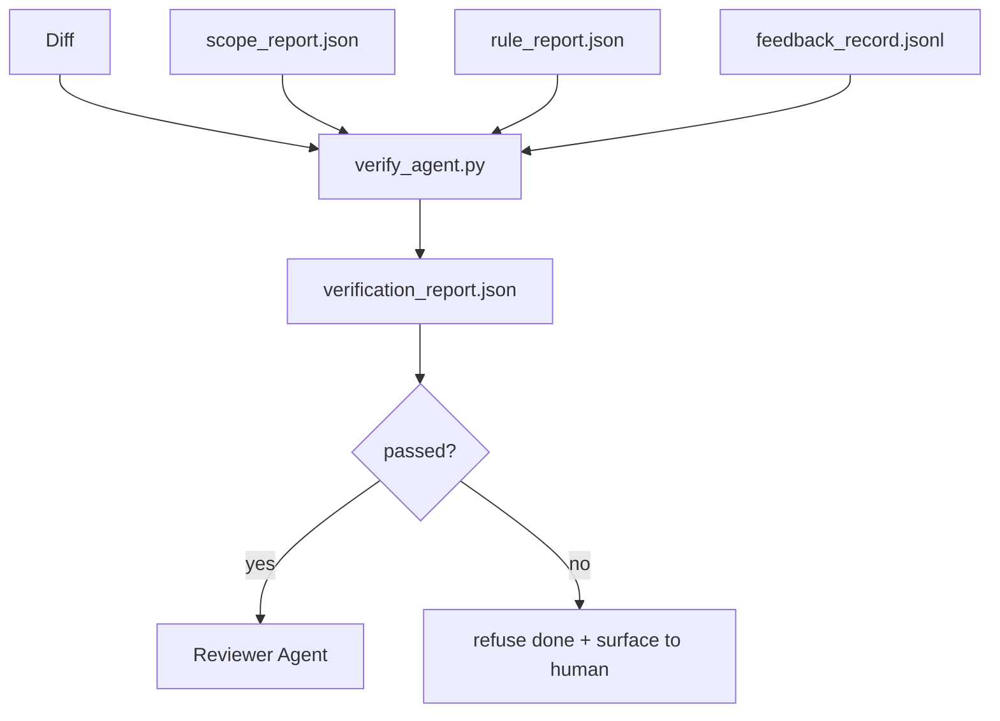

# Verification Gates

> The agent does not get to mark its own work as done. A verification gate reads the scope contract, the feedback log, the rule report, and the diff, and answers a single question: is this task actually complete? If the gate says no, the task is not done, no matter what the chat says.

**Type:** Build
**Languages:** Python
**Prerequisites:** Phase 14 · 33 (Rules), Phase 14 · 36 (Scope), Phase 14 · 37 (Feedback)
**Time:** ~55 minutes

## Learning Objectives

- Define a verification gate as a deterministic function over workbench artifacts.
- Combine rule report, scope report, feedback records, and diff into a single verdict.
- Emit a `verification_report.json` the reviewer agent and CI can both read.
- Refuse to advance a task on any block-severity failure, without exception.

## The Problem

Agents declare success too easily. Three failure shapes dominate:

- "Looks good." The model read its own diff and decided it was correct.
- "Tests passed." Said with confidence. No record of the test actually running.
- "Acceptance met." Acceptance criteria interpreted loosely enough to mean "anything resembling done."

The workbench fix is a single verification gate that reads the artifacts the agent has already produced and makes the call. The gate is deterministic. The gate is in version control. The gate is wired into CI. The agent cannot bribe it.

## The Concept

### What the gate checks

| Check | Source artifact | Severity |
|-------|-----------------|----------|
| All acceptance commands ran | `feedback_record.jsonl` | block |
| All acceptance commands exited zero | `feedback_record.jsonl` | block |
| Scope check has no forbidden writes | `scope_report.json` | block |
| Scope check has no off-scope writes | `scope_report.json` | block or warn |
| All block-severity rules pass | `rule_report.json` | block |
| No `null` exit codes in feedback | `feedback_record.jsonl` | block |
| Touched files match `scope.allowed_files` | both | warn |

A `warn` finding annotates the verdict; a `block` finding prevents `passed: true`.

### Deterministic, not probabilistic

The gate must produce the same verdict for the same artifact set every time. No LLM judges. LLM judges belong on the reviewer side (Phase 14 · 39) where the goal is qualitative evaluation, not status.

### One report, one path

The gate emits one `verification_report.json` per task close-out, written under `outputs/verification/<task_id>.json`. CI consumes the same path. Multiple gates with different paths fork the source of truth.

### Refuse without exception

Block-severity findings cannot be overridden by the agent. They can only be overridden by a human, with a recorded `override_reason` and an `overridden_by` user id. The override is a signed change, not an agent decision.

## Build It

Reconstruct **Verification Gates** by following `Finding` on the demo’s smallest built-in fixture. Run `python3 main.py` and verify that the result reports the empty case explicitly or raises the documented validation error.

## Use It

Call `Finding` from a small caller with the demo’s smallest built-in fixture. Compare its result with the demo output, and record the input contract and the one field a downstream user should rely on.

## Ship It

Hand off `outputs/skill-verification-gate.md` with the command `python3 main.py`, the accepted input shape (the demo’s smallest built-in fixture), the expected observable result, and a failure note for malformed inputs.

## Further Reading

- [Anthropic, Harness design for long-running application development](https://www.anthropic.com/engineering/harness-design-long-running-apps)
- [OpenAI Agents SDK, Guardrails and approvals](https://developers.openai.com/api/docs/guides/agents/guardrails-approvals)
- [microservices.io, GenAI dev platform: guardrails](https://microservices.io/post/architecture/2026/03/09/genai-development-platform-part-1-development-guardrails.html) — defense in depth between pre-commit and CI
- [ICMD, The 2026 Playbook for Agentic AI Ops](https://icmd.app/article/the-2026-playbook-for-agentic-ai-ops-guardrails-costs-and-reliability-at-scale-1776661990431) — approval-gate ladder (draft → approval → auto under thresholds)
- [Type-Checked Compliance: Deterministic Guardrails (arXiv 2604.01483)](https://arxiv.org/pdf/2604.01483) — Lean 4 as the upper bound of deterministic gating
- [logi-cmd/agent-guardrails — merge gate spec](https://github.com/logi-cmd/agent-guardrails) — scope + mutation-testing gates
- [Guardrails AI x MLflow](https://guardrailsai.com/blog/guardrails-mlflow) — deterministic validators as CI scorers
- [Akira, Real-Time Guardrails for Agentic Systems](https://www.akira.ai/blog/real-time-guardrails-agentic-systems) — pre/post-tool gates
- Phase 14 · 27 — prompt injection defenses (the gate's adversarial pair)
- Phase 14 · 36 — the scope contract this gate enforces
- Phase 14 · 37 — the feedback log this gate scores
- Phase 14 · 39 — the reviewer agent the gate hands off to

## Exercises

Use `Finding` as the trace: start from the demo’s smallest built-in fixture, keep the raw output, and tie each observation to a named objective.

1. **Reproduce the reference path.** From `code/`, run `python3 main.py` using the demo’s smallest built-in fixture. Follow `Finding`, `Artifacts`, `VerdictReport`. Expect the result reports the empty case explicitly or raises the documented validation error; capture the first printed shape, metric, status, or summary field and state which part supports **Define a verification gate as a deterministic function over workbench artifacts.**.
2. **Vary one named input.** Repeat the command after changing only the primary fixture value: use the same fixture with its primary value changed from 1 to 2. Predict the direction of the change, then compare the two output values. Explain why **Combine rule report, scope report, feedback records, and diff into a single verdict.** says the other inputs should stay fixed.
3. **Probe the empty case.** Feed the implementation an empty fixture {}. Before running it, write down whether the relevant function should return an empty value, a zero-sized result, or a validation error. Check the observed status against **Emit a `verification_report.json` the reviewer agent and CI can both read.** and record the exception text if the code rejects the case.
4. **Package a usable handoff.** Open `outputs/skill-verification-gate.md` and add a worked example using the demo’s smallest built-in fixture. Include the input contract, one expected output field, and a named acceptance check for **Refuse to advance a task on any block-severity failure, without exception.**; note what the demo cannot establish.

## Reference Solution

A checkable result for **Verification Gates** should contain:

- the `python3 main.py` output for the demo’s smallest built-in fixture, with `Finding`, `Artifacts`, `VerdictReport` traced to the value or shape that supports **Define a verification gate as a deterministic function over workbench artifacts.**;
- a before/after comparison for the primary fixture value, where the same fixture with its primary value changed from 1 to 2 changes the observation in the direction predicted by **Combine rule report, scope report, feedback records, and diff into a single verdict.**;
- a recorded result for an empty fixture {} that matches the implementation’s validation or empty-result contract and explains the evidence for **Emit a `verification_report.json` the reviewer agent and CI can both read.**; and
- an updated `outputs/skill-verification-gate.md` example with a concrete input, expected output field, and acceptance check tied to **Refuse to advance a task on any block-severity failure, without exception.**.

Run the lesson tests after the demo. If the boundary behaves differently from the prediction, keep the actual exception or output and explain the implementation path that produced it.
