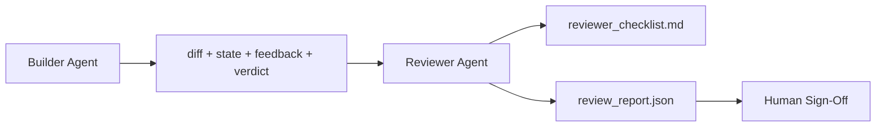

# Reviewer Agent: Separate Builder from Marker

> The agent that wrote the code cannot grade it. A reviewer is a second loop with a different system prompt, a different goal, and read-only access to everything the builder produced. The gap between builder and reviewer is where most reliability lives.

**Type:** Build
**Languages:** Python
**Prerequisites:** Phase 14 · 38 (Verification Gate)
**Time:** ~55 minutes

## Learning Objectives

- State why the same agent cannot reliably review its own work.
- Build a reviewer agent loop that consumes builder artifacts and emits a structured review report.
- Author a reviewer rubric that grades specific dimensions, not vibes.
- Wire the reviewer into the workbench so the human review step starts from a real artifact.

## The Problem

You ask the agent to fix a bug. It edits four files, runs the tests, and reports done. The verification gate (Phase 14 · 38) confirms acceptance ran and scope held. The gate says `passed: true`. You merge. Two days later you find that the fix solved the wrong half of the bug.

Acceptance is necessary, not sufficient. The reviewer asks the questions acceptance cannot ask: did this solve the right problem? Did it expand scope without flagging it? Did it document assumptions that should have been questioned? Did it leave the workbench in a state the next session can pick up?

## The Concept



### Reviewer rubric

Five dimensions, each scored 0 to 2.

| Dimension | Question |
|-----------|----------|
| Problem fit | Did the change solve the task as stated, not a nearby task? |
| Scope discipline | Were edits confined to the contract or was the contract grown deliberately? |
| Assumptions | Are all hidden assumptions written down somewhere reviewable? |
| Verification quality | Does the acceptance command actually prove the goal, or did it prove a weaker version? |
| Handoff readiness | Could the next session pick up cleanly from the current state? |

Total out of 10. A run below 7 is a soft fail; a run below 5 is a hard fail.

Every example below shares this setup — run it once, then the rest reuse `lrn_llm`. Score two sample builder artifacts against the rubric: a clean change, and one that solved the wrong problem.

```python editable
import sys, json, types
lrn_llm = types.ModuleType("lrn_llm")
try:
    from pyodide.http import pyfetch as _pyfetch
    _IN_PYODIDE = True
except ImportError:
    import urllib.request as _urlreq
    _IN_PYODIDE = False
lrn_llm.API_BASE = "/api/llm"
lrn_llm.DEFAULT_MODEL = "azure/gpt-5.4-mini"
lrn_llm.API_KEY = ""

async def _lrn_call(messages, *, system=None, max_tokens=400, model=None):
    if system is not None:
        messages = [{"role": "system", "content": system}] + list(messages)
    payload = {"model": model or lrn_llm.DEFAULT_MODEL, "messages": messages,
               "max_completion_tokens": max_tokens}
    headers = {"content-type": "application/json"}
    _key = lrn_llm.API_KEY
    if _key:
        headers["Authorization"] = "Bearer " + _key
    url = lrn_llm.API_BASE.rstrip("/") + "/chat/completions"
    body = json.dumps(payload)
    if _IN_PYODIDE:
        r = await _pyfetch(url, method="POST", headers=headers, body=body)
        data = await r.json()
    else:
        req = _urlreq.Request(url, method="POST", headers=headers, data=body.encode("utf-8"))
        with _urlreq.urlopen(req, timeout=60) as r:
            data = json.loads(r.read())
    if "error" in data:
        raise RuntimeError("LLM error: " + str(data["error"]))
    return data

def _lrn_text(r):
    ch = (r or {}).get("choices") or []
    return (ch[0].get("message", {}) or {}).get("content", "") if ch else ""

async def _lrn_ping():
    r = await _lrn_call([{"role": "user", "content": "Reply with exactly: OK"}], max_tokens=5)
    return {"ok": _lrn_text(r).strip().upper().startswith("OK"), "model": r.get("model")}

lrn_llm.call = _lrn_call
lrn_llm.text = _lrn_text
lrn_llm.ping = _lrn_ping
r = await lrn_llm.ping()
print(f"LLM reachable: {r}")
```

```python editable
# Case 1: Clean change — fixed the right problem, documented assumptions, good state
case_clean = {
    "task_id": "T-001",
    "goal": "add input validation to signup",
    "diff_summary": {
        "touched": ["app/signup.py", "tests/test_signup.py"],
        "added_lines": 45,
        "removed_lines": 8,
    },
    "state": {
        "active_task_id": None,
        "assumptions": ["users sign up with email + password only", "email length ≤ 254 chars"],
        "next_action": "pick next task from board",
    },
    "feedback": [{"command": "pytest", "exit_code": 0}],
    "verdict": {"passed": True, "findings": []},
}

# Case 2: Wrong problem — tests pass, but only docs changed, not code
case_wrong = {
    "task_id": "T-002",
    "goal": "add input validation to signup",
    "diff_summary": {
        "touched": ["docs/api.md"],
        "added_lines": 12,
        "removed_lines": 0,
    },
    "state": {
        "active_task_id": "T-002",  # task not closed
        "assumptions": [],  # no assumptions recorded
        "next_action": "",  # no next action
    },
    "feedback": [{"command": "pytest", "exit_code": 0}],
    "verdict": {"passed": True, "findings": [{"code": "scope.off_scope", "severity": "warn"}]},
}

print("Case 1 (clean): files =", case_clean["diff_summary"]["touched"])
print("Case 2 (wrong): files =", case_wrong["diff_summary"]["touched"])
```

Dimension 1, problem fit: does the set of files touched actually align with the stated goal?

```python editable
async def score_problem_fit(case):
    prompt = f"""You are a code reviewer assessing whether a change solves its stated task.

Task goal: {case['goal']}
Files touched: {', '.join(case['diff_summary']['touched'])}

Does the set of files touched align with the goal?
If yes (code/test files changed for signup), score 2.
If partial (only one touched), score 1.
If no (unrelated files), score 0.

Reply with ONLY a JSON object: {{"score": <int>, "note": "<reason>"}}"""

    r = await lrn_llm.call(
        [{"role": "user", "content": prompt}],
        max_tokens=100
    )
    text = lrn_llm.text(r)
    try:
        result = json.loads(text)
        return result["score"], result.get("note", "")
    except:
        return 0, f"Could not parse response: {text[:50]}"

# Score both cases
print("Case 1 (clean):")
score1, note1 = await score_problem_fit(case_clean)
print(f"  Problem fit: {score1}/2 — {note1}")

print("\nCase 2 (wrong):")
score2, note2 = await score_problem_fit(case_wrong)
print(f"  Problem fit: {score2}/2 — {note2}")
```

Dimension 2, scope discipline: did edits stay inside the contract, or did scope creep in?

```python editable
async def score_scope_discipline(case):
    findings_text = "; ".join([f"{f.get('code')}: {f.get('severity')}" for f in case["verdict"].get("findings", [])])
    prompt = f"""You are reviewing whether a change respected its scope boundaries.

Task: {case['goal']}
Verification findings: {findings_text if findings_text else "none"}
Files touched: {', '.join(case['diff_summary']['touched'])}

Did the builder stay within scope?
If no findings and files are on-scope: score 2.
If there are off-scope warnings but no forbidden writes: score 1.
If there are forbidden writes: score 0.

Reply with ONLY a JSON object: {{"score": <int>, "note": "<reason>"}}"""

    r = await lrn_llm.call(
        [{"role": "user", "content": prompt}],
        max_tokens=100
    )
    text = lrn_llm.text(r)
    try:
        result = json.loads(text)
        return result["score"], result.get("note", "")
    except:
        return 0, f"Could not parse response: {text[:50]}"

print("Case 1 (clean):")
score1, note1 = await score_scope_discipline(case_clean)
print(f"  Scope discipline: {score1}/2 — {note1}")

print("\nCase 2 (wrong):")
score2, note2 = await score_scope_discipline(case_wrong)
print(f"  Scope discipline: {score2}/2 — {note2}")
```

Dimension 3, assumptions: if no assumptions are recorded, either the work was trivial (unlikely) or undocumented (bad) — the reviewer wants to see what bounded the solution.

```python editable
async def score_assumptions(case):
    assumptions = case["state"].get("assumptions") or []
    assumptions_text = "; ".join(assumptions) if assumptions else "none"

    prompt = f"""You are reviewing whether a builder documented their assumptions.

Task: {case['goal']}
Assumptions recorded: {assumptions_text}

Are assumptions properly documented?
If ≥2 assumptions are recorded and specific: score 2.
If some assumptions recorded but sparse: score 1.
If no assumptions recorded, judge whether the task genuinely required disambiguation (which fields, which rules, which edge cases — most non-trivial feature/behavior changes do):
  - If the task was truly mechanical/unambiguous and no judgment calls were possible: score 2 (nothing to document).
  - If the task required judgment calls and none were surfaced: score 0 (assumptions were needed but never recorded).

Reply with ONLY a JSON object: {{"score": <int>, "note": "<reason>"}}"""

    r = await lrn_llm.call(
        [{"role": "user", "content": prompt}],
        max_tokens=100
    )
    text = lrn_llm.text(r)
    try:
        result = json.loads(text)
        return result["score"], result.get("note", "")
    except:
        return 0, f"Could not parse response: {text[:50]}"

print("Case 1 (clean):")
score1, note1 = await score_assumptions(case_clean)
print(f"  Assumptions: {score1}/2 — {note1}")

print("\nCase 2 (wrong):")
score2, note2 = await score_assumptions(case_wrong)
print(f"  Assumptions: {score2}/2 — {note2}")
```

Dimension 4, verification quality: did the acceptance command actually prove the goal?

```python editable
async def score_verification_quality(case):
    exits = [rec.get("exit_code") for rec in case["feedback"]]
    exit_text = ", ".join(str(e) for e in exits)

    prompt = f"""You are reviewing whether acceptance tests were sufficient.

Task: {case['goal']}
Feedback exit codes: {exit_text}
Verification passed: {case['verdict'].get('passed')}

Were the acceptance tests adequate?
If all exit zero and verification passed: score 2.
If mixed exit codes or verification has findings: score 1.
If missing exit codes: score 0.

Reply with ONLY a JSON object: {{"score": <int>, "note": "<reason>"}}"""

    r = await lrn_llm.call(
        [{"role": "user", "content": prompt}],
        max_tokens=100
    )
    text = lrn_llm.text(r)
    try:
        result = json.loads(text)
        return result["score"], result.get("note", "")
    except:
        return 0, f"Could not parse response: {text[:50]}"

print("Case 1 (clean):")
score1, note1 = await score_verification_quality(case_clean)
print(f"  Verification quality: {score1}/2 — {note1}")

print("\nCase 2 (wrong):")
score2, note2 = await score_verification_quality(case_wrong)
print(f"  Verification quality: {score2}/2 — {note2}")
```

Dimension 5, handoff readiness: has the builder closed the task in state and set a next action?

```python editable
async def score_handoff_readiness(case):
    active = case["state"].get("active_task_id")
    next_action = case["state"].get("next_action")

    prompt = f"""You are reviewing whether a builder left a clean handoff.

Task ID: {case['task_id']}
Active task after work: {active if active else "none"}
Next action set: {next_action if next_action else "none"}

Is the handoff ready for the next session?
If task closed and next_action is set: score 2.
If task not closed but next_action is set: score 1.
If neither is set: score 0.

Reply with ONLY a JSON object: {{"score": <int>, "note": "<reason>"}}"""

    r = await lrn_llm.call(
        [{"role": "user", "content": prompt}],
        max_tokens=100
    )
    text = lrn_llm.text(r)
    try:
        result = json.loads(text)
        return result["score"], result.get("note", "")
    except:
        return 0, f"Could not parse response: {text[:50]}"

print("Case 1 (clean):")
score1, note1 = await score_handoff_readiness(case_clean)
print(f"  Handoff readiness: {score1}/2 — {note1}")

print("\nCase 2 (wrong):")
score2, note2 = await score_handoff_readiness(case_wrong)
print(f"  Handoff readiness: {score2}/2 — {note2}")
```

Now combine all five dimension scores into the final review report and verdict:

```python editable
async def review_case(case):
    """Run all five dimension scorers and produce a review report."""
    dimensions = []
    total = 0

    # Score each dimension
    scores = [
        await score_problem_fit(case),
        await score_scope_discipline(case),
        await score_assumptions(case),
        await score_verification_quality(case),
        await score_handoff_readiness(case),
    ]
    names = ["problem_fit", "scope_discipline", "assumptions", "verification_quality", "handoff_readiness"]

    for name, (score, note) in zip(names, scores):
        dimensions.append({"name": name, "score": score, "note": note})
        total += score

    # Determine verdict
    has_zero = any(d["score"] == 0 for d in dimensions)
    if has_zero or total < 5:
        verdict = "hard_fail"
    elif total >= 7:
        verdict = "pass"
    else:
        verdict = "soft_fail"

    return {
        "task_id": case["task_id"],
        "total": total,
        "verdict": verdict,
        "dimensions": dimensions,
    }

# Review both cases
print("Reviewing Case 1 (clean)...")
report1 = await review_case(case_clean)
print(f"✅ Task {report1['task_id']}: {report1['total']}/10 — {report1['verdict']}")
for d in report1["dimensions"]:
    print(f"   {d['name']:25} {d['score']}/2 — {d['note'][:40]}..." if len(d['note']) > 40 else f"   {d['name']:25} {d['score']}/2 — {d['note']}")

print("\nReviewing Case 2 (wrong problem)...")
report2 = await review_case(case_wrong)
print(f"{'✅' if report2['verdict'] == 'pass' else '⚠️ ' if report2['verdict'] == 'soft_fail' else '❌'} Task {report2['task_id']}: {report2['total']}/10 — {report2['verdict']}")
for d in report2["dimensions"]:
    print(f"   {d['name']:25} {d['score']}/2 — {d['note'][:40]}..." if len(d['note']) > 40 else f"   {d['name']:25} {d['score']}/2 — {d['note']}")
```

### The reviewer is a separate role, not a separate model

You can run the reviewer with the same model as the builder. The discipline is the role separation: different system prompt, different inputs, no write access to the diff. The change in posture is the change in signal.

### The reviewer cannot edit the diff

The reviewer reads the diff, the state, the feedback, the verdict. It writes a report. It does not patch the diff. If the report says "fix this," the next builder turn does the fix; the reviewer goes back to reviewing. Mixing roles defeats the gap.

### Reviewer rubric versus verification gate

The gate (Phase 14 · 38) checks deterministic facts: did acceptance run, did rules pass, did scope hold. The reviewer makes qualitative judgments: was this the right work, is it documented, is the handoff usable. Both are required.

## Try It Yourself

Edit the case below and run it through `review_case`. Try changing only docs (like the wrong-problem case above), recording no assumptions, or leaving an active task unclosed — watch which dimension drops.

```python editable
your_case = {
    "task_id": "T-003",
    "goal": "refactor database connection pooling",  # TODO: change to a different goal
    "diff_summary": {
        "touched": ["db/pool.py", "tests/test_pool.py"],  # TODO: add or remove files
        "added_lines": 30,
        "removed_lines": 15,
    },
    "state": {
        "active_task_id": None,  # TODO: try setting this to "T-003" to break handoff
        "assumptions": ["pool size must be ≥4"],  # TODO: remove to test assumption scoring
        "next_action": "measure latency impact in staging",  # TODO: empty this to test handoff
    },
    "feedback": [{"command": "pytest", "exit_code": 0}],
    "verdict": {"passed": True, "findings": []},
}

print("Running custom review...")
report = await review_case(your_case)
print(f"Task {report['task_id']}: {report['total']}/10 — {report['verdict']}")
for d in report["dimensions"]:
    print(f"   {d['name']:25} {d['score']}/2")
```

## Further Reading

- [OpenAI Agents SDK, Orchestration and handoffs](https://developers.openai.com/api/docs/guides/agents/orchestration)
- [Anthropic Claude Code subagents](https://docs.anthropic.com/en/docs/agents-and-tools/claude-code/sub-agents)
- [Cloudflare, Orchestrating AI Code Review at Scale](https://blog.cloudflare.com/ai-code-review/) — 7-specialist + coordinator architecture, 131k runs / 30 days
- [Agent-as-a-Judge: Evaluating Agents with Agents (OpenReview / ICLR)](https://openreview.net/forum?id=DeVm3YUnpj) — DevAI benchmark, 365 hierarchical solution requirements
- [Adnan Masood, Rubric-Based Evaluations and LLM-as-a-Judge: Methodologies, Biases, Empirical Validation](https://medium.com/@adnanmasood/rubric-based-evals-llm-as-a-judge-methodologies-and-empirical-validation-in-domain-context-71936b989e80) — the 4 biases and mitigations
- [MLflow, LLM-as-a-Judge Evaluation](https://mlflow.org/llm-as-a-judge) — production tooling for separated builder/evaluator
- [LangChain, How to Calibrate LLM-as-a-Judge with Human Corrections](https://www.langchain.com/articles/llm-as-a-judge) — calibration-set workflow
- [Evidently AI, LLM-as-a-judge: a complete guide](https://www.evidentlyai.com/llm-guide/llm-as-a-judge)
- [Arize, LLM as a Judge — Primer and Pre-Built Evaluators](https://arize.com/llm-as-a-judge/)
- Phase 14 · 05 — Self-Refine and CRITIC (single-agent self-review baseline)
- Phase 14 · 30 — Eval-driven agent development (calibration set generator)
- Phase 14 · 38 — the verification gate the reviewer reads
- Phase 14 · 40 — the handoff packet the reviewer report feeds
