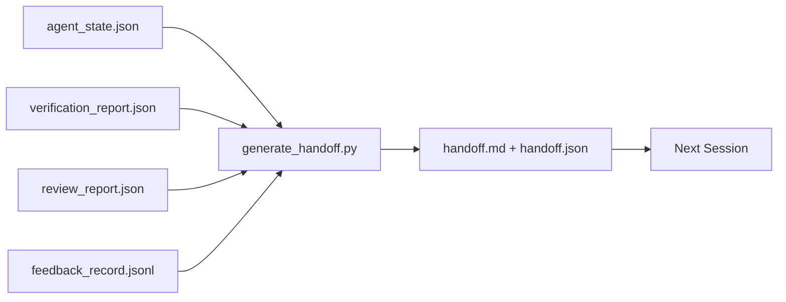

# Multi-Session Handoff

> The session is going to end. The work is not. The handoff packet is the artifact that turns "the agent worked for an hour" into "the next session is productive in the first minute." Build it on purpose, not as an afterthought.

**Type:** Build
**Languages:** Python (stdlib)
**Prerequisites:** Phase 14 · 34 (Repo Memory), Phase 14 · 38 (Verification), Phase 14 · 39 (Reviewer)
**Time:** ~50 minutes

## Learning Objectives

- Identify the seven fields every handoff packet needs.
- Generate a handoff from the workbench artifacts without hand-writing prose.
- Trim large feedback logs into a handoff-sized summary.
- Make the next session's first action deterministic.

## The Problem

The session ends. The agent says "great, we made progress." The next session opens. The next agent asks "where did we leave off?" The first agent's answer is gone. The next agent rediscovers, re-runs the same commands, re-asks the human the same questions, and burns thirty minutes recovering the last thirty seconds of the previous session.

The cost of a bad handoff is paid every session for the life of the task. The fix is a packet generated automatically at session end: what changed, why, what was tried, what failed, what is left, what to do first next time.

## The Concept

### Seven fields every handoff carries

| Field | Question it answers |
|-------|---------------------|
| `summary` | One paragraph of what was done |
| `changed_files` | The diff at a glance |
| `commands_run` | What was actually executed |
| `failed_attempts` | What was tried and why it did not work |
| `open_risks` | What could bite next session, with severity |
| `next_action` | The first concrete step next session takes |
| `verdict_pointer` | Path to the verification + review reports |

The `next_action` field is the load-bearing one. A handoff with everything except `next_action` is a status report, not a handoff.

### Handoffs are generated, not written

A hand-written handoff is a handoff that gets skipped on a hard day. The generator reads the workbench artifacts and emits the packet. The agent's job is to leave the workbench in a state the generator can summarize, not to write the summary.

### Two forms: human-readable and machine-readable

`handoff.md` is what the human reads. `handoff.json` is what the next agent loads. Both come from the same source artifacts. If they diverge, the JSON wins.

### Feedback log trimming

The full `feedback_record.jsonl` may be hundreds of entries. The handoff carries only the last K plus every entry with a non-zero exit. The next session loads the full log if it needs to, but the packet stays small.

### Leave a clean state

A handoff describes the work. A clean state makes the work resumable. They are not the same thing. A perfect `handoff.md` is worthless if the next session opens to a half-applied diff, a temp file the agent forgot, a stray branch, and tests that error before they even run. The next agent then spends its first ten minutes cleaning up after the last one instead of building, and the cost compounds every session for the life of the task.

So the session does not end when the feature works. It ends when the workbench is in a state the generator can summarize and the next session can trust. Cleanup is its own phase, run before the handoff, and it is a check, not a habit, because a habit is the thing that gets skipped on a hard day.

| Check | Clean means | Dirty blocks because |
|-------|-------------|----------------------|
| Working tree | Every change committed or explicitly stashed with a note | A half-applied diff looks like intentional work to the next agent |
| Temp artifacts | No `*.tmp`, scratch dirs, debug prints, or commented-out blocks left behind | Stray files pollute the diff and the next agent's mental model |
| Tests | Green, or red with the failure named in `open_risks` | A silent red test is a trap the next session steps in |
| Feature board | `feature_list.json` status reflects reality (Phase 14 · 36) | A stale board sends the next session to work that is already done |
| Branch | On the expected branch, no detached HEAD, no orphan branches | Wrong branch means the next session's first commit lands in the wrong place |

The cleanup phase emits a `clean_state.json` of blocking issues; an empty list is the precondition the handoff generator asserts before it writes a packet. A handoff built on a dirty tree is not a handoff, it is a forwarded mess. The two artifacts pair: cleanup proves the workbench is safe to leave, the handoff proves the next session knows where to start.

## Further Reading

- [Anthropic, Effective harnesses for long-running agents](https://www.anthropic.com/engineering/effective-harnesses-for-long-running-agents)
- [OpenAI Agents SDK, Orchestration and handoffs](https://developers.openai.com/api/docs/guides/agents/orchestration)
- [Codex Blog, Codex CLI Context Compaction: Architecture, Configuration, Managing Long Sessions](https://codex.danielvaughan.com/2026/03/31/codex-cli-context-compaction-architecture/) — POST /v1/responses/compact and local fallback
- [Justin3go, Shedding Heavy Memories: Context Compaction in Codex, Claude Code, OpenCode](https://justin3go.com/en/posts/2026/04/09-context-compaction-in-codex-claude-code-and-opencode) — three-vendor compaction comparison
- [JD Hodges, Claude Handoff Prompt: How to Keep Context Across Sessions (2026)](https://www.jdhodges.com/blog/ai-session-handoffs-keep-context-across-conversations/) — CLAUDE.md + HANDOVER.md, 50-75% context budget
- [Mervin Praison, Managing Handoffs in Multi-Agent Coding Sessions: Fresh Context Without Losing Continuity](https://mer.vin/2026/04/managing-handoffs-in-multi-agent-coding-sessions-fresh-context-without-losing-continuity/) — distributed-systems framing
- [Hermes Issue #20372 — automatic fresh-session handoff when compression becomes risky](https://github.com/NousResearch/hermes-agent/issues/20372)
- [Hermes Issue #499 — Context Compaction Quality Overhaul](https://github.com/NousResearch/hermes-agent/issues/499) — handoff-oriented prompts in Codex CLI
- [Microsoft Agent Framework, Compaction](https://learn.microsoft.com/en-us/agent-framework/agents/conversations/compaction)
- [OpenCode, Context Management and Compaction](https://deepwiki.com/sst/opencode/2.4-context-management-and-compaction)
- [LangChain, Context Engineering for Agents](https://www.langchain.com/blog/context-engineering-for-agents)
- Phase 14 · 34 — the state file the generator reads
- Phase 14 · 38 — the verification verdict the packet points at
- Phase 14 · 39 — the reviewer report bundled into the packet
