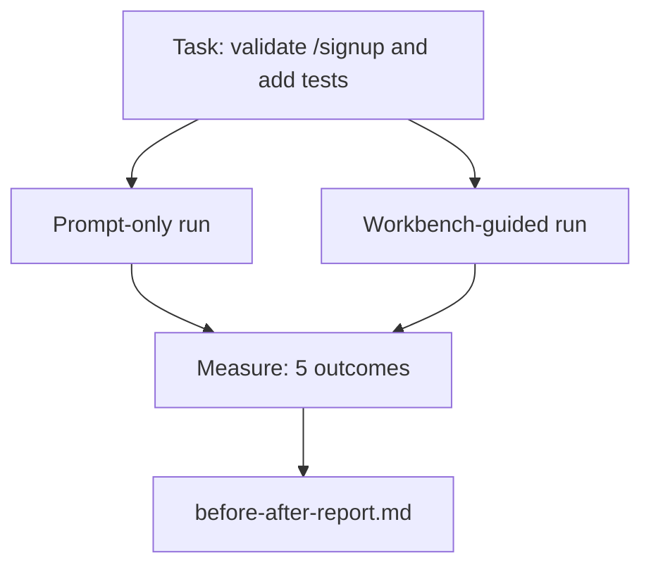

# The Workbench on a Real Repo

> Eleven lessons of surfaces are worth nothing if they do not survive contact with a real codebase. This lesson runs the same task twice on a small sample app: prompt-only versus workbench-guided. The numbers do the arguing.

**Type:** Build
**Languages:** Python
**Prerequisites:** Phases 14 · 32 to 14 · 40
**Time:** ~60 minutes

## Learning Objectives

- Bring the seven workbench surfaces together on a small application.
- Run the same task twice (prompt-only and workbench-guided) and measure five outcomes.
- Read the before/after report and decide which surfaces gave the most leverage.
- Defend the workbench against a "but my model is good enough" pushback.

## The Problem

A demo on a toy task convinces no one. The case for the workbench is made when a real-feeling task on a real-feeling repo lands in production with fewer failures, fewer reverts, and a packet the next session can use.

This lesson ships that real-feeling repo and runs the same task through both pipelines. The result is a before/after report you can hand to a skeptic.

## The Concept

### The sample app

A minimal FastAPI-style handler in `sample_app/`:

- `app.py` with `/signup` (no validation yet).
- `test_app.py` with one happy-path test.
- `README.md` and `scripts/release.sh` as forbidden-zone bait.

### The task

> Add input validation to `/signup`: reject passwords shorter than 8 characters, return 422 with a typed error envelope. Add a test that proves the new behavior.

### The two pipelines

Prompt-only:

1. Read the README.
2. Read `app.py`.
3. Edit files.
4. Claim done.

Workbench-guided:

1. Run init script (Lesson 35).
2. Read scope contract (Lesson 36).
3. Read state (Lesson 34).
4. Edit allowed files only.
5. Run acceptance command via feedback runner (Lesson 37).
6. Run verification gate (Lesson 38).
7. Run reviewer (Lesson 39).
8. Generate handoff (Lesson 40).

### The five outcomes measured

| Outcome | Why it matters |
|---------|----------------|
| `tests_actually_run` | Most "tests passed" claims are unverifiable |
| `acceptance_met` | The test that proves the goal must be the test that ran |
| `files_outside_scope` | Scope creep is the dominant silent failure |
| `handoff_quality` | The next session pays for or benefits from this |
| `reviewer_total` | Qualitative judgment on top of the gate |

## Further Reading

- [LangChain, The Anatomy of an Agent Harness](https://blog.langchain.com/the-anatomy-of-an-agent-harness/) — Terminal Bench Top-30 to Top-5 receipt
- [MongoDB, The Agent Harness: Why the LLM Is the Smallest Part of Your Agent System](https://www.mongodb.com/company/blog/technical/agent-harness-why-llm-is-smallest-part-of-your-agent-system) — Vercel + Harvey numbers
- [preprints.org, Harness Engineering for Language Agents](https://www.preprints.org/manuscript/202603.1756) — 88% enterprise failure rate, runtime root causes
- [HN: Improving 15 LLMs at Coding in One Afternoon. Only the Harness Changed](https://news.ycombinator.com/item?id=46988596) — replicated across 15 models
- [Cloudflare, Orchestrating AI Code Review at Scale](https://blog.cloudflare.com/ai-code-review/) — 131k review runs / 30 days in production
- [Anthropic, Building Effective Agents](https://www.anthropic.com/research/building-effective-agents)
- Phases 14 · 32 to 14 · 40 — the surfaces this lesson exercises end-to-end
- Phase 14 · 19 — SWE-bench, GAIA, AgentBench as the macro benchmarks this lesson complements
- Phase 14 · 30 — eval-driven agent development the same harness plugs into
