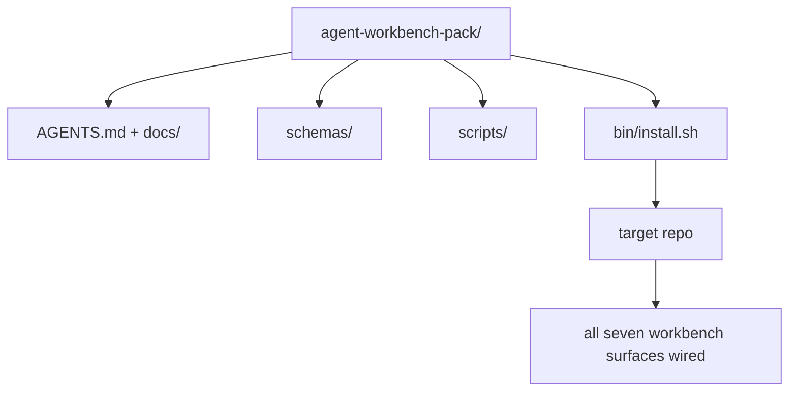

# Capstone: Ship a Reusable Agent Workbench Pack

> The mini-track ends with a pack you drop into any repo. Eleven lessons of surfaces compressed into a directory you can `cp -r` and have an agent working reliably the next morning. The capstone is the artifact this curriculum trades on.

**Type:** Build
**Languages:** Python
**Prerequisites:** Phases 14 · 31 to 14 · 41
**Time:** ~75 minutes

## Learning Objectives

- Package the seven workbench surfaces into one drop-in directory.
- Pin the schemas, scripts, and templates so a new repo gets a known-good baseline.
- Add a single installer script that lays down the pack idempotently.
- Decide what stays in the pack and what stays out, defending the cut for each.

## The Problem

A workbench that lives in a Google Doc, a chat history, and three half-remembered scripts is a workbench that gets rebuilt every quarter. The cure is a versioned pack: a repo or directory with the surfaces, the schemas, the scripts, and a one-command installer.

You will end this lesson with `outputs/agent-workbench-pack/` shipped on disk and a `bin/install.sh` that drops it into any target repo.

## The Concept



### The pack layout

```
outputs/agent-workbench-pack/
├── AGENTS.md
├── docs/
│   ├── agent-rules.md
│   ├── reliability-policy.md
│   ├── handoff-protocol.md
│   └── reviewer-rubric.md
├── schemas/
│   ├── agent_state.schema.json
│   ├── task_board.schema.json
│   └── scope_contract.schema.json
├── scripts/
│   ├── init_agent.py
│   ├── run_with_feedback.py
│   ├── verify_agent.py
│   └── generate_handoff.py
├── bin/
│   └── install.sh
└── README.md
```

### What stays in, what stays out

In:

- Surface schemas. They are the contract.
- The four scripts above. They are the runtime.
- The four docs. They are the rules and the rubric.

Out:

- Project-specific tasks. Tasks belong on the target repo's board, not in the pack.
- Vendor SDK calls. The pack is framework-agnostic.
- Onboarding prose. The pack lives next to the team's existing onboarding, not inside it.

### The installer

A short `bin/install.sh` (or `bin/install.py`):

1. Refuses to install over an existing pack without `--force`.
2. Copies the pack into the target repo.
3. Wires up CI if a `.github/workflows/` exists.
4. Prints next steps: fill in the board, set acceptance commands, run the init script.

### Versioning

The pack carries a `VERSION` file. Schema bumps and script changes that require migrations bump the major. Doc-only changes bump the patch. The target repo's `agent_state.json` records which pack version it was initialized against.


## Build It

Reconstruct **Capstone: Ship a Reusable Agent Workbench Pack** by following `deterministic_tail` on the smallest valid record {"id": 1}. Run `python3 main.py` and verify that validation names the missing field or rejects the request; it must not silently accept an incomplete record.

## Use It

Call `deterministic_tail` from a small caller with the smallest valid record {"id": 1}. Compare its result with the demo output, and record the input contract and the one field a downstream user should rely on.

## Ship It

Hand off `outputs/agent-workbench-pack` with the command `python3 main.py`, the accepted input shape (the smallest valid record {"id": 1}), the expected observable result, and a failure note for malformed inputs.

## Further Reading

- Phases 14 · 31 to 14 · 41 — every surface this pack bundles
- [SkillKit](https://github.com/rohitg00/skillkit) — install this skill across 32 AI agents
- [Nx Blog, Teach Your AI Agent How to Work in a Monorepo](https://nx.dev/blog/nx-ai-agent-skills) — single-source generator across six tools
- [agents.md — the open spec](https://agents.md/) — what your pack's router must implement
- [HKUDS/OpenHarness](https://github.com/HKUDS/OpenHarness) — reference implementation of a pack-equivalent
- [andrewgarst/agentic_harness](https://github.com/andrewgarst/agentic_harness) — Redis-backed reference with eval suite
- [Augment Code, A good AGENTS.md is a model upgrade](https://www.augmentcode.com/blog/how-to-write-good-agents-dot-md-files) — pack docs quality bar
- [Anthropic, Effective harnesses for long-running agents](https://www.anthropic.com/engineering/effective-harnesses-for-long-running-agents)
- [Anthropic, Harness design for long-running application development](https://www.anthropic.com/engineering/harness-design-long-running-apps)
- Phase 14 · 30 — eval-driven agent development that consumes the pack's verification gate
- Phase 14 · 41 — the before/after benchmark this pack improves on

## Exercises

Use `deterministic_tail` as the trace: start from the smallest valid record {"id": 1}, keep the raw output, and tie each observation to a named objective.

1. **Reproduce the reference path.** From `code/`, run `python3 main.py` using the smallest valid record {"id": 1}. Follow `deterministic_tail`, `run_with_feedback`, `check_acceptance`. Expect validation names the missing field or rejects the request; it must not silently accept an incomplete record; capture the first printed shape, metric, status, or summary field and state which part supports **Package the seven workbench surfaces into one drop-in directory.**.
2. **Vary one named input.** Repeat the command after changing only the optional field: use the same record with one optional field changed. Predict the direction of the change, then compare the two output values. Explain why **Pin the schemas, scripts, and templates so a new repo gets a known-good baseline.** says the other inputs should stay fixed.
3. **Probe the empty case.** Feed the implementation a record missing the required "id" field. Before running it, write down whether the relevant function should return an empty value, a zero-sized result, or a validation error. Check the observed status against **Add a single installer script that lays down the pack idempotently.** and record the exception text if the code rejects the case.
4. **Package a usable handoff.** Open `outputs/agent-workbench-pack` and add a worked example using the smallest valid record {"id": 1}. Include the input contract, one expected output field, and a named acceptance check for **Decide what stays in the pack and what stays out, defending the cut for each.**; note what the demo cannot establish.

## Reference Solution

A checkable result for **Capstone: Ship a Reusable Agent Workbench Pack** should contain:

- the `python3 main.py` output for the smallest valid record {"id": 1}, with `deterministic_tail`, `run_with_feedback`, `check_acceptance` traced to the value or shape that supports **Package the seven workbench surfaces into one drop-in directory.**;
- a before/after comparison for the optional field, where the same record with one optional field changed changes the observation in the direction predicted by **Pin the schemas, scripts, and templates so a new repo gets a known-good baseline.**;
- a recorded result for a record missing the required "id" field that matches the implementation’s validation or empty-result contract and explains the evidence for **Add a single installer script that lays down the pack idempotently.**; and
- an updated `outputs/agent-workbench-pack` example with a concrete input, expected output field, and acceptance check tied to **Decide what stays in the pack and what stays out, defending the cut for each.**.

Run the lesson tests after the demo. If the boundary behaves differently from the prediction, keep the actual exception or output and explain the implementation path that produced it.
