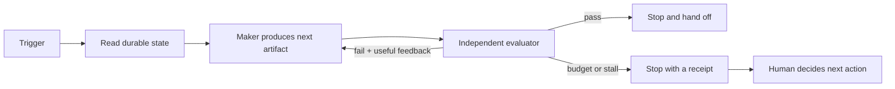
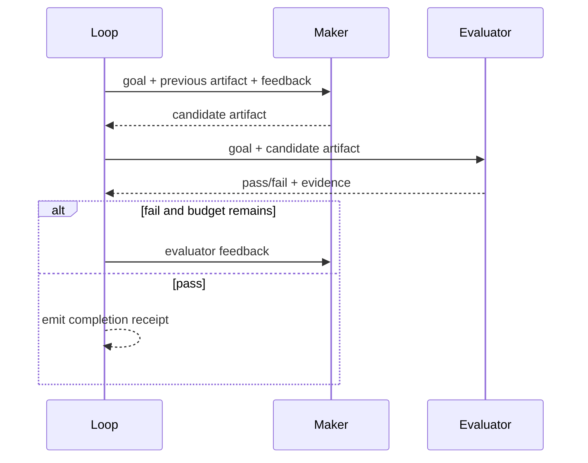

# Loop Engineering: From Prompts to Bounded Autonomy

> A harness makes one run reliable; a loop decides how the next run starts, what evidence counts, and when to stop.

**Type:** Build
**Languages:** Python
**Prerequisites:** Phase 14 · 38 (Verification Gates), Phase 14 · 39 (Reviewer Agent), Phase 14 · 42 (Agent Workbench Capstone)
**Time:** ~60 minutes

## Learning Objectives

- Distinguish a manual turn, a goal loop, a timer loop, and an event-triggered loop.
- Define a loop contract with a goal, an independent evaluator, feedback, and bounded stop conditions.
- Implement a deterministic maker/evaluator loop with receipts for every round.
- Detect stalled work and exhausted budgets before an unattended loop can run forever.
- Choose the smallest trigger and autonomy level that fits a task.

## The handoff after the workbench

Lessons 31–42 built the workbench around an agent: instructions, durable state,
scope, feedback, verification, review, and handoff. That workbench still needs a
human to press the next button. The human reads the handoff, decides what to do,
and sends another prompt.

Loop engineering moves that scheduling decision into a small, inspectable
runtime. It does not mean giving an agent unlimited permission. It means making
the trigger, state transition, evaluator, and stop condition explicit enough to
run without a person hovering over every turn.



The loop is not the model. The model may be one implementation of the maker or
the evaluator. The loop owns the contract around those calls.

## Four ways to wake a loop

The trigger answers *when work may begin*. It is separate from the policy that
answers *how the work proceeds*.

| Trigger | Starts when | Good fit | Main risk |
|---------|-------------|----------|-----------|
| Manual | A person explicitly requests a run | Exploratory work and sensitive changes | The process is still fully human-driven |
| Goal | A goal with a verifiable finish line is submitted | A feature with tests, lint, or another acceptance command | An evaluator that is too weak declares victory |
| Timer | A clock interval elapses | Periodic checks and maintenance | Repeating a useless action or creating duplicate work |
| Event | A named event arrives, such as a CI failure | Reactive repair and triage | Retries amplify an event storm |

Goal and timer loops are not interchangeable. A goal loop should make measurable
progress toward one end state. A timer loop wakes periodically and may find no
work at all. If the task has no finish line, a timer or event trigger is usually
more honest than pretending it is a goal.

## The three-part loop contract

A reliable goal loop can be stated in one paragraph:

1. **Goal:** the outcome, not a list of prompts. For example, “add validation
   and prove it with the acceptance suite.”
2. **Evaluator:** a separate function, command, or reviewer that decides
   whether the artifact satisfies the goal. The maker does not grade itself.
3. **Stop policy:** a success threshold plus hard limits for rounds, time,
   tool calls, cost, or lack of progress.

The evaluator must return structured evidence, not only prose:

```json
{
  "passed": false,
  "feedback": "missing: acceptance",
  "score": 0.5
}
```

Feedback is an input to the next round, not a status message for a human. A
loop should preserve the complete round receipt: the input artifact, output
artifact, verdict, score, feedback, and whether anything changed.

## Maker and evaluator are different roles

The maker changes the artifact. The evaluator observes it and decides whether it
meets the contract. A model can perform both calls, but the calls need separate
interfaces and separate prompts or deterministic checks. This separation gives
the reviewer a real point of independence and lets a test command replace a
model judge when possible.



“The agent said it was done” is not an evaluator. “The tests exited zero” may
be an evaluator, provided the tests actually ran and cover the stated goal.
The verification gate from Lesson 38 remains useful inside the loop; this
lesson adds the scheduling and repetition around it.

## Stop conditions are part of correctness

An unattended loop needs more than `while not done`. The reference
implementation has four independent exits:

- **Complete:** the evaluator passes for the configured number of consecutive
  rounds.
- **Exhausted:** the maximum round budget is reached.
- **Stalled:** the evaluator still fails while the maker returns the same
  artifact for too many rounds.
- **Invalid input/output:** an empty goal is rejected before the first round;
  malformed maker or evaluator output aborts the current round before its
  receipt is recorded or another round starts.

Real deployments can add wall-clock, token, monetary, or tool-call budgets.
They should be represented as policy fields and receipts, not hidden constants.
A stop is not a failure of autonomy; it is the loop preserving a decision for a
human when its evidence is insufficient.

## Read the implementation

`code/main.py` keeps the core deliberately small:

- `Trigger` and `trigger_is_due` make wake-up semantics explicit and stateless.
- `LoopPolicy` validates the upper bounds before a run begins.
- `CheckResult` is the evaluator's typed boundary.
- `RoundRecord` is an append-only receipt for replay and review.
- `run_maker_checker` owns the state transition and never lets the maker return
  a completion verdict.
- `write_round_receipts` and `read_round_receipts` persist and validate the
  receipts as JSONL so a later process can replay the evidence.

The demo maker adds one missing acceptance item per round. The demo evaluator
requires `implementation`, `tests`, and `acceptance`. It is intentionally not a
model call: the loop's reliability properties should be testable offline before
an API is introduced.

## Durable round receipts

`LoopResult.rounds` is an in-memory view during execution. Call
`write_round_receipts(result, "outputs/loop/run-001/rounds.jsonl")` when the run
ends. The writer uses an atomic replace and emits one JSON object per round.
`read_round_receipts` checks the field set, types, score range, and sequential
round numbers before returning `RoundRecord` values. The JSONL file is the
durable evidence; the in-memory list is only the live convenience view.

## Design exercise: take yourself out of the loop

Use a task from Lesson 42 and write a `goal.md` with these fields:

```text
Goal: the exact end state
Evidence: commands or checks that prove it
Stop: round, time, tool-call, and stall limits
Scope: files and side effects that are allowed
Escalate: conditions requiring a human
```

Run it once manually, then run it through a bounded maker/evaluator loop. Record
the number of interventions, failed checks, unchanged artifacts, and the final
handoff. A useful experiment has a baseline; “it felt faster” is not a metric.

For a timer loop, choose a check that is safe to repeat and idempotent. For an
event loop, include a deduplication key and a retry limit. In both cases, persist
the trigger payload and loop result so a later session can explain why work ran.

## What not to automate yet

Do not put an irreversible production action behind a loop until the evaluator,
scope contract, approval boundary, and rollback path are independently tested.
Parallel agents also do not remove the review bottleneck: more runs can create
more output than a human can inspect. The graph lesson that follows makes that
coordination cost explicit.

## Further reading

- [Anthropic: Building effective agents](https://www.anthropic.com/engineering/building-effective-agents) — workflow patterns and evaluator/optimizer separation.
- [OpenAI: Harness engineering](https://openai.com/index/harness-engineering-leveraging-codex-in-an-agent-first-world/) — repository structure and verification as agent infrastructure.

## Exercises

1. Replace the demo evaluator with a command-backed evaluator that records an
   exit code and truncated output, reusing the feedback discipline from Lesson
   37.
2. Add a wall-clock deadline to `LoopPolicy` and test that a deadline produces a
   receipt instead of an unbounded wait.
3. Design a timer loop for a read-only task. List the idempotency key, interval,
   empty-result behavior, and human escalation rule.
4. Add a second evaluator that reviews scope. Explain why both evaluators must
   pass before the loop reports completion.
