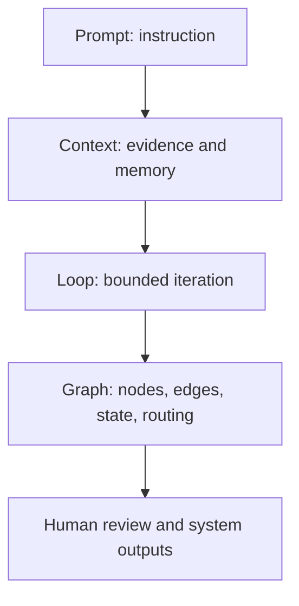
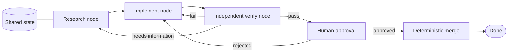

# Graph Engineering: Make Agent Structure Explicit

> A loop hides its control flow inside one context; a graph names the nodes, edges, shared state, and routing rules so the system can be audited and repaired.

**Type:** Build
**Languages:** Python
**Prerequisites:** Phase 14 · 13 (LangGraph — Stateful Graphs), Phase 14 · 38 (Verification Gates), Phase 14 · 43 (Loop Engineering)
**Time:** ~75 minutes

## Learning Objectives

- Decompose a multi-step agent system into nodes, edges, shared state, and routing rules.
- Distinguish a graph that contains agent nodes from a deterministic workflow.
- Implement conditional routing, rollback, checkpoints, human approval, and fan-out/fan-in with the standard library.
- Define explicit merge semantics so parallel branches cannot silently overwrite each other.
- Decide when graph coordination is worth its cost and when a simple loop is the better design.

## From one loop to a system

"Loop Engineering: From Prompts to Bounded Autonomy" made the loop's internal contract visible: a goal, a maker, an
evaluator, feedback, and stop conditions. That is enough for one coherent task.
Real engineering work often needs several kinds of work at once: research,
implementation, tests, review, rollback, and human approval. If one agent keeps
all of those decisions in one context, the structure becomes difficult to inspect
and failures are hard to localize.

A graph is the next layer, not a replacement for the loop. Each agent node may
contain its own loop. The graph controls the handoff between nodes.



The useful question is not “is a graph fashionable?” It is “which control-flow
decision is currently implicit, and would making it explicit improve safety,
replay, or repair?”

## Four parts of a graph

| Part | Responsibility | Example in a coding task |
|------|----------------|---------------------------|
| Node | Own one unit of work | Research, implement, verify, merge |
| Edge | Describe a possible handoff | `verify --fail--> implement` |
| Shared state | Carry durable facts between nodes | Requirements, artifact, evidence, approval |
| Routing rule | Select the next edge | Pass → approval; fail → implement |

A node can be deterministic code, a tool invocation, a model call, a complete
agent loop, or a human approval point. The node's type does not change the graph
contract: it receives a state snapshot and returns an explicit state patch.



The graph above is a small state machine. Its value is that a reviewer can see
where a failure goes without reading a hidden transcript.

## Graph versus workflow

Traditional workflow systems already have nodes and edges. The practical
distinction is the unit inside a node and who can choose control flow:

| Property | Deterministic workflow | Agent graph |
|----------|------------------------|-------------|
| Node | Function, job, or script | Function, tool, human, or full agent loop |
| Control flow | Usually fixed in code | May use structured output or a model-backed router |
| State | Task payload and metadata | Task payload plus evidence, context, and agent handoffs |
| Failure repair | Retry the job or fail the run | Route to a specialized node or rollback edge |
| Verification | Pipeline check | Independent evaluator, test node, or human gate |

This is a difference of generality, not a license to use a model everywhere. A
test command should remain deterministic. A graph may contain a workflow-shaped
subgraph and one or more agent nodes. Use the simplest node that can make the
decision honestly.

## The graph design contract

Before writing code, answer six questions:

1. **What is shared?** List each state field and its owner. Keep private node
   context out of shared state unless a later node needs it.
2. **Which nodes exist?** Give each node one responsibility, input shape, output
   patch, and definition of done.
3. **Which edges are possible?** Name success, failure, retry, rollback, and
   approval paths. An unlisted path is a design bug.
4. **How is routing selected?** Route labels should be finite and validated;
   never fall back silently from an unknown route to success.
5. **What happens at fan-in?** Define overwrite, append, sum, or conflict rules
   before branches run. Shared state is a merge contract, not a shared scratchpad.
6. **Where can execution pause and resume?** Persist state after every node and
   identify the human approval or recovery point.

A compact state declaration might look like this:

```json
{
  "requirements": "text written by research",
  "artifact": "candidate written by implement",
  "review": "pass | fail | needs_research",
  "evidence": ["append-only receipts"],
  "attempts": 0,
  "approval": null
}
```

The state is not a chat transcript. It is the smallest durable package needed
for the next node and the next session to make a correct decision.

## Conditional routing and rollback

The reference graph uses explicit labels. Verification can route to:

- `pass`: continue to an approval node.
- `fail`: return to implementation with actionable feedback.
- `needs_research`: return farther upstream when the requirements themselves are
  insufficient.

This is local repair. A failed test should not always restart the whole graph;
a missing requirement should not be “fixed” by asking the implementer to guess.
The edge identifies the layer that owns the correction.

## Checkpoints and human approval

`GraphRunner` creates an in-memory `Checkpoint` after every committed node. A
checkpoint contains the next node, a deep-copied state snapshot, and a trace
length. While the process is alive, the caller must pass that checkpoint to
`save_checkpoint`, which writes validated JSON using an atomic replace. If the
process later dies, a fresh process can call `load_checkpoint` and `restore` to
continue from the saved state and next-node position. Persisted checkpoints do
not contain or reconstruct the historical `TraceEvent` payloads; persist the
trace separately (for example, as `trace.jsonl`) when a complete path record is
required. Route selection is validated before a node patch, trace event, or
checkpoint is committed, so an invalid route leaves the runner retryable and
unchanged.

```python
save_checkpoint(runner.checkpoints[-1], "outputs/graph/run-001/checkpoint.json")
loaded = load_checkpoint("outputs/graph/run-001/checkpoint.json")
fresh_runner.restore(loaded)
```

The approval node returns `pause=True` when no decision exists. The run stops
with an approval request instead of treating the absence of a human as consent.
`resume({"approval": "approved"})` supplies the decision and continues. A
rejection is consumed before the graph routes back to implementation, so the
repair pauses for a fresh decision instead of inheriting the old rejection. A
real system should add an expiry, an approver identity, and a rejection path
that cannot be mistaken for a successful merge.

## Fan-out and fan-in

Parallel work is useful only when branch inputs are independent and the merge is
defined. The lesson's `fan_out_merge` runs branches sequentially to stay
deterministic and dependency-free, but it gives every branch a deep copy of the
same input. At fan-in:

- list-valued evidence can be explicitly appended;
- equal scalar values may be shared;
- conflicting scalar values raise `GraphError`.

The same policy belongs in a concurrent production scheduler. Concurrency does
not make an ambiguous merge safe; it merely makes the ambiguity happen sooner.

## Use It

`code/main.py` runs the real fan-in, but the merge contract itself — append
lists, pass through equal scalars, raise on conflicting scalars — is plain
dict logic you can check without the runner:

```python fillin
class GraphError(Exception):
    pass

def naive_merge(base, patches):
    merged = dict(base)
    for patch in patches:
        merged.update(patch)  # last writer wins -- silently drops branch_a's evidence
    return merged

base = {"evidence": ["seed"], "attempts": 0}
branch_a = {"evidence": ["a-finding"], "attempts": 0}
branch_b = {"evidence": ["b-finding"], "attempts": 0}

print("naive:", naive_merge(base, [branch_a, branch_b]))
# {"evidence": ["b-finding"], "attempts": 0} -- branch_a's finding vanished

def merge_state(base, patches):
    merged = dict(base)
    for patch in patches:
        for key, value in patch.items():
            if key not in merged:
                merged[key] = value
            elif isinstance(value, {{blank:list}}):
                merged[key] = merged[key] + value
            elif merged[key] == value:
                continue
            else:
                raise GraphError(f"conflicting value for {key!r}")
    return merged

merged = merge_state(base, [branch_a, branch_b])

conflict_raised = False
try:
    merge_state(merged, [{"attempts": {{blank:1}}}])
except GraphError:
    conflict_raised = {{blank:True}}

expected_merged = {"evidence": ["seed", "a-finding", "b-finding"], "attempts": 0}
if merged == expected_merged and conflict_raised:
    print("PASS")
else:
    print("WRONG:", merged, conflict_raised)
```

## Read the implementation

`code/main.py` has four layers:

1. `GraphSpec` validates node names and route labels.
2. `GraphRunner` executes one node at a time, records a trace, and checkpoints
   state after every step.
3. `fan_out_merge` demonstrates isolated branch execution and explicit merge
   semantics.
4. The demo nodes form a research → implement → verify graph with a failure
   rollback and an approval pause before merge.

The runner does not import an agent framework. That keeps the topology visible
and makes tests cheap. A framework can replace the runner later; the state,
edges, and routing contract should stay reviewable.

## When a graph is worth drawing

Use a graph when at least three of these are true:

1. The task decomposes into independent responsibilities.
2. There are meaningful branch, retry, or rollback paths.
3. Intermediate state is worth checkpointing and replaying.
4. Each node has a checkable definition of done.
5. The coordination benefit exceeds the state and review overhead.

Do not graphify a simple linear script just to produce a diagram. More nodes can
increase throughput while also increasing coordination, merge conflicts, token
cost, and review load. Human attention is still a serial resource. The graph's
job is to make that cost visible and place approval where it matters.

## Build It

Reconstruct **Graph Engineering: Make Agent Structure Explicit** by following `GraphError` on a graph with edges (0,1) and (1,2). Run `python3 main.py` and verify that degrees, adjacency, or connectivity expose the isolated/no-edge case explicitly.

## Ship It

Hand off `outputs/skill-graph-engineering.md` with the command `python3 main.py`, the accepted input shape (a graph with edges (0,1) and (1,2)), the expected observable result, and a failure note for malformed inputs.

## Exercises

1. Draw the loop from "Loop Engineering: From Prompts to Bounded Autonomy" as a graph. Mark the edge that was implicit in
   the loop and name the state field that carries its feedback.
2. Add a second verification branch for security findings. Choose append or
   conflict semantics for each shared field and test a conflicting update.
3. Add a timeout to the approval node. Decide whether timeout means reject,
   escalate, or pause indefinitely, and record the choice in state.
4. Compare a five-node graph with a one-node loop on the same fixture task. Count
   checkpoints, branch decisions, and human review actions; do not compare only
   wall-clock time.

## Further reading

- [Anthropic: Building effective agents](https://www.anthropic.com/engineering/building-effective-agents) — routing, parallelization, and evaluator/optimizer patterns.
- [LangGraph graph API](https://docs.langchain.com/oss/python/langgraph/graph-api) — a framework-specific vocabulary for nodes, edges, state, and checkpoints.

## Reference Solution

For Graph Engineering: Make Agent Structure Explicit, run python3 main.py from code/ and keep the output beside the input that produced it. A defensible submission contains:

1. Evidence for “Decompose a multi-step agent system into nodes, edges, shared state, and routing rules”: identify the exact field, trace entry, or report line that proves it; a successful process exit alone is not enough.
2. A one-variable comparison for “Distinguish a graph that contains agent nodes from a deterministic workflow”. State the prediction first and explain why the observed change follows from _checkpoint_from_mapping, save_checkpoint, load_checkpoint.
3. A boundary or failure result for “Implement conditional routing, rollback, checkpoints, human approval, and fan-out/fan-in with the standard library”. Include the input, the expected guard or refusal, and the observed behavior. If the demo has no guard, record that gap instead of calling a crash a pass.
4. A practical update to outputs/skill-graph-engineering.md that applies “Define explicit merge semantics so parallel branches cannot silently overwrite each other” and names the person or system responsible for the next decision.

Run the relevant tests after the experiment. Keep any mismatch between prediction and observation in the receipt; the purpose of this lesson is to make the reasoning inspectable, not to make every run look successful.
