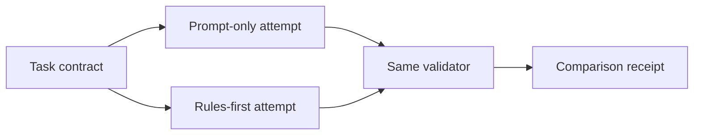

# Prompt-Only vs Rules-First

> Run one small delivery task twice and make the reliability gap measurable.

**Type:** Build
**Languages:** Python
**Prerequisites:** Phase 14 · 31 (Agent Workbench: Why Capable Models Still Fail), Phase 14 · 36 (Scope Contracts)
**Time:** ~45 minutes

## Learning Objectives

- Compare a prompt-only attempt with a rules-first attempt on the same task.
- Express allowed files and acceptance checks as executable constraints.
- Separate a plausible artifact from evidence that the task is complete.
- Record scope violations and missing checks as reviewable receipts.

## The experiment

The first project makes the central claim testable. Use one task with an explicit
scope and two required checks. A prompt-only worker is allowed to return a
plausible patch and a confident sentence. A rules-first worker must pass scope
and acceptance validation before it can report success.

The worker in this lesson is deterministic on purpose. The point is to measure
the contract around a model, not to call a model. Replace the worker later with
an API call while keeping the `Task`, `Attempt`, and validation boundary.

## Build It

1. Define the task's allowed files and required checks.
2. Run the same fixture through both workers.
3. Validate changed paths before reading the prose verdict.
4. Validate every required check, not only the one that happened to pass.
5. Keep the comparison as a small JSON-shaped receipt suitable for a reviewer.

The prompt-only run intentionally edits an unrelated notes file and omits the
acceptance check. The rules-first run refuses that shape and returns a bounded,
machine-readable verdict. In production the rules-first worker should repair or
escalate rather than silently discard the violation.

## Use It

Copy the task contract into a real repository's issue or task board. Start with
one feature, a short allow-list, and commands that prove the definition of done.
If the first comparison reports no difference, strengthen the acceptance check;
an evaluator that cannot distinguish the two runs is not protecting the repo.

## Practice notes

The artifact is intentionally deterministic, so the useful question is what evidence a change produces. Before editing it, write down which part of “Compare a prompt-only attempt with a rules-first attempt on the same task” should be visible in the result. Then inspect __post_init__, validate_attempt, prompt_only_attempt rather than treating the final sentence as an explanation.

For “Express allowed files and acceptance checks as executable constraints”, keep the task and acceptance condition fixed while changing one input. A useful receipt has the input, the predicted result, the observed result, and one sentence about the mechanism. For “Separate a plausible artifact from evidence that the task is complete”, choose a boundary the implementation can actually reach and record whether it rejects, pauses, reports, or continues. Finally, use skill-prompt-rules-comparison.md to capture “Record scope violations and missing checks as reviewable receipts” as a reusable decision aid: include an owner and a next action, not only a summary.
## Ship It

Hand off `outputs/skill-prompt-rules-comparison.md` with the command `python3 main.py`, the accepted input shape (the text "red fox"), the expected observable result, and a failure note for malformed inputs.

## Exercises

- Add a forbidden path that is more specific than the general allow-list.
- Add a third acceptance check and show that one passing command is insufficient.
- Replace the fixture workers with a subprocess-backed implementation and retain
  the same validator API.

## Further reading

- [Phase 14 · 36 — Scope Contracts](../../36-scope-contracts/docs/en.md)
- [Phase 14 · 38 — Verification Gates](../../38-verification-gates/docs/en.md)

## Reference Solution

For Prompt-Only vs Rules-First, run python3 main.py from code/ and keep the output beside the input that produced it. A defensible submission contains:

1. Evidence for “Compare a prompt-only attempt with a rules-first attempt on the same task”: identify the exact field, trace entry, or report line that proves it; a successful process exit alone is not enough.
2. A one-variable comparison for “Express allowed files and acceptance checks as executable constraints”. State the prediction first and explain why the observed change follows from __post_init__, validate_attempt, prompt_only_attempt.
3. A boundary or failure result for “Separate a plausible artifact from evidence that the task is complete”. Include the input, the expected guard or refusal, and the observed behavior. If the demo has no guard, record that gap instead of calling a crash a pass.
4. A practical update to outputs/skill-prompt-rules-comparison.md that applies “Record scope violations and missing checks as reviewable receipts” and names the person or system responsible for the next decision.

Run the relevant tests after the experiment. Keep any mismatch between prediction and observation in the receipt; the purpose of this lesson is to make the reasoning inspectable, not to make every run look successful.
