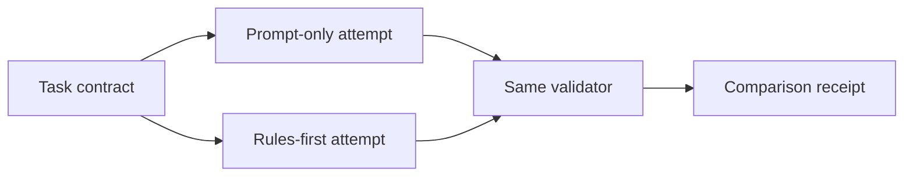

# Prompt-Only vs Rules-First

> Run one small delivery task twice and make the reliability gap measurable.

**Type:** Build
**Languages:** Python
**Prerequisites:** Phase 14 · 31 (Agent Workbench: Why Capable Models Still Fail), Phase 14 · 36 (Scope Contracts)
**Time:** ~45 minutes

## Learning Objectives

- Compare a prompt-only attempt with a rules-first attempt on the same task.
- Express allowed files and acceptance checks as executable constraints.
- Separate a plausible artifact from evidence that the task is complete.
- Record scope violations and missing checks as reviewable receipts.

## The experiment

The first project makes the central claim testable. Use one task with an explicit
scope and two required checks. A prompt-only worker is allowed to return a
plausible patch and a confident sentence. A rules-first worker must pass scope
and acceptance validation before it can report success.

The worker in this lesson is deterministic on purpose. The point is to measure
the contract around a model, not to call a model. Replace the worker later with
an API call while keeping the `Task`, `Attempt`, and validation boundary.

## Build It

1. Define the task's allowed files and required checks.
2. Run the same fixture through both workers.
3. Validate changed paths before reading the prose verdict.
4. Validate every required check, not only the one that happened to pass.
5. Keep the comparison as a small JSON-shaped receipt suitable for a reviewer.

The prompt-only run intentionally edits an unrelated notes file and omits the
acceptance check. The rules-first run refuses that shape and returns a bounded,
machine-readable verdict. In production the rules-first worker should repair or
escalate rather than silently discard the violation.

## Use It

Copy the task contract into a real repository's issue or task board. Start with
one feature, a short allow-list, and commands that prove the definition of done.
If the first comparison reports no difference, strengthen the acceptance check;
an evaluator that cannot distinguish the two runs is not protecting the repo.

## Exercises

- Add a forbidden path that is more specific than the general allow-list.
- Add a third acceptance check and show that one passing command is insufficient.
- Replace the fixture workers with a subprocess-backed implementation and retain
  the same validator API.

## Further reading

- [Phase 14 · 36 — Scope Contracts](../../36-scope-contracts/docs/en.md)
- [Phase 14 · 38 — Verification Gates](../../38-verification-gates/docs/en.md)

## Reference Solution

Use the canonical [main.py](../code/main.py) as the executable baseline. A complete solution records a successful run, identifies the invariant tied to “Compare a prompt-only attempt with a rules-first attempt on the same task,” and changes only one variable for the comparison. The edge-case result must distinguish the prediction from the observation, explain the cause using “Separate a plausible artifact from evidence that the task is complete,” and cite a repeatable check rather than relying on visual inspection alone.
