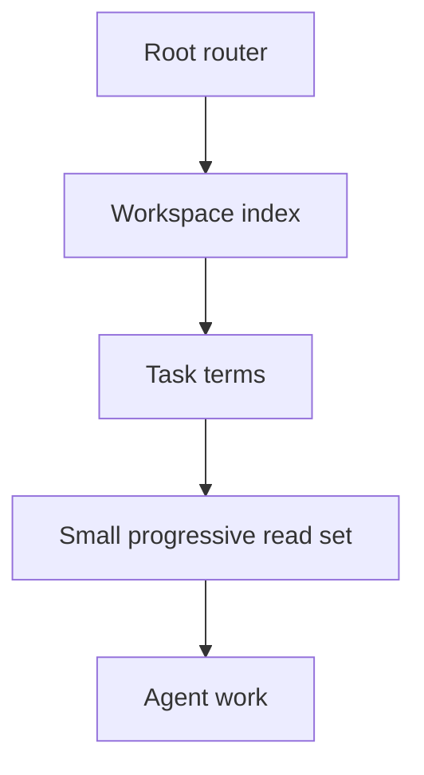

# Agent-Readable Workspace

> Turn a repository into a map an agent can navigate without loading everything.

**Type:** Build
**Languages:** Python
**Prerequisites:** Phase 14 · 33 (Agent Instructions as Executable Constraints), Phase 14 · 34 (Repo Memory and Durable State)
**Time:** ~45 minutes

## Learning Objectives

- Build a compact index from repository paths and headings.
- Keep a root router separate from deeper, task-specific guidance.
- Select a progressive read set from a task description.
- Test that hidden or generated directories do not pollute agent context.

## The problem

An agent cannot use information it never finds, but giving it every file is not
the same as making a repository readable. Large instruction files, generated
build output, and stale notes compete with the files that define the task. A
workspace index gives the agent a map first and lets it open detail on demand.

## Build It

The reference implementation extracts a short summary from each relevant file,
sorts entries deterministically, skips `.git` and generated caches, and ranks
paths by overlap with task terms. A root `AGENTS.md` or `README.md` is included
when present because it explains how to interpret the rest of the map.

The index is deliberately shallow. It is not a code search engine and it is not
a substitute for opening the source of truth. Its job is to make the first
three reads predictable and to keep progressive disclosure explicit.

## Use It

Run the index at session start, store it as a short receipt, and inspect the
ranked read set before changing files. Add project-specific summaries only when
the generic first-line extractor is not enough. If a path never appears in a
task read set, improve its name or router entry instead of inflating the
context budget.

## Practice notes

The artifact is intentionally deterministic, so the useful question is what evidence a change produces. Before editing it, write down which part of “Build a compact index from repository paths and headings” should be visible in the result. Then inspect _summary, build_index, progressive_read_set rather than treating the final sentence as an explanation.

For “Keep a root router separate from deeper, task-specific guidance”, keep the task and acceptance condition fixed while changing one input. A useful receipt has the input, the predicted result, the observed result, and one sentence about the mechanism. For “Select a progressive read set from a task description”, choose a boundary the implementation can actually reach and record whether it rejects, pauses, reports, or continues. Finally, use skill-workspace-index.md to capture “Test that hidden or generated directories do not pollute agent context” as a reusable decision aid: include an owner and a next action, not only a summary.
## Ship It

Hand off `outputs/skill-workspace-index.md` with the command `python3 main.py`, the accepted input shape (the text "red fox"), the expected observable result, and a failure note for malformed inputs.

## Exercises

- Add a `docs/` summary file and make it rank above an unrelated source file.
- Add a generated directory and prove that it never appears in the index.
- Replace keyword overlap with a small path-to-capability registry.

## Further reading

- [Phase 14 · 33 — Agent Instructions as Executable Constraints](../../33-instructions-as-executable-constraints/docs/en.md)
- [Phase 14 · 35 — Initialization Scripts](../../35-initialization-scripts/docs/en.md)

## Reference Solution

For Agent-Readable Workspace, run python3 main.py from code/ and keep the output beside the input that produced it. A defensible submission contains:

1. Evidence for “Build a compact index from repository paths and headings”: identify the exact field, trace entry, or report line that proves it; a successful process exit alone is not enough.
2. A one-variable comparison for “Keep a root router separate from deeper, task-specific guidance”. State the prediction first and explain why the observed change follows from _summary, build_index, progressive_read_set.
3. A boundary or failure result for “Select a progressive read set from a task description”. Include the input, the expected guard or refusal, and the observed behavior. If the demo has no guard, record that gap instead of calling a crash a pass.
4. A practical update to outputs/skill-workspace-index.md that applies “Test that hidden or generated directories do not pollute agent context” and names the person or system responsible for the next decision.

Run the relevant tests after the experiment. Keep any mismatch between prediction and observation in the receipt; the purpose of this lesson is to make the reasoning inspectable, not to make every run look successful.
