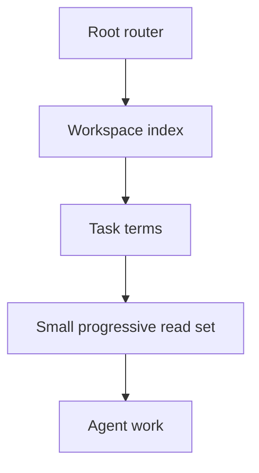

# Agent-Readable Workspace

> Turn a repository into a map an agent can navigate without loading everything.

**Type:** Build
**Languages:** Python
**Prerequisites:** Phase 14 · 33 (Agent Instructions as Executable Constraints), Phase 14 · 34 (Repo Memory and Durable State)
**Time:** ~45 minutes

## Learning Objectives

- Build a compact index from repository paths and headings.
- Keep a root router separate from deeper, task-specific guidance.
- Select a progressive read set from a task description.
- Test that hidden or generated directories do not pollute agent context.

## The problem

An agent cannot use information it never finds, but giving it every file is not
the same as making a repository readable. Large instruction files, generated
build output, and stale notes compete with the files that define the task. A
workspace index gives the agent a map first and lets it open detail on demand.

## Build It

The reference implementation extracts a short summary from each relevant file,
sorts entries deterministically, skips `.git` and generated caches, and ranks
paths by overlap with task terms. A root `AGENTS.md` or `README.md` is included
when present because it explains how to interpret the rest of the map.

The index is deliberately shallow. It is not a code search engine and it is not
a substitute for opening the source of truth. Its job is to make the first
three reads predictable and to keep progressive disclosure explicit.

## Use It

Run the index at session start, store it as a short receipt, and inspect the
ranked read set before changing files. Add project-specific summaries only when
the generic first-line extractor is not enough. If a path never appears in a
task read set, improve its name or router entry instead of inflating the
context budget.

## Exercises

- Add a `docs/` summary file and make it rank above an unrelated source file.
- Add a generated directory and prove that it never appears in the index.
- Replace keyword overlap with a small path-to-capability registry.

## Further reading

- [Phase 14 · 33 — Agent Instructions as Executable Constraints](../../33-instructions-as-executable-constraints/docs/en.md)
- [Phase 14 · 35 — Initialization Scripts](../../35-initialization-scripts/docs/en.md)
