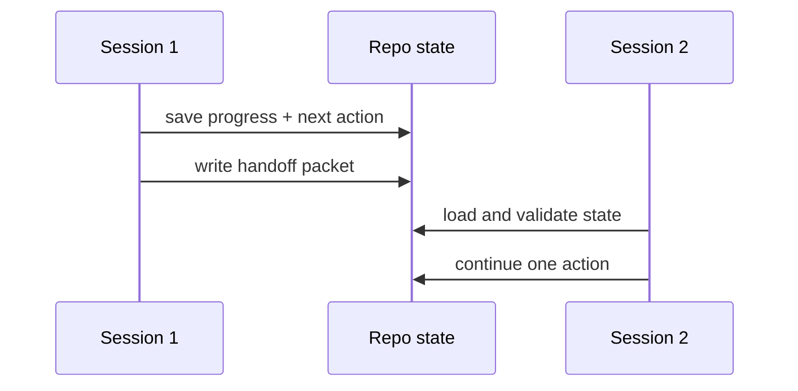

# Multi-Session Continuity

> Persist the smallest state package that lets the next session continue safely.

**Type:** Build
**Languages:** Python
**Prerequisites:** Phase 14 · 34 (Repo Memory and Durable State), Phase 14 · 35 (Initialization Scripts)
**Time:** ~50 minutes

## Learning Objectives

- Model session progress as validated state rather than chat history.
- Persist state atomically so a crash cannot leave a half-written handoff.
- Resume a task with one concrete next action and visible blockers.
- Emit a handoff packet that another session can verify before acting.

## The continuity contract

Long-running delivery is a sequence of short sessions. Each session must leave
enough durable context for the next one to know what is complete, what changed,
what is blocked, and what to do first. A transcript is useful evidence but is
not a reliable state store: it can be truncated, unavailable, or attached to a
different task.

## Build It

The state schema in `code/main.py` deliberately stays small: task identity,
completed steps, touched files, blockers, and a single next action. The writer
uses an adjacent temporary file followed by an atomic replace. The loader
rejects unknown schema versions, missing fields, invalid list types, and empty
next actions.

`build_handoff` records commands and risks separately from the state snapshot.
That separation lets a human review what happened while the next agent reads a
compact machine-facing packet.

## Use It

Keep one state file per active task or branch. Update it after every meaningful
step, not only at the end. A blocker is not a reason to erase progress; it is a
durable fact that tells the next session whether to ask, retry, or escalate.

## Exercises

- Add a monotonic `updated_at` field and reject stale state from another branch.
- Add a handoff signature or owner field for a team workflow.
- Simulate an interrupted write and prove that the previous valid state remains.

## Further reading

- [Phase 14 · 40 — Multi-Session Handoff](../../40-multi-session-handoff/docs/en.md)
- [Phase 14 · 42 — Agent Workbench Capstone](../../42-agent-workbench-capstone/docs/en.md)

## Reference Solution

Use the canonical [main.py](../code/main.py) as the executable baseline. A complete solution records a successful run, identifies the invariant tied to “Model session progress as validated state rather than chat history,” and changes only one variable for the comparison. The edge-case result must distinguish the prediction from the observation, explain the cause using “Resume a task with one concrete next action and visible blockers,” and cite a repeatable check rather than relying on visual inspection alone.
