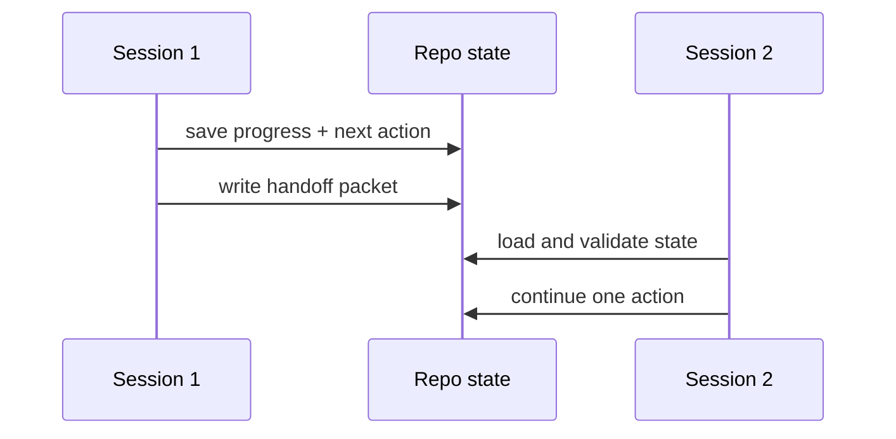

# Multi-Session Continuity

> Persist the smallest state package that lets the next session continue safely.

**Type:** Build
**Languages:** Python
**Prerequisites:** Phase 14 · 34 (Repo Memory and Durable State), Phase 14 · 35 (Initialization Scripts)
**Time:** ~50 minutes

## Learning Objectives

- Model session progress as validated state rather than chat history.
- Persist state atomically so a crash cannot leave a half-written handoff.
- Resume a task with one concrete next action and visible blockers.
- Emit a handoff packet that another session can verify before acting.

## The continuity contract

Long-running delivery is a sequence of short sessions. Each session must leave
enough durable context for the next one to know what is complete, what changed,
what is blocked, and what to do first. A transcript is useful evidence but is
not a reliable state store: it can be truncated, unavailable, or attached to a
different task.

## Build It

The state schema in `code/main.py` deliberately stays small: task identity,
completed steps, touched files, blockers, and a single next action. The writer
uses an adjacent temporary file followed by an atomic replace. The loader
rejects unknown schema versions, missing fields, invalid list types, and empty
next actions.

`build_handoff` records commands and risks separately from the state snapshot.
That separation lets a human review what happened while the next agent reads a
compact machine-facing packet.

## Use It

Keep one state file per active task or branch. Update it after every meaningful
step, not only at the end. A blocker is not a reason to erase progress; it is a
durable fact that tells the next session whether to ask, retry, or escalate.

## Practice notes

The artifact is intentionally deterministic, so the useful question is what evidence a change produces. Before editing it, write down which part of “Model session progress as validated state rather than chat history” should be visible in the result. Then inspect validate, _from_mapping, save_state rather than treating the final sentence as an explanation.

For “Persist state atomically so a crash cannot leave a half-written handoff”, keep the task and acceptance condition fixed while changing one input. A useful receipt has the input, the predicted result, the observed result, and one sentence about the mechanism. For “Resume a task with one concrete next action and visible blockers”, choose a boundary the implementation can actually reach and record whether it rejects, pauses, reports, or continues. Finally, use skill-session-handoff.md to capture “Emit a handoff packet that another session can verify before acting” as a reusable decision aid: include an owner and a next action, not only a summary.
## Ship It

Hand off `outputs/skill-session-handoff.md` with the command `python3 main.py`, the accepted input shape (the demo’s smallest built-in fixture), the expected observable result, and a failure note for malformed inputs.

## Exercises

- Add a monotonic `updated_at` field and reject stale state from another branch.
- Add a handoff signature or owner field for a team workflow.
- Simulate an interrupted write and prove that the previous valid state remains.

## Further reading

- [Phase 14 · 40 — Multi-Session Handoff](../../40-multi-session-handoff/docs/en.md)
- [Phase 14 · 42 — Agent Workbench Capstone](../../42-agent-workbench-capstone/docs/en.md)

## Reference Solution

For Multi-Session Continuity, run python3 main.py from code/ and keep the output beside the input that produced it. A defensible submission contains:

1. Evidence for “Model session progress as validated state rather than chat history”: identify the exact field, trace entry, or report line that proves it; a successful process exit alone is not enough.
2. A one-variable comparison for “Persist state atomically so a crash cannot leave a half-written handoff”. State the prediction first and explain why the observed change follows from validate, _from_mapping, save_state.
3. A boundary or failure result for “Resume a task with one concrete next action and visible blockers”. Include the input, the expected guard or refusal, and the observed behavior. If the demo has no guard, record that gap instead of calling a crash a pass.
4. A practical update to outputs/skill-session-handoff.md that applies “Emit a handoff packet that another session can verify before acting” and names the person or system responsible for the next decision.

Run the relevant tests after the experiment. Keep any mismatch between prediction and observation in the receipt; the purpose of this lesson is to make the reasoning inspectable, not to make every run look successful.
